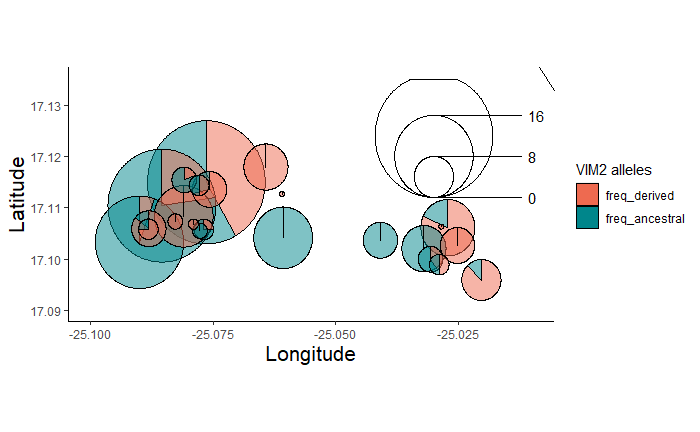
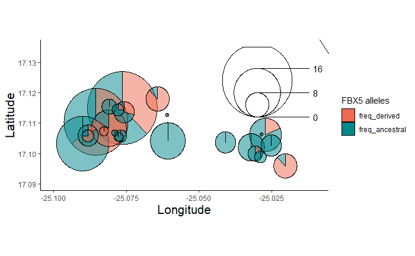

```{r setup, include=FALSE}
knitr::opts_chunk$set(eval = FALSE)
```

```{r,echo=FALSE,message=FALSE,warning=FALSE}
# Set so that long lines in R will be wrapped:
knitr::opts_chunk$set(tidy.opts = list(width.cutoff = 80), tidy = TRUE)
```


# Overview

This documentation explains step by step how was performed the analysis on whole-genome bisulfite sequencing (WGBS) data on African *Arabidopsis thaliana* accessions (Morocco and Cape Verde) and the reanalysis of a subset of the WGBS data from the 1001 Genome Project (1001GP) ([Kawakatsu et al., 2016](http://www.sciencedirect.com/science/article/pii/S0092867416308522)) and the RNA-seq performed on Cape Verde accessions.


# WGBS library preparation

Libraries were prepared as described previously in [Urich et al. 2012](http://www.nature.com/nprot/journal/v10/n3/full/nprot.2014.114.html) with minor modifications.

# Sequencing

Libraries were pooled based on the 24 NEXTFlex Bisulfite-Seq barcodes (BiooScientific) for multiplex sequencing on the HiSeq3000 sequencer (Illumina) in 150 bp single-end mode.  1 Gb (7 M reads) of data were ordered for each library (minimum required by the sequencing facility). Reads were trimmed from adapters by the sequencing facility using Cutadapt ([Martin et al., 2011](http://journal.embnet.org/index.php/embnetjournal/article/view/200)). Visual inspection on graphics produced by [fastQC](https://www.bioinformatics.babraham.ac.uk/projects/fastqc/) was used to visually determine the quality of the reads.

# Softwares required

* Bismark (v0.19.0)
* Python3.5
* GEMMA (v0.94)
* vcftools (v0.1.14)
* bcftools (v1.2)
* bwa (v0.7.15)
* R (>3.3.0) with the libraries indicated in the scripts
* [SRA tool kit](https://trace.ncbi.nlm.nih.gov/Traces/sra/sra.cgi?view=toolkit_doc) from NCBI
* FastQC v0.11.9
* multiqc v1.6
* cutadapt v2.9
* methylKit (v1.14.2) R package and dependencies

# Reanalysis of the 1001 GP data


## Get information samples

Working directory: `/srv/netscratch/dep_coupland/grp_hancock/johan/bs-seq_data_1001`

Go to NCBI SRA selector for project PRJNA187927 (SALK La Jolla) and PRJNA236110 (GMI Vienna)
Web: https://www.ncbi.nlm.nih.gov/Traces/study/?go=home enter PRJNA187927, Download the SraRunTable.txt (478 samples)

`mv SraRunTable.txt SraRunTable_SALK.txt`

Web: https://www.ncbi.nlm.nih.gov/Traces/study/?go=home enter PRJNA236110, Download the SraRunTable.txt (2215 samples)

`mv SraRunTable.txt SraRunTable_GMI.txt`

Go to http://1001genomes.org/accessions.html and download the csv file (link at the bottom of the page)

Convert CSV to tab-separated file

```{bash}
sed 's/,/\t/g' query.txt > accessions_1001genome.txt
```

A subset of 526 accessions were selected, discarding accessions from USA and replicates. A dataframe containing details about each accessions was created and put in `accessions_1001GP_figure1.txt`.

## Download data

Select SRR names of each the 526 accessions to download

```{bash}
cut -f2 accessions_1001GP_figure1.txt > to_download.txt
```

The script `download_sra.sh` retrieves fastq file for each SRR number.

```{bash}
i=$1

if [[ ! -e ${i}.sra ]]; then
  first_6_chars=$(echo $i | cut -c1-6)
  accession="${i%.*}"
  
  # Download SRA file
  echo "wget ftp://ftp-trace.ncbi.nih.gov/sra/sra-instant/reads/ByRun/sra/SRR/${first_6_chars}/${accession}/${accession}.sra"
  wget ftp://ftp-trace.ncbi.nih.gov/sra/sra-instant/reads/ByRun/sra/SRR/${first_6_chars}/${accession}/${accession}.sra
  
  # Extract fastq file from SRA
  echo "fastq-dump --split-3 ${i}.sra"
  fastq-dump --split-3 ${i}.sra
  
  # Compress fastq file(s) (1 or 2 files for SE or PE libraries, respectively)
  gzip ${i}*.fastq
  
  # Remove SRA file
  rm ${i}.sra
else
  echo "${i}.sra already exists"
fi

```

Download the data

```{bash}

# Launch script in bsub
while read i; do
  bash download_sra.sh $i
done < to_download.txt

```


## Mapping with Bismark

Reads were mapped on *A. thaliana* TAIR10 reference [fasta file](https://www.arabidopsis.org/download_files/Genes/TAIR10_genome_release/TAIR10_chromosome_files/TAIR10_chr_all.fas). Note that the fasta file contains the 5 chromosomes and the 2 plastids (chloroplast and mitochondria). In order to be processed by the R package methylKit ([Akalin et al., 2011](https://doi.org/10.1186/gb-2012-13-10-r87)), the cytosine report files from Bismark were generated for each chromosome and each methylation context. In order to perform the analysis on many accessions, the bash script [run_bismark.sh](scripts/run_bismark.sh) performs Bismark analysis step-by-step.

Note that absolute paths can be given, the output files will be generated in the specified output directory (argument `-o`) or by default in the directory containing the input fastq file if no -o argument is specified. While running, the script will echo each step performed, which can be redirected to a log file.

The script will take care of:
* Building the bismark reference genome
* Perform the alignment
* Remove duplicate reads from the bam file 
* Extract the methylation status and generate coverage and bedGraph files (visualization in SeqMonk and IGV)
* Generate cytosine reports (used as input file for methylKit R package)
* Calculate conversion efficiency (based on spurious non-converted cytosines from the chloroplast genome) 

To get more information on how run_bismark.sh is working:

```{bash}
bash run_bismark.sh -h
```
The code itself contains comments for each step so have look at it and tweak it to your needs.


### Get reference genome

Download the fasta file for *A. thaliana* TAIR10 reference:

```{bash}
# Download fasta file
wget https://www.arabidopsis.org/download_files/Genes/TAIR10_genome_release/TAIR10_chromosome_files/TAIR10_chr_all.fas

# Rename chromosomes to add prefix "Chr" (easier to retrieve information, e.g. Chr1 rather than 1)
sed -i 's/^>\([1-5]\)/>Chr\1/g' TAIR10_chr_all.fas 

# Move the file in "/path/to/dir_fasta/"
mv TAIR10_chr_all.fas /path/to/dir_fasta/

```


### Mapping single-end data

The data from the 1001 GP have a mix of SE and PE data, put fastq files in separate folders.

```{bash}
# Split SE and PE data in different folders
mkdir PE_data
mkdir SE_data

# Move paired-end data in PE_data
mv *_1.fastq.gz PE_data/
mv *_2.fastq.gz PE_data/

# Move the rest (SE data) into SE_data
mv *fastq.gz SE_data

```

Map the reads with the light mode on (remove unnecessary intermediary files) with the flag `-l`

```{bash}
while read i; do
bash run_all_bismark.sh -l -r </path/to/dir_fasta/> -1 ${i} -o </path/to/output/> 
done < <(ls *fastq.gz)

```

#### Assess mapping efficiency

```{bash}

for i in *bismark_bt2_SE_report.txt; do
  library=$(echo $i | cut -d'_' -f1,2)
  map=$(grep "Mapping efficiency" $i | cut -d':' -f2 -)
  echo -e "${library}\t${map}" >> mapping_efficiency.txt
done
```

Put data in excel and calculate average and SD
average: 64.89%
Stdev: 9.34%

#### Assess conversion efficiency

```{bash}
for i in *_report.conversion_efficiency.txt; do 
  name=$(echo $i | cut -d'_' -f1,2) 
  line=$(tail -n1 $i | cut -f3)
  echo $name $line
done >> conversion_efficiency.txt
```

Put data in excel and calculate average and SD

average: 99.52%
Stdev: 0.38%


### Mapping paired-end data

```{bash}

# Get single name for each pair data
ls *fastq.gz | cut -d'_' -f1,2 | uniq > list_fastq_files.txt

while read i; do
          fastq1=${i}_1.fastq.gz
          fastq2=${i}_2.fastq.gz
	        bash run_all_bismark.sh -l -r </path/to/dir_fasta/> -1 $fastq1 -2 $fastq2 -o </path/to/output/> 
done < list_fastq_files.txt

```

#### Assess mapping efficiency

```{bash}

cd /srv/netscratch/dep_coupland/grp_hancock/johan/bs-seq_data_1001/fastq_files/1001/PE_data

for i in *bismark_bt2_PE_report.txt.gz; do
  library=$(echo $i | cut -d'_' -f1,2)
  map=$(zgrep "Mapping efficiency" $i | cut -d':' -f2 -)
  echo -e "${library}\t${map}" >> mapping_efficiency.txt
done
```

average: 51.82%
Stdev: 8.21%

Interestingly, the SE end data map at higher efficiency than PE data (about 10% more uniquely mapped reads) and I observed the same trend for the data of project GC_4050. This is probably due to the fact that more reads are unlinked in SE mode and therefore reads mapping in repetitive regions in PE mode are 2 times more numerous as they belong to the same DNA fragment.

#### Assess conversion efficiency

```{bash}
for i in *_report.conversion_efficiency.txt; do 
  name=$(echo $i | cut -d'_' -f1,2) 
  line=$(tail -n1 $i | cut -f3)
  echo $name $line
done >> conversion_efficiency.txt
```

# Analysis of the accessions from Cape Verde and Morocco

We generated WGBS data for 83 accessions from Cape Verde - Santo Antao, 20 from Morocco and diverse mutants (ARABIDILLO-1 and CMT2). We also included as control the accessions Col-0, Col-3, Doer-10, and UKID116. The data for the fastq files for these samples can be downloaded in the NCBI depository PRJNA612437.

## Download fastq files

1. Go on website https://www.ncbi.nlm.nih.gov/sra and type PRJNA612437.
2. Click to "SRA Experiments"
3. Click on "Send Results to Run selector"
4. Download the SRR list by clicking 'Accession List' as SRR_Acc_List.txt

*NB: The data are all single-end reads*

In bash, download SRA files and convert them in fastq files:

```{bash}
while read name in list; do
	fastq-dump --split-spot $name
done < SRR_Acc_List.txt
```

## Rename fastq files

Change the SRR name to the name of the library

```{bash}
TODO when the data of CPV paper will be in NCBI
Also group needs to agree on name system for fastq files
```

## Run Bismark

For each fastq file, run the following command:

```{bash}
bash run_bismark.sh -1 <filename.fastq> -r </path/to/dir_fasta/> -o </name/output/directory/>
``` 


# Methylation call and DMR

Once Bismark has been run, cytosine report files for each methylation contexts are imported in methylKit R packages for further analysis.

Typical format of the bismark output file imported in methylKit:

The suffix of the file is `*_bismark_bt2.deduplicated.bismark.cov.gz.CHG_report_only_chr.txt` so it contains all the call for cytosines in CHG context, excluding the calls in organelles (chloroplast and mitochondria).

```
Chr4    1004    +       1       1       CHG     CAG
Chr4    1006    -       2       3       CHG     CTG
Chr4    1009    -       0       5       CHG     CCG
Chr4    1020    +       1       3       CHG     CCG
Chr4    1023    -       4       5       CHG     CCG
Chr4    1052    -       9       3       CHG     CCG
Chr4    1071    +       3       4       CHG     CAG
Chr4    1073    -       6       6       CHG     CTG
Chr4    1090    +       4       5       CHG     CCG
Chr4    1096    +       4       5       CHG     CTG

```

The columns represent chromosome, base position, strand position of the cytosine, number of methylated Cs, number unmethylated Cs, methylation context, and trinucleotide context.

Different functions were created to run the functions of methylKit in batch. These functions can be found in [functions_methylkit.R](functions_methylkit.R).


Here is described the pipeline used to process the methylation data in methylKit.

## Annotation Araport11

We need the last annotation of genes and TEs for Col-0. Use Araport11 annotation

Files downloaded from https://www.arabidopsis.org/download/index-auto.jsp?dir=%2Fdownload_files%2FGenes%2FAraport11_genome_release

```{bash}
# Get genes
grep -P "\tgene\t" Araport11_GFF3_genes_transposons.201606.gff  > Araport11_GFF3_genes_only.gff

# Convert gff to bed format
gff2bed < Araport11_GFF3_genes_only.gff > Araport11_GFF3_genes_only_full.bed

# Keep only first 4 columns
cut -f1,2,3,4 Araport11_GFF3_genes_only_full.bed > Araport11_GFF3_genes_only.bed

# For TEs
grep "transposable_element" Araport11_GFF3_genes_transposons.201606.gff | wc -l
35090

# In comparison, there were 35082 transposable_element feature in TAIR10 annotation

grep "transposable_element" Araport11_GFF3_genes_transposons.201606.gff  > Araport11_GFF3_transposons.gff

# Convert gff to bed format
gff2bed < Araport11_GFF3_transposons.gff > Araport11_GFF3_transposons_full.bed

# Keep only first 4 columns
cut -f1,2,3,4 Araport11_GFF3_transposons_full.bed > Araport11_GFF3_transposons.bed


# Keep TEs bigger than 4 kb
cat Araport11_GFF3_transposons.bed | awk -F'\t' '$3-$2 >= 4000 {print $0}' > Araport11_GFF3_transposons_longer_4kb.bed

# Keep TEs smaller than 500 bp
cat Araport11_GFF3_transposons.bed | awk -F'\t' '$3-$2 < 500 {print $0}' > Araport11_GFF3_transposons_smaller_500bp.bed

```

## R libraries and functions

```{r,  message = FALSE}
####################################
#       Libraries and functions    #
####################################

library(scatterpie)
library(plyr)

# Load the R script functions_methylkit.R which contains wrap up functions to run in batch several
# methylKit functions
source("scripts/functions_methylkit.R")

####################################
#      Paths to DB directories     #
####################################

# Paths to database for the output files of methylKit
path_DB_CpG <- "/path/to/methylDB_CpG"
path_DB_CHG <- "/path/to/methylDB_CHG"
path_DB_CHH <- "/path/to/methylDB_CHH"

# Create a list of these 3 paths
list_DB_paths <- list(path_DB_CpG, path_DB_CHG, path_DB_CHH, path_DB_CX)

# Path containing cytosine report and bam files from bismark pipeline
path_bismark_files <- paste("/path/to/bismark/output/files/", sep = "")

####################################################
################# BED FILES ########################
####################################################

# Path to bed files for region analysis
bed_genes <- "Araport11_GFF3_genes_only.bed"

# Get coordinates of the genes body methylated and body methylated + intermediate methylated from Takuno et al., 2017 (https://academic.oup.com/mbe/article/34/6/1479/3059954)
# List sent by Takuno on 2019-06-24
bed_genes_BM <- "BM_gene_ID.bed"
bed_genes_BM_IM <- "BM_IM_gene_ID.bed"

# Analysis on cluster 5 and 6
# # Path to bed files for region analysis (see section 'Analysis of cluster 5 and 6' for details of these bed files)
bed_genes_cluster5 <- paste(path_bed, "cluster5_coordinates.bed", sep = "")
bed_genes_cluster6 <- paste(path_bed, "cluster6_coordinates.bed", sep = "")

# bed_genes_annotate <- paste(workdir, "Arabidopsis_thaliana.TAIR10.39.bed", sep="") # Version that was made from GTF (works with readTranscriptFeatures)

# All TEs
bed_TEs <- paste(path_bed, "Araport11_GFF3_transposons.bed", sep = "")

# TEs longer than 4 kb
bed_TEs_4kb <- paste(path_bed, "Araport11_GFF3_transposons_longer_4kb.bed", sep = "")

# TEs shorter than 500 bp
bed_TEs_500bp <- paste(path_bed, "Araport11_GFF3_transposons_smaller_500bp.bed", sep = "")


####################################################
################# ACCESSIONS FILES ########################
####################################################

# Path to file with accession information (several were used in the different analyses and they are all available in GitHub)
path_df_accessions <- "df_accessions.txt"

# Get information of the accessions and generate a table
# Order first the file to export so that the elements are ordered as the fastq files (3542_AA, 3542_AB, ...)
df_accessions <- read.table(path_df_accessions, header = TRUE, stringsAsFactors = TRUE)

# Order the accession as list.files() list the bismark cytosine report files
df_accessions <- order_df_accessions(df_accessions)

# I need to create an hybrid name otherwise the loading of the file won't respect the original order of the input bismark file
df_accessions$sample <- paste(df_accessions$library, df_accessions$name, sep = "_")

# Make a list of samples
list_samples <- as.list(as.vector(df_accessions$sample))

# Get list of treatments and reformat so that the first treatment is 0 (control should be 0 optimally)
# Here I put as example CMT2 allele but the variable used as treatment differ in different analysis
list_treatments <- as.vector(df_accessions$cmt2_allele)

# Change char to numeric to avoid bugs when using unite() function
list_treatments <- as.numeric(list_treatments)

# Vector of the 3 contexts analyzed
context <- c("CpG", "CHG", "CHH")
```


# Create methylKit objects

## Create methylRawListDB objects

The function `import_bismark_cytosine_report` will retrieve automatically the different cytosine report files generated by Bismark and will create flat database files, allowing to reduce RAM usage. 

```{r}
import_bismark_cytosine_report(path_bismark_files, list_DB_paths, list_samples, list_treatments)
```

## Load methylRawListDB objects

Once created, load methylRawListDB objects. The files won't actually be loaded but accessed in real time when needed.

```{r}
list_methylRawLists <- load_methylRawListDB(list_DB_paths, type = "", list_samples, list_treatments)
```

## Filter methylRawList raw

Keep only cytosine positions that have a define minimum coverage. This threshold is usually set at around 5 in most WGBS analyses but since our samples were sequenced at the minimum depth allowed by the sequencing facility, we defined a lower threshold (minimum 2). This approach is valid considering that we look at pattern across large genomic regions. We assumed we would catch any strong signal if any.

```{r}
filter_methylRawList(list_methylRawLists_raw)
```

## Load filtered methylRawListDB objects

```{r,  message = FALSE}
list_methylRawLists <- load_methylRawListDB(list_DB_paths, type = "filtered", list_samples, list_treatments)
```


# Subset genomic regions

We want now to analyze methylation patterns is specific genomic regions. For this, we need to subset our data and generate new DB flat files for the different regions.

## Subset data

```{r,  message = FALSE}
# Create subset for methylRawList
subset_methylObject(list_methylRawLists, list_DB_paths, bed_genes, "genes", "methylRaw")

subset_methylObject(list_methylRawLists, list_DB_paths, bed_TEs, "TEs", "methylRaw")

subset_methylObject(list_methylRawLists, list_DB_paths, bed_TEs_4kb, "TEs_4kb", "methylRaw")

subset_methylObject(list_methylRawLists, list_DB_paths, bed_genes_BM, "genes_BM", "methylRaw")

subset_methylObject(list_methylRawLists, list_DB_paths, bed_genes_BM_IM, "genes_BM_IM", "methylRaw")

subset_methylObject(list_methylRawLists, list_DB_paths, bed_TEs_500bp, "TEs_500bp", "methylRaw")

subset_methylObject(list_methylRawLists, list_DB_paths, bed_genes_cluster5, "genes_cluster5", "methylRaw")

subset_methylObject(list_methylRawLists, list_DB_paths, bed_genes_cluster6, "genes_cluster6", "methylRaw")
```

## Load methylRaw subset data
```{r}
# Load subset data

# Load methylRawListDB objects (without filtering)
list_methylRawLists_genes <- load_methylRawListDB(list_DB_paths, type = "genes", list_samples, list_treatments)

list_methylRawLists_TEs <- load_methylRawListDB(list_DB_paths, type = "TEs", list_samples, list_treatments)

list_methylRawLists_TEs_4kb <- load_methylRawListDB(list_DB_paths, type = "TEs_4kb", list_samples, list_treatments)

list_methylRawLists_TEs_500bp <- load_methylRawListDB_wo_CX(list_DB_paths, type = "TEs_500bp", list_samples, list_treatments)

list_methylRawLists_genes_BM <- load_methylRawListDB(list_DB_paths, type = "genes_BM", list_samples, list_treatments)

list_methylRawLists_genes_BM_IM <- load_methylRawListDB(list_DB_paths, type = "genes_BM_IM", list_samples, list_treatments)
```


# Methylation levels

We want first to visualize the methylation levels in different genomic regions. For this, we extract the weighted methylation levels

## Whole genome
```{r, fig.width=14, fig.height=5}
df_name <- "df_mean_filtered"
title <- "Weighted Methylation Level for genes"

get_df_wml(list_methylRawLists, path_DB, df_name)

load_df_wml(path_DB, df_name)

# Plot (use get() to pass the string name of the dataframe as a R object)
ggplot_all(get(df_name), title = title)
```


## Genes

```{r, fig.width=14, fig.height=5}
df_name <- "df_mean_genes"
title <- "Weighted Methylation Level for genes"

get_df_wml(list_methylRawLists_genes, path_DB, df_name)

load_df_wml(path_DB, df_name)

# Plot (use get() to pass the string name of the dataframe as a R object)
ggplot_all(df_mean_genes, title = title)
```

## All TEs

```{r, fig.width=14, fig.height=5}
df_name <- "df_mean_TEs"
title <- "Weighted Methylation Level for long TEs (>4 kb)"

get_df_wml(list_methylRawLists_TEs, path_DB, df_name)

load_df_wml(path_DB, df_name)
```

## Long TEs

```{r, fig.width=14, fig.height=5}
df_name <- "df_mean_TEs_4kb"
title <- "Weighted Methylation Level for long TEs (>4 kb)"

get_df_wml(list_methylRawLists_TEs_4kb, path_DB, df_name)

load_df_wml(path_DB, df_name)
```


# GWAS analysis


GWAS was performed as described in this repository: https://github.com/johanzi/gwas_gemma

The script `run_gwas_gemma.sh` can be downloaded from GitHub [gwas_gemma](https://github.com/johanzi/gwas_gemma) repository:

```{bash}
git clone https://github.com/johanzi/gwas_gemma
```


## Prepare VCF file

Check https://github.com/johanzi/gwas_gemma?tab=readme-ov-file#section-id-35

```{bash, eval=FALSE}
bcftools view -S list_accessions_to_keep.txt file.vcf.gz > subset_83.vcf

bcftools view -r Chr1,Chr2,Chr3,Chr4,Chr5 subset_80.vcf > subset_83_only_chr.vcf

bcftools view --min-ac=1 --max-alleles 2  subset_80_only_chr.vcf > subset_83_only_chr_biallelic_only_alt.vcf

vcftools --vcf subset_83_only_chr_biallelic_only_alt.vcf  \
			--minDP 3 --minGQ 25 --remove-indels --recode --recode-INFO-all \
			--out subset_83_only_chr_biallelic_only_alt_DP3_GQ25_wo_indels
```

The output file will be `subset_83_only_chr_biallelic_only_alt_DP3_GQ25_wo_singletons.recode.vcf.gz`.

## Prepare phenotye

Check https://github.com/johanzi/gwas_gemma?tab=readme-ov-file#section-id-139


## Run Gemma

The script should be executed for each context and each genomic region:

```{bash}

VCF="subset_83_only_chr_biallelic_only_alt_DP3_GQ25_wo_singletons.recode.vcf.gz"

# Genes
bash gwas_gemma/run_gwas_gemma.sh CpG_genes.tsv $VCF

bash gwas_gemma/run_gwas_gemma.sh CHG_genes.tsv $VCF

bash gwas_gemma/run_gwas_gemma.sh CHH_genes.tsv $VCF

# TEs
bash gwas_gemma/run_gwas_gemma.sh CpG_TEs.tsv $VCF

bash gwas_gemma/run_gwas_gemma.sh CHG_TEs.tsv $VCF

bash gwas_gemma/run_gwas_gemma.sh CHH_TEs.tsv $VCF

# long TEs
bash gwas_gemma/run_gwas_gemma.sh CpG_TEs_4kb.tsv $VCF

bash gwas_gemma/run_gwas_gemma.sh CHG_TEs_4kb.tsv $VCF

bash gwas_gemma/run_gwas_gemma.sh CHH_TEs_4kb.tsv $VCF

```

### GWAS genes

```{r}
dir_file="/path/to/file/"

file.name <- "CpG_genes.assoc.clean.txt"

path.file <- paste(dir_file, file.name, sep="")

SNP_significant <- GWAS_run(path.file, threshold_pvalue = "bonferroni")


file.name <- "CHG_genes.assoc.clean.txt"

path.file <- paste(dir_file, file.name, sep="")

SNP_significant <- GWAS_run(path.file, threshold_pvalue = "bonferroni")


file.name <- "CHH_genes.assoc.clean.txt"

path.file <- paste(dir_file, file.name, sep="")

SNP_significant <- GWAS_run(path.file, threshold_pvalue = "bonferroni")

```

### GWAS all TEs


```{r}
dir_file="/path/to/file/"

file.name <- "CpG_TEs.assoc.clean.txt"

path.file <- paste(dir_file, file.name, sep="")

SNP_significant <- GWAS_run(path.file, threshold_pvalue = "bonferroni")


file.name <- "CHG_TEs.assoc.clean.txt"

path.file <- paste(dir_file, file.name, sep="")

SNP_significant <- GWAS_run(path.file, threshold_pvalue = "bonferroni")


file.name <- "CHH_TEs.assoc.clean.txt"

path.file <- paste(dir_file, file.name, sep="")

SNP_significant <- GWAS_run(path.file, threshold_pvalue = "bonferroni")


```

### GWAS long TEs

```{r}

dir_file="/path/to/file/"

file.name <- "CpG_TEs_4kb.assoc.clean.txt"

path.file <- paste(dir_file, file.name, sep="")

SNP_significant <- GWAS_run(path.file, threshold_pvalue = "bonferroni")


file.name <- "CHG_TEs_4kb.assoc.clean.txt"

path.file <- paste(dir_file, file.name, sep="")

SNP_significant <- GWAS_run(path.file, threshold_pvalue = "bonferroni")


file.name <- "CHH_TEs_4kb.assoc.clean.txt"

path.file <- paste(dir_file, file.name, sep="")

SNP_significant <- GWAS_run(path.file, threshold_pvalue = "bonferroni")

```


# DMR analysis for the 3 genes


# Call allele status

```{bash, eval=FALSE}

# This script defines the step to retrieve the allele status for
# each CPV-SA accessions of the CMT2, ARABIDILLO-1, and VIM2 variants

################################################################################
# Packages/Sofwares requires
################################################################################

# vcf_melt (install with command "pip install PyVCF --user")

# bcftools

# samtools

################################################################################
########## Get VIM2 deletion, ARA1, and CMT2 status
################################################################################

# Use VCF file used for GWAS 

VCF="superVcf_19-07-04_cvis.vcf.b.gz_snps.vcf.b.gz"

#################################################################
# FBX5
#################################################################

# Get VCF data for SNP in FBX5
bcftools view -r Chr2:18513626 $VCF > Chr2_18513626.vcf

# Convert into vertical
vcf_melt Chr2_18513626.vcf > Chr2_18513626.melted.vcf 

# Keep only line with GQ >= 25 and DP >= 3
awk '$3>=25 && $4>=3 {print $0}' Chr2_18513626.melted.vcf > Chr2_18513626_GQ25_DP3.melted.vcf
 
# Accessions with alternative allele
awk '$2 == "1" {print $0}' Chr2_18513626_GQ25_DP3.melted.vcf | wc -l
84

awk '$2 == "1" {print $0}' Chr2_18513626_GQ25_DP3.melted.vcf | cut -f1 | sort - > FBX5_alt.txt
awk '$2 == "0" {print $0}' Chr2_18513626_GQ25_DP3.melted.vcf | cut -f1 | sort - > FBX5_ref.txt


awk -v OFS='\t' '{print $0,"FBX5_alt"}' FBX5_alt.txt > FBX5_alt_final.txt
awk -v OFS='\t' '{print $0,"FBX5_ref"}' FBX5_ref.txt > FBX5_ref_final.txt

cat FBX5_alt_final.txt FBX5_ref_final.txt > FBX5_allele_status.txt

rm FBX5_alt.txt FBX5_ref.txt FBX5_alt_final.txt FBX5_ref_final.txt 

#################################################################
# CMT2
#################################################################

bcftools view -r Chr4:10420088 $VCF > Chr4_10420088.vcf

# Convert into vertical
vcf_melt Chr4_10420088.vcf > Chr4_10420088.melted.vcf 

# Keep only line with GQ >= 25 and DP >= 3
awk '$3>=25 && $4>=3 {print $0}' Chr4_10420088.melted.vcf  > Chr4_10420088_GQ25_DP3.melted.vcf 

# Accessions with alternative allele
awk '$2 == "1" {print $0}' Chr4_10420088_GQ25_DP3.melted.vcf  | wc -l
65

awk '$2 == "1" {print $0}' Chr4_10420088_GQ25_DP3.melted.vcf  | cut -f1 | sort - > CMT2_alt.txt
awk '$2 == "0" {print $0}' Chr4_10420088_GQ25_DP3.melted.vcf  | cut -f1 | sort - > CMT2_ref.txt

awk -v OFS='\t' '{print $0,"CMT2_alt"}' CMT2_alt.txt > CMT2_alt_final.txt
awk -v OFS='\t' '{print $0,"CMT2_ref"}' CMT2_ref.txt > CMT2_ref_final.txt

cat CMT2_alt_final.txt CMT2_ref_final.txt > CMT2_allele_status.txt

rm CMT2_alt.txt CMT2_ref.txt CMT2_alt_final.txt CMT2_ref_final.txt 


#################################################################
# VIM2 deletion
#################################################################

# Considering that the VIM2 deletion is not present in the VCF file as it is a 
# structural variant and not a SNP, we need to assess the presence of the deletion
# based on read density at the deletion region

# coordinates of the deletion location (based on Cvi-0). The deletion is 2740 bp
# This region was defined by looking at read mapping in Cvi-0 and determine visually
# the beginning and end of the deletion
coordinates="chr1:24586731-24589471"

for i in mappedBAM/*bam; do
	name=$(basename $i | cut -d'.' -f1)
	nb_reads=$(samtools view $i $coordinates | wc -l)
	echo -e "${name}\t${nb_reads}" >> nb_reads_vim2_deletion.txt
done

cut -f2 nb_reads_vim2_deletion.txt | sort -n -
# Looking at the distribution of reads, it seems there is threshold at 14 reads. i
# Let's use 50 reads as the threshold to define that there is indeed a deletion

# Classify each sample based on nb of reads with threshold = 50
awk -v OFS="\t" '$2 <= 50 {print $1,$2,"deletion"} $2 > 50 {print $1,$2,"no_deletion"}' nb_reads_vim2_deletion.txt > nb_reads_vim2_deletion_status.txt

```

Note that for S3-9 (12849), reads support 50% of A and 50% of T, suggesting heterozygosity for the FBX5 SNP Chr2:18,513,626. We excluded this accession from the analysis based on this uncertainty.

# Allele distribution by population

```{bash, eval=FALSE}
########################################################
# Summary by population in SA for VIM2, FBX5, and CMT2
#########################################################

# 4073_M (Cvi-0 is included)
clean_file="/srv/biodata/dep_coupland/grp_hancock/VCF/santos_clean_2019-07-11.txt"

# File contains 190 accessions

#########################################################
# For FBX5

while read i; do 
	grep -w $i FBX5_allele_status.txt >> FBX5_allele_status_SA.txt
done < /srv/biodata/dep_coupland/grp_hancock/VCF/santos_clean_2019-07-11.txt

while read i; do
    seqID=$(echo "$i" | cut -f1)
    name=$(python /home/zicola/SCRIPTS/find_accession/find_accession.py /home/zicola/SCRIPTS/find_accession/updated_list_seqID_name.dict $seqID | cut -f2)
	population=$(echo $name | cut -d'-' -f1)
    echo -e "${i}\t${name}\t${population}"
done < FBX5_allele_status_SA.txt > FBX5_allele_status_SA_with_names.txt


# Replace FBX5_ref by 0 and FBX5_alt by 1
sed -i 's/FBX5_ref/0/' FBX5_allele_status_SA_with_names.txt
sed -i 's/FBX5_alt/1/' FBX5_allele_status_SA_with_names.txt

# 189 retrieved, accession 12849 has no GT assigned  

cd /srv/netscratch/dep_coupland/grp_hancock/mappedBAM/CVI
samtools tview  12849.sorted.bam  -p chr2:18513626 --reference /home/zicola/TAIR10_chr_Pt_Mt/TAIR10.fasta

# Weird as many reads support the ALT allele A
cd /srv/biodata/dep_coupland/grp_hancock/johan/allele_status

# Also present after filtering but no genotype given (second column
grep "12849" Chr2_18513626_GQ25_DP3.melted.vcf
12849   .                       ['q25'] Chr2    18513626        T       [A]             1       94957   84      2003


#########################################################
# For CMT2

while read i; do 
	grep -w $i CMT2_allele_status.txt >> CMT2_allele_status_SA.txt
done < /srv/biodata/dep_coupland/grp_hancock/VCF/santos_clean_2019-07-11.txt

# 190 accessions retrieved => OK


while read i; do
    seqID=$(echo "$i" | cut -f1)
    name=$(python /home/zicola/SCRIPTS/find_accession/find_accession.py /home/zicola/SCRIPTS/find_accession/updated_list_seqID_name.dict $seqID | cut -f2)
	population=$(echo $name | cut -d'-' -f1)
    echo -e "${i}\t${name}\t${population}"
done < CMT2_allele_status_SA.txt > CMT2_allele_status_SA_with_names.txt


# Replace CMT2_ref by 0 and CMT2_alt by 1
sed -i 's/CMT2_ref/0/' CMT2_allele_status_SA_with_names.txt
sed -i 's/CMT2_alt/1/' CMT2_allele_status_SA_with_names.txt


#########################################################
# For VIM2

while read i; do 
	foo=$(grep -w $i nb_reads_vim2_deletion_all_with_name_clean.txt | cut -f1,3,4)
	population=$(echo "$foo" | cut -f3 | cut -d'-' -f1)
	echo -e "${foo}\t${population}"
done < /srv/biodata/dep_coupland/grp_hancock/VCF/santos_clean_2019-07-11.txt > VIM2_allele_status_SA_with_names.txt

# 190 accessions retrieved => OK

# Replace no_deletion by 0 and deletion by 1
sed -i 's/no_deletion/0/' VIM2_allele_status_SA_with_names.txt
sed -i 's/deletion/1/' VIM2_allele_status_SA_with_names.txt

# Integrate that with coordinates data

# Reference files
/netscratch/dep_coupland/grp_hancock/Celia/Experiments/newBronson/coord_genotype.txt

# Get first 3 first rows
cut -f1,2,3 /netscratch/dep_coupland/grp_hancock/Celia/Experiments/newBronson/coord_genotype.txt > coord_populations_SA.txt
```


# Map allele distribution by population

```{r}
#install.packages("scatterpie")
#install.packages("ggmap")
#install.packages("maps")

library(scatterpie)
library(ggmap)
library(maps)
library(plyr)

# As input file, I need longitude, latitude, population name, frequency of ancestral allele, frequency of derived allele, gene name (optional if only 1 gene), 
# the radius to define the size of the pie charts on the map (use total_individuals  * 0.005 / 10)
```

## Coordinate file 

```{r}
# Replace Cratera by SCratera in bash
# Modify header
# Data from SantoCoordinates.csv files in Google Drive Hancock lab
# There are coordinates for 31 populations

# I chose arbitrarily S11-rav1	-25.076404	17.114951 as S11 population and S24-1	-25.076925	17.105766 as S24
# population, remove the other S11 and S24 from the file

df_coordinates <- read.table("data/coord_populations_SA.txt", header=TRUE)
names(df_coordinates) <- c("population","long","lat")
```

## VIM2 distribution

```{r}

df_vim2 <- read.table("data/VIM2_allele_status_SA_with_names.txt", header=FALSE)
names(df_vim2) <- c("seqID","GT","accession","population")

df_vim2$population <- as.factor(df_vim2$population )

# Summarize by population
df_vim2_summary <- plyr::ddply(df_vim2, .(population), summarise, total=length(population), freq_derived=sum(GT)/total, freq_derived=(sum(GT)/total), freq_ancestral=(1-freq_derived), radius=(total*0.005/10))

# Merge with coordinate, somehow I get duplicated rows. Use unique()
df_vim2_coord <- unique(merge(df_vim2_summary, df_coordinates, by="population"))

world <- map_data("world")
SA <- world[world$long > -30 & world$long < -20 & world$lat > 10 & world$lat < 20,]

ggplot(SA, aes(long, lat)) +
  geom_map(map = world, aes(map_id = region), fill = NA, color = "black") +
  coord_quickmap() +
  xlim(-25.1, -25.01) +
  ylim(17.09, 17.135) +
  theme(plot.background = element_rect(fill = "transparent"), panel.background = element_rect(fill = "transparent"), panel.grid.minor = element_blank(), panel.grid.major = element_blank(), axis.line.x = element_line(color = "black", size = 0.5), axis.line.y = element_line(color = "black", size = 0.5)) +
  xlab("Longitude") +
  ylab("Latitude") +
  geom_scatterpie(aes(x = long, y = lat, r = radius, group = population), data = df_vim2_coord, cols = c("freq_derived","freq_ancestral"), sorted_by_radius = TRUE, alpha = .5) +
  labs(fill = "VIM2 alleles") +
  scale_fill_manual(values = c("coral2", "turquoise4")) +
  theme(axis.title.x = element_text(size = 16), axis.title.y = element_text(size = 16)) +
  geom_scatterpie_legend(df_vim2_coord$radius, x = -25.03, y = 17.124, n = 4, labeller = function(x) 10 * x / 0.005)

```



## CMT2 distribution

```{r}

df_cmt2 <- read.table("data/CMT2_allele_status_SA_with_names.txt", header=FALSE)
names(df_cmt2) <- c("seqID","GT","accession","population")

# Summarize by population
df_cmt2_summary <- ddply(df_cmt2, .(population), summarise, total=length(population), freq_derived=(sum(GT)/total), freq_ancestral=(1-freq_derived), radius=(total*0.005/10))

# Merge with coordinate, somehow I get duplicated rows. Use unique()
df_cmt2_coord <- merge(df_cmt2_summary, df_coordinates, by="population")

world <- map_data("world")
SA <- world[world$long > -30 & world$long < -20 & world$lat > 10 & world$lat < 20,]

ggplot(SA, aes(long, lat)) +
  geom_map(map = world, aes(map_id = region), fill = NA, color = "black") +
  coord_quickmap() +
  xlim(-25.1, -25.01) +
  ylim(17.09, 17.135) +
  theme(plot.background = element_rect(fill = "transparent"), panel.background = element_rect(fill = "transparent"), panel.grid.minor = element_blank(), panel.grid.major = element_blank(), axis.line.x = element_line(color = "black", size = 0.5), axis.line.y = element_line(color = "black", size = 0.5)) +
  xlab("Longitude") +
  ylab("Latitude") +
  geom_scatterpie(aes(x = long, y = lat, r = radius, group = population), data = df_cmt2_coord, cols = c("freq_derived","freq_ancestral"), sorted_by_radius = TRUE, alpha = .5) +
  labs(fill = "CMT2 alleles") +
  scale_fill_manual(values = c("turquoise4", "coral2")) +
  theme(axis.title.x = element_text(size = 16), axis.title.y = element_text(size = 16)) +
  geom_scatterpie_legend(df_cmt2_coord$radius, x = -25.03, y = 17.124, n = 4, labeller = function(x) 10 * x / 0.005)

```


## FBX5 distribution

```{r}

df_fbx5 <- read.table("data/FBX5_allele_status_SA_with_names.txt", header=FALSE)
names(df_fbx5) <- c("seqID","GT","accession","population")

# Summarize by population
df_fbx5_summary <- ddply(df_fbx5, .(population), summarise, total=length(population), freq_derived=(sum(GT)/total), freq_ancestral=(1-freq_derived), radius=(total*0.005/10))

# Merge with coordinate, somehow I get duplicated rows. Use unique()
df_fbx5_coord <- unique(merge(df_fbx5_summary, df_coordinates, by="population"))

world <- map_data("world")
SA <- world[world$long > -30 & world$long < -20 & world$lat > 10 & world$lat < 20,]

ggplot(SA, aes(long, lat)) +
  geom_map(map = world, aes(map_id = region), fill = NA, color = "black") +
  coord_quickmap() +
  xlim(-25.1, -25.01) +
  ylim(17.09, 17.135) +
  theme(plot.background = element_rect(fill = "transparent"), panel.background = element_rect(fill = "transparent"), panel.grid.minor = element_blank(), panel.grid.major = element_blank(), axis.line.x = element_line(color = "black", size = 0.5), axis.line.y = element_line(color = "black", size = 0.5)) +
  xlab("Longitude") +
  ylab("Latitude") +
  geom_scatterpie(aes(x = long, y = lat, r = radius, group = population), data = df_fbx5_coord, cols = c("freq_derived","freq_ancestral"), sorted_by_radius = TRUE, alpha = .5) +
  labs(fill = "FBX5 alleles") +
  scale_fill_manual(values = c("coral2","turquoise4")) +
  theme(axis.title.x = element_text(size = 16), axis.title.y = element_text(size = 16)) +
  geom_scatterpie_legend(df_fbx5_coord$radius, x = -25.03, y = 17.124, n = 4, labeller = function(x) 10 * x / 0.005)

```



## Plot diagram VIM2

```{r}
df_vim2_coord$population_nb <- paste(df_vim2_coord$population, " n=", df_vim2_coord$total, sep="")

# Remove Cvi
df <- df_vim2_coord[!(df_vim2_coord$population=="Cvi"),]

# Order accesstion by longitude
df$population_nb <- factor(df$population_nb, levels = df$population_nb[order(df$long)])

ggplot(data = df, aes(population_nb, freq_derived)) +
  ggtitle("VIM2 deletion frequency") +
  geom_bar(aes(x = population_nb, y = freq_derived), stat = "identity", colour = "black", fill = "grey") +
  theme_bw() +
  theme(plot.title = element_text(hjust = 0.5)) +
  theme(axis.text.x = element_text(angle = 90, hjust = 1)) +
  ylab("Deletion frequency") +
  xlab("Population") +
  scale_y_continuous(labels = scales::percent)


```


## Plot diagram CMT2

```{r}

df_cmt2_coord$population_nb <- paste(df_cmt2_coord$population, " n=", df_cmt2_coord$total, sep="")

# Remove Cvi
df <- df_cmt2_coord[!(df_cmt2_coord$population=="Cvi"),]

# Order accesstion by longitude
df$population_nb <- factor(df$population_nb, levels = df$population_nb[order(df$long)])

ggplot(data = df, aes(population_nb, freq_derived)) +
  ggtitle("Derived CMT2 allele frequency") +
  geom_bar(aes(x = population_nb, y = freq_derived), stat = "identity", colour = "black", fill = "grey") +
  theme_bw() +
  theme(plot.title = element_text(hjust = 0.5)) +
  theme(axis.text.x = element_text(angle = 90, hjust = 1)) +
  ylab("Derived allele frequency") +
  xlab("Population") +
  scale_y_continuous(labels = scales::percent)


```


## Plot diagram FBX5

```{r}
# Create new variable which concatenat population name and number of accessions
df_fbx5_coord$population_nb <- paste(df_fbx5_coord$population, " n=", df_fbx5_coord$total, sep="")

# Remove Cvi
df <- df_fbx5_coord[!(df_fbx5_coord$population=="Cvi"),]

# Order accesstion by longitude
df$population_nb <- factor(df$population_nb, levels = df$population_nb[order(df$long)])

ggplot(data = df, aes(population_nb, freq_derived)) +
  ggtitle("Derived ARABIDILLO-1 allele frequency") +
  geom_bar(aes(x = population_nb, y = freq_derived), stat = "identity", colour = "black", fill = "grey") +
  theme_bw() +
  theme(plot.title = element_text(hjust = 0.5)) +
  theme(axis.text.x = element_text(angle = 90, hjust = 1)) +
  ylab("Derived allele frequency") +
  xlab("Population") +
  scale_y_continuous(labels = scales::percent)

```


# Analysis DNA methylation in fbx5 mutants


```{bash, eval=FALSE}

echo "###############################################################################"
echo "STEP I: Mapping RNA-seq data as first step of RepEnrich2"
echo "###############################################################################"
# bowtie2 in /opt/share/software/bin/bowtie2
# version 2.2.8

fastq_dir="/srv/biodata/irg/grp_hancock/NGS_data/GC_4559/raw_fastq/final/trimmed_reads"
bowtie_index="~/TAIR10_Chr_no_Pt_Mt/bowtie2_index/TAIR10_bowtie2"
output_dir="/srv/netscratch/irg/grp_hancock/johan/repenrich2_pipeline/output_4559"

for i in ${fastq_dir}/*.fastq.gz; do
  name_fastq=$(basename $i | cut -d. -f1)
  # Create a directory to store the output bam file
  if [ ! -d ${output_dir}/${name_fastq} ]; then
    mkdir  ${output_dir}/${name_fastq}
    echo "bowtie2 -q -p 16 -x $bowtie_index -U $i | samtools view -bS - > ${output_dir}/${name_fastq}/${name_fastq}.bam"
    bowtie2 -q -p 16 -x $bowtie_index -U $i | samtools view -bS - > ${output_dir}/${name_fastq}/${name_fastq}.bam
  else
    echo "${output_dir}/${name_fastq} already exists"
  fi
done

echo "###############################################################################"
echo "STEP II: Split uniquely mapped and multimapping reads"
echo "###############################################################################"

repenrich2_index="/srv/netscratch/irg/grp_hancock/johan/repenrich2_pipeline/repenrich2_araport11"
script_repenrich2="/home/zicola/SCRIPTS/analysis_RNA-seq_GC4559_4568_4623/analysis_RepEnrich/RepEnrich2"


# Loop over created directories in step I
for dir in ${output_dir}/*/; do
name_sample=$(basename $dir)
  if [ -e ${dir}${name_sample}_multimap.fastq ] && [ -e ${dir}${name_sample}_unique.bam ] && [ -e ${dir}${name_sample}_multimap_filtered.bam ]; then
    echo "${dir}${name_sample}_unique.bam already exists"
    echo "${dir}${name_sample}_multimap.fastq already exists"
    echo "${dir}${name_sample}_multimap_filtered.bam already exists"
  else
    name_sample=$(basename $dir)
    echo "python ${script_repenrich2}/RepEnrich2_subset.py ${dir}${name_sample}.bam 30 ${dir}${name_sample} --pairedend FALSE"
    python ${script_repenrich2}/RepEnrich2_subset.py ${dir}${name_sample}.bam 30 ${dir}${name_sample} --pairedend FALSE
  fi
done


echo "###############################################################################"
echo "STEP III: Mapping to TEs"
echo "###############################################################################"

te_annotation="/home/zicola/SCRIPTS/analysis_RNA-seq_GC4559_4568_4623/analysis_RepEnrich/araport11_TE_annotation_fixed.txt"

# When the index will be renamed
for dir in ${output_dir}/*/; do
  name_sample=$(basename $dir)
  if [ ! -e ${dir}${name_sample}_fraction_counts.txt ]; then
    echo "python ${script_repenrich2}/RepEnrich2.py $te_annotation ${dir} ${name_sample} ${repenrich2_index} ${dir}${name_sample}_multimap.fastq ${dir}${name_sample}_unique.bam --is_bed TRUE --cpus 16 --pairedend FALSE"
    python ${script_repenrich2}/RepEnrich2.py $te_annotation ${dir} ${name_sample} ${repenrich2_index} ${dir}${name_sample}_multimap.fastq ${dir}${name_sample}_unique.bam --is_bed TRUE --cpus 16 --pairedend FALSE
  else
    echo "${dir}${name_sample}_fraction_counts.txt already exists"
  fi
done


```


```{bash, eval=FALSE}
nohup bash repenrich2_batch_4559.sh &

```

#.

# RNA-seq library preparation

We generated leaf transcriptomes for 97 Santo Antão accessions, including 11 accessions with three biological replicates. Rosette leaves from 4-true leaves (20 DAG) were collected between ZT3 and ZT6 and flash-frozen into liquid nitrogen. Samples were ground in 2 ml Eppendorf tubes containing one tungsten carbide ball in a TissueLyser II (Qiagen). An aliquot of about 20 mg of powder was transferred into a 96 well plate, and total RNA was prepared with the NucleoMag® 96 RNA kit (Macherey Nagel). Libraries were prepared with the NEBNext Ultra™ Directional RNA Library Prep Kit for Illumina sequencing (New England Biolabs). Approximately about 7 million reads of 150 bp single-end reads were generated on the Illumina sequencer HiSeq3000. The adaptors were trimmed using Cutadapt (parameters -m 20 -q 35) (Martin 2011). Reads were mapped on TAIR10 reference genome and Araport11 gene annotation using HISAT2 (v2.2.0) (Kim et al. 2019, 2). The read count was performed with HTSeq (v0.12.4) (Anders et al. 2015). Differential expression analysis was performed in R using the DESeq2 package (v1.28.1) (Love et al. 2014).

137 samples
98 accessions (97 SA + Col-0)
19 samples in 3 replicates (57 samples) + 1 sample in duplicate (S4-B3-14, 4623_AR and 4623_BF)
CMT2stop = 37/98
FBX5stop = 42/98
VIM2del = 45/98


| library | sample           | seqID   | FBX5 | CMT2 | VIM2 |
|---------|------------------|---------|------|------|------|
| 4559_AA | S11-45           | 27175   | 0    | 1    | 0    |
| 4559_AB | S11-63           | 15675   | 1    | 0    | 1    |
| 4559_AC | S11-63           | 15675   | 1    | 0    | 1    |
| 4559_AD | S11-63           | 15675   | 1    | 0    | 1    |
| 4559_AE | S11-9            | 27180   | 0    | 1    | 0    |
| 4559_AH | S15-7            | 22634   | 0    | 0    | 0    |
| 4559_AI | S15-7            | 22634   | 0    | 0    | 0    |
| 4559_AJ | S15-7            | 22634   | 0    | 0    | 0    |
| 4559_AK | S15-T2-15-41     | 2876_X  | 0    | 1    | 0    |
| 4559_AL | S15-T2-15-41     | 2876_X  | 0    | 1    | 0    |
| 4559_AM | S15-T2-15-41     | 2876_X  | 0    | 1    | 0    |
| 4559_AN | S16-T1-15-47     | 2876_J  | 1    | 0    | 1    |
| 4559_AO | S16-T1-15-47     | 2876_J  | 1    | 0    | 1    |
| 4559_AP | S16-T1-15-47     | 2876_J  | 1    | 0    | 1    |
| 4559_AQ | S17-1            | 2876_B  | 0    | 0    | 1    |
| 4559_AR | S17-1            | 2876_B  | 0    | 0    | 1    |
| 4559_AS | S17-1            | 2876_B  | 0    | 0    | 1    |
| 4559_AT | S18-2            | 20683   | 0    | 0    | 0    |
| 4559_AU | S18-2            | 20683   | 0    | 0    | 0    |
| 4559_AV | S18-2            | 20683   | 0    | 0    | 0    |
| 4559_AW | S3-12            | 12912   | 0    | 0    | 1    |
| 4559_AX | S3-12            | 12912   | 0    | 0    | 1    |
| 4559_AY | S3-12            | 12912   | 0    | 0    | 1    |
| 4559_AZ | S3-4             | 13173   | 1    | 0    | 1    |
| 4559_BA | S3-4             | 13173   | 1    | 0    | 1    |
| 4559_BB | S3-4             | 13173   | 1    | 0    | 1    |
| 4559_BC | S4-B2-9          | 13581   | 0    | 1    | 0    |
| 4559_BD | S4-B2-9          | 13581   | 0    | 1    | 0    |
| 4559_BE | S4-B2-9          | 13581   | 0    | 1    | 0    |
| 4559_BF | S5-100           | 22624   | 0    | 0    | 1    |
| 4559_BG | S5-100           | 22624   | 0    | 0    | 1    |
| 4559_BH | S5-100           | 22624   | 0    | 0    | 1    |
| 4559_BI | S7-B2            | 35519   | 0    | 1    | 0    |
| 4559_BJ | S7-B2            | 35519   | 0    | 1    | 0    |
| 4559_BK | S7-B2            | 35519   | 0    | 1    | 0    |
| 4559_BL | S7-B20           | 27172   | 0    | 1    | 0    |
| 4559_BM | S7-B20           | 27172   | 0    | 1    | 0    |
| 4559_BN | S7-B20           | 27172   | 0    | 1    | 0    |
| 4559_BO | S7-B5            | 13578   | 0    | 0    | 0    |
| 4559_BP | S7-B5            | 13578   | 0    | 0    | 0    |
| 4559_BQ | S7-B5            | 13578   | 0    | 0    | 0    |
| 4559_BR | S7-T1-15-2       | 2876_AD | 0    | 1    | 0    |
| 4559_BS | S7-T1-15-2       | 2876_AD | 0    | 1    | 0    |
| 4559_BT | S7-T1-15-2       | 2876_AD | 0    | 1    | 0    |
| 4559_BV | S7-T1-15-89      | 2876_V  | 0    | 0    | 0    |
| 4559_C  | Col-0            | 6909    | 0    | 0    | 0    |
| 4559_D  | Cvi-0            | 4073_M  | 1    | 0    | 1    |
| 4559_E  | Cvi-0            | 4073_M  | 1    | 0    | 1    |
| 4559_F  | Cvi-0            | 4073_M  | 1    | 0    | 1    |
| 4559_J  | S10-16           | 15673   | 0    | 0    | 0    |
| 4559_K  | S10-16           | 15673   | 0    | 0    | 0    |
| 4559_L  | S10-16           | 15673   | 0    | 0    | 0    |
| 4559_M  | S10-29           | 15671   | 0    | 0    | 1    |
| 4559_N  | S10-29           | 15671   | 0    | 0    | 1    |
| 4559_O  | S10-29           | 15671   | 0    | 0    | 1    |
| 4559_P  | S11-100          | 2876_AN | 0    | 0    | 1    |
| 4559_S  | S11-20           | 16293   | 0    | 0    | 1    |
| 4559_T  | S11-20           | 16293   | 0    | 0    | 1    |
| 4559_U  | S11-20           | 16293   | 0    | 0    | 1    |
| 4559_V  | S11-35           | 27174   | 1    | 1    | 1    |
| 4559_Y  | S11-45           | 27175   | 0    | 1    | 0    |
| 4559_Z  | S11-45           | 27175   | 0    | 1    | 0    |
| 4568_A  | S10-102          | 22637   | 1    | 1    | 1    |
| 4568_B  | S10-12           | 27158   | 0    | 1    | 1    |
| 4568_C  | S1-100           | 22615   | 0    | 0    | 0    |
| 4568_D  | S11-101          | 22620   | 1    | 1    | 0    |
| 4568_E  | S11-48           | 27170   | 1    | 0    | 0    |
| 4568_F  | S11-54           | 27160   | 0    | 1    | 1    |
| 4568_G  | S11-61           | 27161   | 1    | 0    | 0    |
| 4568_H  | S15-1            | 22631   | 1    | 0    | 0    |
| 4568_I  | S15-3            | 20682   | 1    | 0    | 0    |
| 4568_J  | S15-6            | 22622   | 0    | 1    | 1    |
| 4568_K  | S15-T1-15-11     | 2876_C  | 1    | 0    | 0    |
| 4568_L  | S15-T1-15-4      | 2876_M  | 1    | 0    | 0    |
| 4568_M  | S15-T2-15-1      | 2876_R  | 1    | 1    | 0    |
| 4568_N  | S15-T2-15-21     | 2876_F  | 1    | 1    | 0    |
| 4568_O  | S16-2            | 2876_AR | 1    | 0    | 1    |
| 4568_P  | S18-3            | 22630   | 0    | 1    | 0    |
| 4568_Q  | S19-1            | 22633   | 1    | 0    | 1    |
| 4568_R  | S3-2             | 13179   | 1    | 0    | 1    |
| 4568_S  | S3-5             | 13183   | 1    | 0    | 1    |
| 4568_T  | S7-B15           | 16150   | 0    | 0    | 0    |
| 4568_U  | S8-B100          | 22626   | 0    | 0    | 0    |
| 4623_A  | S10_101          | 2876_AM | 0    | 1    | 1    |
| 4623_AB | S15_T3_15_2      | 2876_S  | 0    | 1    | 0    |
| 4623_AC | S15_T3_15_27     | 2876_G  | 1    | 0    | 1    |
| 4623_AD | S16_3            | 2876_AS | 1    | 0    | 1    |
| 4623_AE | S16_5            | 20686   | 1    | 0    | 1    |
| 4623_AF | S16_8            | 20685   | 1    | 0    | 1    |
| 4623_AG | S16_L_15_4       | 2876_K  | 1    | 0    | 1    |
| 4623_AH | S16_T1_15_11     | 2876_Q  | 1    | 0    | 1    |
| 4623_AI | S16_T1_15_37     | 2876_L  | 1    | 0    | 1    |
| 4623_AJ | S16_T2_15_1      | 2876_P  | 1    | 0    | 1    |
| 4623_AK | S18_4            | 22643   | 0    | 1    | 0    |
| 4623_AL | S18_5            | 27163   | 0    | 1    | 1    |
| 4623_AM | S19_T2_15_13     | 2876_AA | 1    | 0    | 1    |
| 4623_AN | S3_1             | 13175   | 1    | 0    | 1    |
| 4623_AO | S3_100           | 2876_AT | 1    | 0    | 1    |
| 4623_AP | S3_3             | 13172   | 1    | 0    | 1    |
| 4623_AQ | S4_B2_2          | 2876_AK | 0    | 0    | 1    |
| 4623_AR | S4_B3_14         | 27177   | 1    | 0    | 1    |
| 4623_AS | S5_10            | 2876_AU | 0    | 0    | 1    |
| 4623_AT | S5_101           | 22632   | 1    | 1    | 0    |
| 4623_AU | S5_102           | 22618   | 0    | 0    | 1    |
| 4623_AW | S5_8             | 13177   | 0    | 0    | 1    |
| 4623_AX | S7_B100          | 2876_AV | 0    | 1    | 0    |
| 4623_AY | S7_B11           | 27165   | 0    | 1    | 0    |
| 4623_AZ | S7_T1            | 15669   | 0    | 1    | 0    |
| 4623_B  | S10_105          | 22619   | 0    | 1    | 1    |
| 4623_BA | S7_T100          | 22617   | 0    | 1    | 0    |
| 4623_BB | S7_T1_15_28      | 2876_Z  | 0    | 1    | 0    |
| 4623_BC | S7_T2            | 27179   | 0    | 1    | 0    |
| 4623_BD | S7_T3            | 2876_AW | 0    | 1    | 0    |
| 4623_BE | S8_B9            | 16292   | 0    | 0    | 0    |
| 4623_BF | S4_B3_14         | 27177   | 1    | 0    | 1    |
| 4623_C  | S10_5            | 15672   | 0    | 0    | 0    |
| 4623_D  | S11_102          | 22642   | 0    | 1    | 0    |
| 4623_E  | S11_103          | 22623   | 0    | 1    | 1    |
| 4623_F  | S11_105          | 2876_AO | 0    | 1    | 0    |
| 4623_G  | S11_14           | 15674   | 0    | 1    | 0    |
| 4623_H  | S11_19           | 35517   | 0    | 0    | 1    |
| 4623_I  | S11_28           | 2876_AP | 0    | 0    | 0    |
| 4623_J  | S11_33           | 27169   | 0    | 0    | 0    |
| 4623_K  | S11_36           | 27181   | 1    | 0    | 1    |
| 4623_L  | S11_38           | 16151   | 1    | 0    | 1    |
| 4623_N  | S11_41           | 27182   | 0    | 1    | 0    |
| 4623_P  | S11_60           | 2876_D  | 1    | 0    | 0    |
| 4623_Q  | S11_62           | 27162   | 1    | 0    | 0    |
| 4623_R  | S11_R2_T2_15_233 | 2876_W  | 0    | 0    | 1    |
| 4623_S  | S15_13           | 22616   | 0    | 1    | 0    |
| 4623_T  | S15_14           | 22641   | 0    | 1    | 0    |
| 4623_U  | S15_2            | 20681   | 1    | 0    | 0    |
| 4623_V  | S15_5            | 22013   | 1    | 0    | 1    |
| 4623_W  | S15_8            | 22636   | 0    | 0    | 0    |
| 4623_X  | S15_T1_15_25     | 2876_O  | 1    | 0    | 0    |
| 4623_Y  | S15_T1_15_31     | 2876_N  | 1    | 0    | 0    |
| 4623_Z  | S15_T2_15_13     | 2876_AB | 1    | 1    | 0    |


## Read trimming

```{bash, eval=FALSE}
# Trim fastq files
for i in *.fastq.gz; do
    name=$(basename $i | cut -d. -f1 -)
    if [ ! -e trimmed_reads/${name}.fastq* ]; then
		  zcat $i | cutadapt -m 20 -q 35 -o trimmed_reads/${name}.fastq -
	  fi
done
```


## Mapping

### Get reference genome

```{bash, eval=FALSE}

# Download fasta file
wget https://www.arabidopsis.org/download_files/Genes/TAIR10_genome_release/TAIR10_chromosome_files/TAIR10_chr_all.fas -O TAIR10.fa

# Replace chromosome names to add prefix Chr
sed -i 's/^>\([1-5]\)/>Chr\1/g' TAIR10.fa

```

### Get gene annotation Araport11

Download from https://www.arabidopsis.org/download/index-auto.jsp?dir=%2Fdownload_files%2FGenes%2FAraport11_genome_release the file Araport11_GFF3_genes_transposons.201606.gff.gz

Convert it in gtf with gffread (argument  `-T main output will be GTF instead of GFF3`) (version 0.11.4)

```{bash}
# Uncompress
gunzip Araport11_GFF3_genes_transposons.201606.gff.gz

# Convert with gffread 
gffread Araport11_GFF3_genes_transposons.201606.gff -T -o Araport11_GFF3_genes_transposons.201606_gffread.gtf

# Change the names of mitochondria and chloroplast to match the fasta reference

cut -f1 Araport11_GFF3_genes_transposons.201606_gffread.gtf | sort - | uniq
Chr1
Chr2
Chr3
Chr4
Chr5
ChrC
ChrM

sed -i 's/ChrC/chloroplast/g' Araport11_GFF3_genes_transposons.201606_gffread.gtf
sed -i 's/ChrM/mitochondria/g' Araport11_GFF3_genes_transposons.201606_gffread.gtf

cut -f1 Araport11_GFF3_genes_transposons.201606_gffread.gtf | sort - | uniq
Chr1
Chr2
Chr3
Chr4
Chr5
chloroplast
mitochondria

```

Note that the protocol https://www.nature.com/articles/nprot.2016.095#Tab1 recommends to create a file for exon and intron before creating the HISAT index.

The two files generated by the python scripts hisat2_extract_exons.py and hisat2_extract_splice_sites.py are bed files of the locations of splicing sites and exons and the corresponding strand orientation.

```{bash}
# Get python script
wget https://raw.githubusercontent.com/DaehwanKimLab/hisat2/master/hisat2_extract_exons.py
wget https://raw.githubusercontent.com/DaehwanKimLab/hisat2/master/hisat2_extract_splice_sites.py


# Extract exon and intron coordinates
python hisat2_extract_exons.py ../Araport11_GFF3_genes_transposons.201606_gffread.gtf > ARAPORT11.exon
python hisat2_extract_splice_sites.py ../Araport11_GFF3_genes_transposons.201606_gffread.gtf > ARAPORT11.ss

# Build the index
hisat2-build --ss ARAPORT11.ss --exon ARAPORT11.exon -f TAIR10.fa TAIR10

```

### Mapping 

```{bash, eval=FALSE}
for i in *.fastq.gz; do
  name=$(basename $i | cut -d. -f1)
	hisat2 -p 8 --rna-strandness R --dta -x /path/to/index/TAIR10 -U $i | \
	samtools view -bS -F 4 - | samtools sort - -o ${name}.bam
done
```


## Read counting

### Install HTseq

```{bash, eval=FALSE}
# Install HTseq (version 0.12.4)
pip install --user numpy --upgrade
pip install htseq --upgrade
```

### Gene annotation for htseq

### Keep only CDS and exons

```{bash}
# Keep only exon and CDS
grep -vw 'transcript' Araport11_GFF3_genes_transposons.201606_gffread.gtf > Araport11_GFF3_genes.gtf
```

### Remove miRNAs genes

htseq-count bugs because the miRNA have no gene_id field (only transcript_id). 

```{bash}
grep -v "ath-miR" Araport11_genes.gtf > Araport11_genes_wo_miRNAs.gtf
```

### Counting

```{bash, eval=FALSE}

mkdir read_count_htseq

for i in *bam; do
	name_file=$(basename $i | cut -d. -f1 -)
	if [! -e ./read_count_htseq/${name_file}.count ]; then
	  samtools view $i | \
	  htseq-count -s reverse -t exon -i gene_id - Araport11_genes_wo_miRNAs.gtf > ./read_count_htseq/${name_file}.count
  fi
done
```


### Count merging

Gather the read counts of different samples in one file using the bash script [scripts/merge_counts.sh](merge_counts.sh).

```{bash, eval=FALSE}
cd read_count_htseq

# Create list_file_counts.txt and sample_names.txt file, I would use the library code for sample names
for i in *count; do
  echo $i >> list_file_counts.txt
  echo $i | cut -d. -f1 >> sample_names.txt
done

# Merge
bash merge_counts.sh list_file_counts.txt sample_names.txt > cts.txt

```

The `cts.txt` file contains the raw read count with the samples in columns and the genes in row.


## Analysis in R

### R Libraries

```{r, warning=FALSE, echo=FALSE}
# RNA-seq analysis
library("DESeq2")

# Plotting functions
library("ggplot2")
library("ggpubr")
library(gridExtra)

# Perform Bayesian shrinkage estimators for effect sizes in GLM models
#library("apeglm")

# Subset and organize dataframes
library("dplyr")
library("tidyverse")
library("magrittr")

# Handle DESeResults to Dataframe conversion
library("tibble")

# Test for significant overlaps
library(GeneOverlap)

# Make Venn diagram
library(VennDiagram)

# Heat map
library("pheatmap")

# Function
give.n <- function(x){
  return(c(y = mean(x), label = length(x)))
}

```


### Load cts and coldata

```{r}
# Load coldata with sample description and variables
coldata <- read.table("data/coldata.txt", header=TRUE, row.names=1, check.names = FALSE)
# Convert the variables into factors
col_names <- names(coldata)
coldata[,col_names] <- lapply(coldata[,col_names] , factor)

# Load cts
# cts <- read.table("data/cts.txt", header=TRUE, row.names=1, check.names = FALSE)

# Turn into a Rds object for smaller size (twice smaller)
saveRDS(cts,"data/cts.Rds")

# Delete cts.txt file to save space on GitHub
# file.remove("data/cts.txt")

# Load Rds object 
cts <-  readRDS("data/cts.Rds")

### Check that sample names match in both files
all(colnames(cts) == rownames(coldata))

```


## Replicates analysis

We have in total 19 accessions with 3 replicates so 57 samples.

```
Cvi-0
S10-16
S10-29
S11-20
S11-45
S11-63
S15-7
S15-T2-15-41
S16-T1-15-47
S17-1
S18-2
S3-12
S3-4
S4-B2-9
S5-100
S7-B2
S7-B20
S7-B5
S7-T1-15-2
```

```{r}

rep_samples <- as.vector(read.table("data/samples_replicates_RNAseq.txt")$V1)

cts_rep <- cts[,rep_samples]

coldata_rep <- coldata[rep_samples,]

# Check if order followed
all(colnames(cts_rep) == rownames(coldata_rep))

```

### PCA analysis


```{r}
dds <- DESeqDataSetFromMatrix(countData = cts_rep,
                              colData = coldata_rep,
                              design= ~1)

keep <- rowSums(counts(dds)) >= 10
dds <- dds[keep,]

dds <- DESeq(dds)

# Get only results
res <- results(dds)

# Variance stabilizing transformation
vsd <- vst(dds, blind=FALSE)

# Create PCA
pcaData <- DESeq2::plotPCA(vsd, intgroup=c("sample"), returnData=TRUE)

# Get percentage variation
percentVar <- round(100 * attr(pcaData, "percentVar"))

p <- ggplot(pcaData, aes(PC1, PC2, color=sample, label = sample)) +  xlab(paste0("PC1: ",percentVar[1],"% variance")) + ylab(paste0("PC2: ",percentVar[2],"% variance")) +  theme_bw()+  theme(legend.title = element_blank()) + theme(legend.position = "none")

p + geom_text(size = 4) + ggtitle("PCA RNA-seq replicates") + theme(plot.title = element_text(hjust = 0.5))

```


Most biological replicates cluster tightly together, indicating homogenous conditions across the growth chamber (replicates were separated randomly across the trays).


