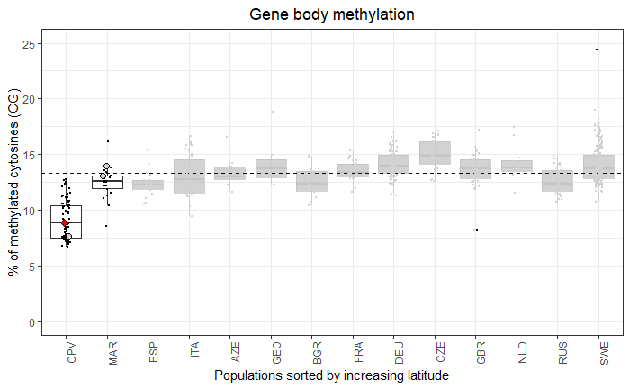

High impact mutations drive DNA methylation variation after colonization
of a novel habitat
================
Johan Zicola
2025-05-22 16:20:28

- [Overview](#overview)
- [WGBS library preparation](#wgbs-library-preparation)
- [Sequencing](#sequencing)
- [Softwares required](#softwares-required)
- [Reanalysis of the 1001 GP data](#reanalysis-of-the-1001-gp-data)
  - [Get information samples](#get-information-samples)
  - [Download data](#download-data)
  - [Mapping with Bismark](#mapping-with-bismark)
    - [Get reference genome](#get-reference-genome)
    - [Mapping single-end data](#mapping-single-end-data)
    - [Mapping paired-end data](#mapping-paired-end-data)
- [Analysis of the accessions from Cape Verde and
  Morocco](#analysis-of-the-accessions-from-cape-verde-and-morocco)
  - [Download fastq files](#download-fastq-files)
  - [Rename fastq files](#rename-fastq-files)
  - [Run Bismark](#run-bismark)
  - [Methylation call with methylKit](#methylation-call-with-methylkit)
  - [Annotation Araport11](#annotation-araport11)
  - [R libraries and functions](#r-libraries-and-functions)
  - [Create methylKit objects](#create-methylkit-objects)
  - [Create methylRawListDB objects](#create-methylrawlistdb-objects)
  - [Load methylRawListDB objects](#load-methylrawlistdb-objects)
  - [Filter methylRawList raw](#filter-methylrawlist-raw)
  - [Load filtered methylRawListDB
    objects](#load-filtered-methylrawlistdb-objects)
  - [Create methlBaseDB objects](#create-methlbasedb-objects)
  - [Load methylBaseDB objects](#load-methylbasedb-objects)
  - [Subset genomic regions](#subset-genomic-regions)
  - [Load methylRaw subset data](#load-methylraw-subset-data)
  - [Methylation levels](#methylation-levels)
    - [Whole genome](#whole-genome)
    - [Genes](#genes)
    - [Plot gene body methylation all world (figure
      1)](#plot-gene-body-methylation-all-world-figure-1)
    - [All TEs](#all-tes)
    - [Long TEs](#long-tes)
  - [TE methylation compared to world-wide accessions (figure
    3)](#te-methylation-compared-to-world-wide-accessions-figure-3)
    - [mCG all TEs](#mcg-all-tes)
    - [mCHG all TEs](#mchg-all-tes)
    - [mCHH all TEs](#mchh-all-tes)
    - [mCG long TEs](#mcg-long-tes)
    - [mCHG long TEs](#mchg-long-tes)
    - [mCHH long TEs](#mchh-long-tes)
- [GWAS analysis](#gwas-analysis)
  - [Download raw fastq reads](#download-raw-fastq-reads)
  - [SNP calling](#snp-calling)
  - [SNP annotation in CVI](#snp-annotation-in-cvi)
  - [Prepare VCF file for the 83 CVI
    accession](#prepare-vcf-file-for-the-83-cvi-accession)
  - [Prepare phenotype](#prepare-phenotype)
  - [Generate phenotype files](#generate-phenotype-files)
  - [Run Gemma](#run-gemma)
    - [GWAS whole genome](#gwas-whole-genome)
    - [GWAS genes](#gwas-genes)
    - [GWAS all TEs](#gwas-all-tes)
    - [GWAS long TEs](#gwas-long-tes)
  - [Variants at SUVH4, AGO9, DRM1, and
    MET1](#variants-at-suvh4-ago9-drm1-and-met1)
    - [Subsample VCF file for the 190 Santo Antao
      accessions](#subsample-vcf-file-for-the-190-santo-antao-accessions)
    - [Run SnpEff](#run-snpeff)
    - [Summary variants](#summary-variants)
- [Allele status in CPV](#allele-status-in-cpv)
  - [Allele distribution by
    population](#allele-distribution-by-population)
  - [Map allele distribution by
    population](#map-allele-distribution-by-population)
  - [Coordinate file](#coordinate-file)
  - [VIM2 distribution](#vim2-distribution)
  - [CMT2 distribution](#cmt2-distribution)
  - [FBX5 distribution](#fbx5-distribution)
  - [Plot diagram VIM2](#plot-diagram-vim2)
  - [Plot diagram CMT2](#plot-diagram-cmt2)
  - [Plot diagram FBX5](#plot-diagram-fbx5)
- [Plot methylation by VIM2/4 allele](#plot-methylation-by-vim24-allele)
- [GWAS gbM with VIM2/4 insertion as
  covariate](#gwas-gbm-with-vim24-insertion-as-covariate)
- [GWAS mCHH long TEs with CMT2 as
  covariate](#gwas-mchh-long-tes-with-cmt2-as-covariate)
- [GWAS mCG long TEs with FBX5 as
  covariate](#gwas-mcg-long-tes-with-fbx5-as-covariate)
- [DMR analysis for VIM2](#dmr-analysis-for-vim2)
  - [Pooling of the data](#pooling-of-the-data)
  - [Run Bismark](#run-bismark-1)
  - [Create methylKit objects](#create-methylkit-objects-1)
    - [Create methylRawListDB
      objects](#create-methylrawlistdb-objects-1)
    - [Load methylRawListDB objects](#load-methylrawlistdb-objects-1)
    - [Filter methylRawList raw](#filter-methylrawlist-raw-1)
    - [Load filtered methylRawListDB
      objects](#load-filtered-methylrawlistdb-objects-1)
  - [Gene methylation](#gene-methylation)
  - [Create methlyBaseDB objects](#create-methlybasedb-objects)
  - [Load methylBaseDB objects](#load-methylbasedb-objects-1)
  - [Create tiles objects](#create-tiles-objects)
  - [Load tiles objects](#load-tiles-objects)
  - [Create methylDiffDB objects](#create-methyldiffdb-objects)
  - [Load methylDiffDB objects](#load-methyldiffdb-objects)
  - [Create DMRs](#create-dmrs)
  - [Distribution of mCG DMRs](#distribution-of-mcg-dmrs)
  - [Merge mCG DMRs](#merge-mcg-dmrs)
  - [Overlap with genes](#overlap-with-genes)
  - [GO analysis](#go-analysis)
- [Analysis DNA methylation in vim
  mutants](#analysis-dna-methylation-in-vim-mutants)
  - [Run Bismark](#run-bismark-2)
  - [Create methylKit objects](#create-methylkit-objects-2)
  - [Create methylRawListDB objects](#create-methylrawlistdb-objects-2)
  - [Load methylRawListDB objects](#load-methylrawlistdb-objects-2)
  - [Filter methylRawList raw](#filter-methylrawlist-raw-2)
  - [Load filtered methylRawListDB
    objects](#load-filtered-methylrawlistdb-objects-2)
  - [Subset genomic regions](#subset-genomic-regions-1)
  - [Subset data](#subset-data)
  - [Load methylRaw subset data](#load-methylraw-subset-data-1)
  - [Genome-wide methylation](#genome-wide-methylation)
  - [Genes](#genes-1)
  - [All TEs](#all-tes-1)
  - [Long TEs](#long-tes-1)
  - [Whole genome methylation compared to
    SA](#whole-genome-methylation-compared-to-sa)
  - [Gene body methylation compared to
    SA](#gene-body-methylation-compared-to-sa)
  - [TEs](#tes)
- [Analysis DNA methylation in SAIL and SALK fbx5 and cmt2
  mutants](#analysis-dna-methylation-in-sail-and-salk-fbx5-and-cmt2-mutants)
  - [Samples](#samples)
  - [Run Bismark](#run-bismark-3)
  - [Create methylKit objects](#create-methylkit-objects-3)
  - [Create methylRawListDB objects](#create-methylrawlistdb-objects-3)
  - [Load methylRawListDB objects](#load-methylrawlistdb-objects-3)
  - [Filter methylRawList raw](#filter-methylrawlist-raw-3)
  - [Load filtered methylRawListDB
    objects](#load-filtered-methylrawlistdb-objects-3)
  - [Subset genomic regions](#subset-genomic-regions-2)
  - [Subset data](#subset-data-1)
  - [Load methylRaw subset data](#load-methylraw-subset-data-2)
  - [mCG in long TEs for FBX5
    mutants](#mcg-in-long-tes-for-fbx5-mutants)
  - [mCHG in long TEs for FBX5
    mutants](#mchg-in-long-tes-for-fbx5-mutants)
    - [Col-0 background](#col-0-background)
    - [Col-3 background](#col-3-background)
  - [mCHH in long TEs for cmt2-5
    mutants](#mchh-in-long-tes-for-cmt2-5-mutants)
    - [Statistical test](#statistical-test)
  - [Compare cmt2 and SA with
    CMT2stop](#compare-cmt2-and-sa-with-cmt2stop)
    - [Statistical difference](#statistical-difference)
- [Analysis DNA methylation fbx5 CRISPR
  lines](#analysis-dna-methylation-fbx5-crispr-lines)
  - [Samples](#samples-1)
  - [Create methylRawListDB objects](#create-methylrawlistdb-objects-4)
  - [Load methylRawListDB objects](#load-methylrawlistdb-objects-4)
  - [Filter methylRawList raw](#filter-methylrawlist-raw-4)
  - [Load filtered methylRawListDB
    objects](#load-filtered-methylrawlistdb-objects-4)
  - [Subset genomic regions](#subset-genomic-regions-3)
  - [Subset data](#subset-data-2)
  - [Load methylRaw objects per
    regions](#load-methylraw-objects-per-regions)
  - [Create methlBaseDB objects](#create-methlbasedb-objects-1)
  - [Load methylBaseDB objects](#load-methylbasedb-objects-2)
  - [Long TE methylation](#long-te-methylation)
    - [mCG](#mcg-6)
    - [mCHG](#mchg-6)
    - [mCHH](#mchh-5)
- [RNA-seq library preparation](#rna-seq-library-preparation)
  - [Read trimming](#read-trimming)
  - [Mapping](#mapping)
    - [Get reference genome](#get-reference-genome-1)
    - [Get gene annotation Araport11](#get-gene-annotation-araport11)
    - [Mapping](#mapping-1)
  - [Read counting](#read-counting)
    - [Install HTseq](#install-htseq)
    - [Gene annotation for htseq](#gene-annotation-for-htseq)
    - [Keep only CDS and exons](#keep-only-cds-and-exons)
    - [Remove miRNAs genes](#remove-mirnas-genes)
    - [Counting](#counting)
    - [Count merging](#count-merging)
  - [Analysis in R](#analysis-in-r)
    - [R Libraries](#r-libraries)
    - [Load cts and coldata](#load-cts-and-coldata)
    - [PCA](#pca)
  - [Replicates analysis (20
    accessions)](#replicates-analysis-20-accessions)
    - [PCA analysis](#pca-analysis)
  - [Analysis without replicates (97
    accessions)](#analysis-without-replicates-97-accessions)
    - [DEG analysis by VIM2 allele](#deg-analysis-by-vim2-allele)
    - [Expression of VIM3 based on VIM3
      allele](#expression-of-vim3-based-on-vim3-allele)
- [Analysis TE expression](#analysis-te-expression)
  - [R Libraries](#r-libraries-1)
  - [TE annotation](#te-annotation)
  - [Reference genome](#reference-genome)
  - [Bowtie2 index for each TE](#bowtie2-index-for-each-te)
  - [STEP I: Mapping RNA-seq data as first step of
    RepEnrich2](#step-i-mapping-rna-seq-data-as-first-step-of-repenrich2)
  - [STEP II: Split uniquely mapped and multimapping
    reads](#step-ii-split-uniquely-mapped-and-multimapping-reads)
  - [STEP III: Mapping to TEs](#step-iii-mapping-to-tes)
  - [Summarize data in read count
    matrix](#summarize-data-in-read-count-matrix)
  - [Analysis in R](#analysis-in-r-1)
    - [Replicates analysis](#replicates-analysis)
    - [Analysis on single accessions and long
      TEs](#analysis-on-single-accessions-and-long-tes)
    - [Analysis by CMT2 allele](#analysis-by-cmt2-allele)
    - [Analysis by FBX5 allele](#analysis-by-fbx5-allele)
    - [Permutation](#permutation)

# Overview

This documentation explains step by step how was performed the analysis
on whole-genome bisulfite sequencing (WGBS) data on African *Arabidopsis
thaliana* accessions (Morocco and Cape Verde) and the reanalysis of a
subset of the WGBS data from the 1001 Genome Project (1001GP)
([Kawakatsu et al.,
2016](http://www.sciencedirect.com/science/article/pii/S0092867416308522))
and the RNA-seq performed on Cape Verde accessions.

# WGBS library preparation

Libraries were prepared as described previously in [Urich et
al. 2012](http://www.nature.com/nprot/journal/v10/n3/full/nprot.2014.114.html)
with minor modifications.

# Sequencing

Libraries were pooled based on the 24 NEXTFlex Bisulfite-Seq barcodes
(BiooScientific) for multiplex sequencing on the HiSeq3000 sequencer
(Illumina) in 150 bp single-end mode. 1 Gb (7 M reads) of data were
ordered for each library (minimum required by the sequencing facility).
Reads were trimmed from adapters by the sequencing facility using
Cutadapt ([Martin et al.,
2011](http://journal.embnet.org/index.php/embnetjournal/article/view/200)).
Visual inspection on graphics produced by
[fastQC](https://www.bioinformatics.babraham.ac.uk/projects/fastqc/) was
used to visually determine the quality of the reads.

# Softwares required

- Bismark (v0.19.0)
- Python3.5
- GEMMA (v0.94)
- vcftools (v0.1.14)
- bcftools (v1.2)
- bwa (v0.7.15)
- R (\>3.3.0) with the libraries indicated in the scripts
- [SRA tool
  kit](https://trace.ncbi.nlm.nih.gov/Traces/sra/sra.cgi?view=toolkit_doc)
  from NCBI
- FastQC v0.11.9
- multiqc v1.6
- cutadapt v2.9
- methylKit (v1.14.2) R package and dependencies

# Reanalysis of the 1001 GP data

## Get information samples

Working directory:
`/srv/netscratch/dep_coupland/grp_hancock/johan/bs-seq_data_1001`

Go to NCBI SRA selector for project PRJNA187927 (SALK La Jolla) and
PRJNA236110 (GMI Vienna) Web:
<https://www.ncbi.nlm.nih.gov/Traces/study/?go=home> enter PRJNA187927,
Download the SraRunTable.txt (478 samples)

`mv SraRunTable.txt SraRunTable_SALK.txt`

Web: <https://www.ncbi.nlm.nih.gov/Traces/study/?go=home> enter
PRJNA236110, Download the SraRunTable.txt (2215 samples)

`mv SraRunTable.txt SraRunTable_GMI.txt`

Go to <http://1001genomes.org/accessions.html> and download the csv file
(link at the bottom of the page)

Convert CSV to tab-separated file

``` bash
sed 's/,/\t/g' query.txt > accessions_1001genome.txt
```

A subset of 526 accessions were selected, discarding accessions from USA
and replicates. A dataframe containing details about each accessions was
created and put in `accessions_1001GP_figure1.txt`.

## Download data

Select SRR names of each the 526 accessions to download

``` bash
cut -f2 accessions_1001GP_figure1.txt > to_download.txt
```

The script `download_sra.sh` retrieves fastq file for each SRR number.

``` bash
i=$1

if [[ ! -e ${i}.sra ]]; then
  first_6_chars=$(echo $i | cut -c1-6)
  accession="${i%.*}"
  
  # Download SRA file
  echo "wget ftp://ftp-trace.ncbi.nih.gov/sra/sra-instant/reads/ByRun/sra/SRR/${first_6_chars}/${accession}/${accession}.sra"
  wget ftp://ftp-trace.ncbi.nih.gov/sra/sra-instant/reads/ByRun/sra/SRR/${first_6_chars}/${accession}/${accession}.sra
  
  # Extract fastq file from SRA
  echo "fastq-dump --split-3 ${i}.sra"
  fastq-dump --split-3 ${i}.sra
  
  # Compress fastq file(s) (1 or 2 files for SE or PE libraries, respectively)
  gzip ${i}*.fastq
  
  # Remove SRA file
  rm ${i}.sra
else
  echo "${i}.sra already exists"
fi
```

Download the data

``` bash

# Launch script in bsub
while read i; do
  bash download_sra.sh $i
done < to_download.txt
```

## Mapping with Bismark

Reads were mapped on *A. thaliana* TAIR10 reference [fasta
file](https://www.arabidopsis.org/download_files/Genes/TAIR10_genome_release/TAIR10_chromosome_files/TAIR10_chr_all.fas).
Note that the fasta file contains the 5 chromosomes and the 2 plastids
(chloroplast and mitochondria). In order to be processed by the R
package methylKit ([Akalin et al.,
2011](https://doi.org/10.1186/gb-2012-13-10-r87)), the cytosine report
files from Bismark were generated for each chromosome and each
methylation context. In order to perform the analysis on many
accessions, the bash script [run_bismark.sh](scripts/run_bismark.sh)
performs Bismark analysis step-by-step.

Note that absolute paths can be given, the output files will be
generated in the specified output directory (argument `-o`) or by
default in the directory containing the input fastq file if no -o
argument is specified. While running, the script will echo each step
performed, which can be redirected to a log file.

The script will take care of: \* Building the bismark reference genome
\* Perform the alignment \* Remove duplicate reads from the bam file \*
Extract the methylation status and generate coverage and bedGraph files
(visualization in SeqMonk and IGV) \* Generate cytosine reports (used as
input file for methylKit R package) \* Calculate conversion efficiency
(based on spurious non-converted cytosines from the chloroplast genome)

To get more information on how run_bismark.sh is working:

``` bash
bash run_bismark.sh -h
```

The code itself contains comments for each step so have look at it and
tweak it to your needs.

### Get reference genome

Download the fasta file for *A. thaliana* TAIR10 reference:

``` bash
# Download fasta file
wget https://www.arabidopsis.org/download_files/Genes/TAIR10_genome_release/TAIR10_chromosome_files/TAIR10_chr_all.fas

# Rename chromosomes to add prefix "Chr" (easier to retrieve information, e.g. Chr1 rather than 1)
sed -i 's/^>\([1-5]\)/>Chr\1/g' TAIR10_chr_all.fas 

# Move the file in "/path/to/dir_fasta/"
mv TAIR10_chr_all.fas /path/to/dir_fasta/
```

### Mapping single-end data

The data from the 1001 GP have a mix of SE and PE data, put fastq files
in separate folders.

``` bash
# Split SE and PE data in different folders
mkdir PE_data
mkdir SE_data

# Move paired-end data in PE_data
mv *_1.fastq.gz PE_data/
mv *_2.fastq.gz PE_data/

# Move the rest (SE data) into SE_data
mv *fastq.gz SE_data
```

Map the reads with the light mode on (remove unnecessary intermediary
files) with the flag `-l`

``` bash
while read i; do
bash run_all_bismark.sh -l -r </path/to/dir_fasta/> -1 ${i} -o </path/to/output/> 
done < <(ls *fastq.gz)
```

#### Assess mapping efficiency

``` bash

for i in *bismark_bt2_SE_report.txt; do
  library=$(echo $i | cut -d'_' -f1,2)
  map=$(grep "Mapping efficiency" $i | cut -d':' -f2 -)
  echo -e "${library}\t${map}" >> mapping_efficiency.txt
done
```

Put data in excel and calculate average and SD average: 64.89% Stdev:
9.34%

#### Assess conversion efficiency

``` bash
for i in *_report.conversion_efficiency.txt; do 
  name=$(echo $i | cut -d'_' -f1,2) 
  line=$(tail -n1 $i | cut -f3)
  echo $name $line
done >> conversion_efficiency.txt
```

Put data in excel and calculate average and SD

average: 99.52% Stdev: 0.38%

### Mapping paired-end data

``` bash

# Get single name for each pair data
ls *fastq.gz | cut -d'_' -f1,2 | uniq > list_fastq_files.txt

while read i; do
          fastq1=${i}_1.fastq.gz
          fastq2=${i}_2.fastq.gz
            bash run_all_bismark.sh -l -r </path/to/dir_fasta/> -1 $fastq1 -2 $fastq2 -o </path/to/output/> 
done < list_fastq_files.txt
```

#### Assess mapping efficiency

``` bash

cd /srv/netscratch/dep_coupland/grp_hancock/johan/bs-seq_data_1001/fastq_files/1001/PE_data

for i in *bismark_bt2_PE_report.txt.gz; do
  library=$(echo $i | cut -d'_' -f1,2)
  map=$(zgrep "Mapping efficiency" $i | cut -d':' -f2 -)
  echo -e "${library}\t${map}" >> mapping_efficiency.txt
done
```

average: 51.82% Stdev: 8.21%

Interestingly, the SE end data map at higher efficiency than PE data
(about 10% more uniquely mapped reads) and I observed the same trend for
the data of project GC_4050. This is probably due to the fact that more
reads are unlinked in SE mode and therefore reads mapping in repetitive
regions in PE mode are 2 times more numerous as they belong to the same
DNA fragment.

#### Assess conversion efficiency

``` bash
for i in *_report.conversion_efficiency.txt; do 
  name=$(echo $i | cut -d'_' -f1,2) 
  line=$(tail -n1 $i | cut -f3)
  echo $name $line
done >> conversion_efficiency.txt
```

1.  

# Analysis of the accessions from Cape Verde and Morocco

We generated WGBS data for 83 accessions from Cape Verde - Santo Antao,
20 from Morocco and diverse mutants (for FBX5 and CMT2). We also
included as control the accessions Col-0, Col-3, Doer-10, and UKID116.
The data for the fastq files for these samples can be downloaded in the
NCBI depository PRJNA612437.

## Download fastq files

1.  Go on website <https://www.ncbi.nlm.nih.gov/sra> and type
    PRJNA612437.
2.  Click to “SRA Experiments”
3.  Click on “Send Results to Run selector”
4.  Download the SRR list by clicking ‘Accession List’ as
    SRR_Acc_List.txt

*NB: The data are all single-end reads*

In bash, download SRA files and convert them in fastq files:

``` bash
while read name in list; do
    fastq-dump --split-spot $name
done < SRR_Acc_List.txt
```

## Rename fastq files

Change the SRR name to the name of the library

``` bash
TODO when the data of CPV paper will be in NCBI
Also group needs to agree on name system for fastq files
```

## Run Bismark

For each fastq file, run the following command:

``` bash
bash run_bismark.sh -1 <filename.fastq> -r </path/to/dir_fasta/> -o </name/output/directory/>
```

## Methylation call with methylKit

Once Bismark has been run, cytosine report files for each methylation
contexts are imported in methylKit R packages for further analysis.

Typical format of the bismark output file imported in methylKit:

The suffix of the file is
`*_bismark_bt2.deduplicated.bismark.cov.gz.CHG_report_only_chr.txt` so
it contains all the call for cytosines in CHG context, excluding the
calls in organelles (chloroplast and mitochondria).

    Chr4    1004    +       1       1       CHG     CAG
    Chr4    1006    -       2       3       CHG     CTG
    Chr4    1009    -       0       5       CHG     CCG
    Chr4    1020    +       1       3       CHG     CCG
    Chr4    1023    -       4       5       CHG     CCG
    Chr4    1052    -       9       3       CHG     CCG
    Chr4    1071    +       3       4       CHG     CAG
    Chr4    1073    -       6       6       CHG     CTG
    Chr4    1090    +       4       5       CHG     CCG
    Chr4    1096    +       4       5       CHG     CTG

The columns represent chromosome, base position, strand position of the
cytosine, number of methylated Cs, number unmethylated Cs, methylation
context, and trinucleotide context.

Different functions were created to run the functions of methylKit in
batch. These functions can be found in
[scripts/functions_methylkit.R](functions_methylkit.R).

Here is described the pipeline used to process the methylation data in
methylKit.

## Annotation Araport11

We need the last annotation of genes and TEs for Col-0. Use Araport11
annotation.

Files downloaded from
<https://www.arabidopsis.org/download/list?dir=Genes%2FAraport11_genome_release>

``` bash
# Get genes
grep -P "\tgene\t" Araport11_GFF3_genes_transposons.201606.gff  > Araport11_GFF3_genes_only.gff

# Convert gff to bed format
gff2bed < Araport11_GFF3_genes_only.gff > Araport11_GFF3_genes_only_full.bed

# Keep only first 4 columns
cut -f1,2,3,4 Araport11_GFF3_genes_only_full.bed > Araport11_GFF3_genes_only.bed

# For TEs
grep "transposable_element" Araport11_GFF3_genes_transposons.201606.gff | wc -l
35090

# In comparison, there were 35082 transposable_element feature in TAIR10 annotation

grep "transposable_element" Araport11_GFF3_genes_transposons.201606.gff  > Araport11_GFF3_transposons.gff

# Convert gff to bed format
gff2bed < Araport11_GFF3_transposons.gff > Araport11_GFF3_transposons_full.bed

# Keep only first 4 columns
cut -f1,2,3,4 Araport11_GFF3_transposons_full.bed > Araport11_GFF3_transposons.bed

wc -l Araport11_GFF3_transposons.bed
31189 Araport11_GFF3_transposons.bed

# Keep TEs bigger than 4 kb
cat Araport11_GFF3_transposons.bed | awk -F'\t' '$3-$2 >= 4000 {print $0}' > Araport11_GFF3_transposons_longer_4kb.bed

wc -l Araport11_GFF3_transposons_longer_4kb.bed
1235 Araport11_GFF3_transposons_longer_4kb.bed


# Keep TEs smaller than 500 bp
cat Araport11_GFF3_transposons.bed | awk -F'\t' '$3-$2 < 500 {print $0}' > Araport11_GFF3_transposons_smaller_500bp.bed

wc -l Araport11_GFF3_transposons_smaller_500bp.bed
19530 Araport11_GFF3_transposons_smaller_500bp.bed
```

We have a total of 31,189 TEs, including 1235 TEs bigger than 4 kb.

## R libraries and functions

``` r
####################################
#       Libraries and functions    #
####################################

library(scatterpie)
library(plyr)

# Load the R script functions_methylkit.R which contains wrap up functions to run in batch several
# methylKit functions
source("scripts/functions_methylkit.R")

####################################
#      Paths to DB directories     #
####################################

# Paths to database for the output files of methylKit
path_DB_CpG <- "F:/NETSCRATCH/methylKit_DB_files/pooled_data/methylDB_CpG"
path_DB_CHG <- "F:/NETSCRATCH/methylKit_DB_files/pooled_data/methylDB_CHG"
path_DB_CHH <- "F:/NETSCRATCH/methylKit_DB_files/pooled_data/methylDB_CHH"

# Create a list of these 3 paths
list_DB_paths <- list(path_DB_CpG, path_DB_CHG, path_DB_CHH)

# Path containing cytosine report and bam files from bismark pipeline
path_bismark_files <- paste("/path/to/bismark/output/files/", sep = "")

####################################################
################# BED FILES ########################
####################################################

path_bed <- "data/bed_files/"

# Path to bed files for region analysis
bed_genes <- paste(path_bed, "Araport11_GFF3_genes_only.bed", sep = "")

# Get coordinates of the genes body methylated and body methylated + intermediate methylated from Takuno et al., 2017 (https://academic.oup.com/mbe/article/34/6/1479/3059954)
# List sent by Takuno on 2019-06-24
bed_genes_BM <- "BM_gene_ID.bed"
bed_genes_BM_IM <- "BM_IM_gene_ID.bed"

# Analysis on cluster 5 and 6
# # Path to bed files for region analysis (see section 'Analysis of cluster 5 and 6' for details of these bed files)
bed_genes_cluster5 <- paste(path_bed, "cluster5_coordinates.bed", sep = "")
bed_genes_cluster6 <- paste(path_bed, "cluster6_coordinates.bed", sep = "")

# bed_genes_annotate <- paste(workdir, "Arabidopsis_thaliana.TAIR10.39.bed", sep="") # Version that was made from GTF (works with readTranscriptFeatures)

# All TEs
bed_TEs <- paste(path_bed, "Araport11_GFF3_transposons.bed", sep = "")

# TEs longer than 4 kb
bed_TEs_4kb <- paste(path_bed, "Araport11_GFF3_transposons_longer_4kb.bed", sep = "")

# TEs shorter than 500 bp
bed_TEs_500bp <- paste(path_bed, "Araport11_GFF3_transposons_smaller_500bp.bed", sep = "")


####################################################
################# ACCESSIONS FILES ########################
####################################################

# Path to file with accession information (several were used in the different analyses and they are all available in GitHub)
path_df_accessions <- "data/df_accessions_83.txt"

# Get information of the accessions and generate a table
# Order first the file to export so that the elements are ordered as the fastq files (3542_AA, 3542_AB, ...)
df_accessions <- read.table(path_df_accessions, header = TRUE, stringsAsFactors = TRUE)

# Order the accession as list.files() list the bismark cytosine report files
df_accessions <- order_df_accessions(df_accessions)

# I need to create an hybrid name otherwise the loading of the file won't respect the original order of the input bismark file
df_accessions$sample <- paste(df_accessions$library, df_accessions$name, sep = "_")

# Make a list of samples
list_samples <- as.list(as.vector(df_accessions$sample))

# Get list of treatments and reformat so that the first treatment is 0 (control should be 0 optimally)
# Here I put as example CMT2 allele but the variable used as treatment differ in different analysis
list_treatments <- as.numeric(df_accessions$CMT2)

# Vector of the 3 contexts analyzed
context <- c("CpG", "CHG", "CHH")
```

## Create methylKit objects

## Create methylRawListDB objects

The function `import_bismark_cytosine_report` will retrieve
automatically the different cytosine report files generated by Bismark
and will create flat database files, allowing to reduce RAM usage.

``` r
import_bismark_cytosine_report(path_bismark_files, list_DB_paths, list_samples, list_treatments)
```

## Load methylRawListDB objects

Once created, load methylRawListDB objects. The files won’t actually be
loaded but accessed in real time when needed.

``` r
list_methylRawLists <- load_methylRawListDB(list_DB_paths, type = "raw", list_samples, list_treatments)
```

## Filter methylRawList raw

Keep only cytosine positions that have a define minimum coverage. This
threshold is usually set at around 5 in most WGBS analyses but since our
samples were sequenced at the minimum depth allowed by the sequencing
facility, we defined a lower threshold (minimum 2). This approach is
valid considering that we look at pattern across large genomic regions.
We assumed we would catch any strong signal if any.

``` r
filter_methylRawList(list_methylRawLists_raw)
```

## Load filtered methylRawListDB objects

``` r
list_methylRawLists <- load_methylRawListDB(list_DB_paths, type = "filtered", list_samples, list_treatments)
```

## Create methlBaseDB objects

Create methylBase objects based on given list_methylRawLists object.
Create DB files if not existing.

``` r
list_methylBases <- merged_methylRawList(list_methylRawLists, suffix="filtered_83")
```

## Load methylBaseDB objects

``` r
# Make lists of objects
list_methylBases <- load_methylBaseDB(list_DB_paths, list_samples, list_treatments, suffix="filtered_83")
```

## Subset genomic regions

We want now to analyze methylation patterns is specific genomic regions.
For this, we need to subset our data and generate new DB flat files for
the different regions.

``` r
# Create subset for methylRawList
subset_methylObject(list_methylRawLists, list_DB_paths, bed_genes, "genes", "methylRaw")

subset_methylObject(list_methylRawLists, list_DB_paths, bed_TEs, "TEs", "methylRaw")

subset_methylObject(list_methylRawLists, list_DB_paths, bed_TEs_4kb, "TEs_4kb", "methylRaw")
```

## Load methylRaw subset data

``` r
# Load subset data

# Load methylRawListDB objects (without filtering)
list_methylRawLists_genes <- load_methylRawListDB(list_DB_paths, type = "genes", list_samples, list_treatments)

list_methylRawLists_TEs <- load_methylRawListDB(list_DB_paths, type = "TEs", list_samples, list_treatments)

list_methylRawLists_TEs_4kb <- load_methylRawListDB(list_DB_paths, type = "TEs_4kb", list_samples, list_treatments)
```

## Methylation levels

We want first to visualize the methylation levels in different genomic
regions. For this, we extract the weighted methylation levels

### Whole genome

``` r
df_name <- "df_mean_filtered"
title <- "Weighted Methylation Level for genes"

get_df_wml(list_methylRawLists, path_DB, df_name)

load_df_wml(path_DB, df_name)

# Plot (use get() to pass the string name of the dataframe as a R object)
ggplot_all(get(df_name), title = title)
```

### Genes

``` r
df_name <- "df_mean_genes"
title <- "Weighted Methylation Level for genes"

get_df_wml(list_methylRawLists_genes, path_DB, df_name)

load_df_wml(path_DB, df_name)

# Plot (use get() to pass the string name of the dataframe as a R object)
ggplot_all(df_mean_genes, title = title)
```

### Plot gene body methylation all world (figure 1)

``` r
require(gghighlight)

df_accessions <- read.table("data/df_accessions_1001_CPV_MOR.txt", header = TRUE, sep="\t", stringsAsFactors = TRUE, na.strings="")  

path_DB <- "F:/NETSCRATCH/methylKit_DB_files/1001_project"

df_name <- "df_mean_genes"
title <- "Weighted Methylation Level for genes"

get_df_wml(list_methylRawLists_genes, path_DB, df_name)

load_df_wml(path_DB, df_name)

# Plot (use get() to pass the string name of the dataframe as a R object)
df <- merge(df_mean_genes, df_accessions, by="sample")

# Use dplyr prefix as desc function is also in IRange, which creates a conflict
df_subset <- df %>% group_by(country_code) %>% filter(context=="CpG", country_code!="USA", name!="SRR771702") %>% filter(n() > 7) %>%  arrange(-dplyr:::desc(Latitude))

df_subset <- df %>% group_by(country_code) %>% filter(context=="CpG", !(country_code %in% c("USA","CPV-FO")), name!="SRR771702") %>% filter(n() > 7) %>%  arrange(-dplyr:::desc(Latitude))

# Change CPV-SA to CPV
levels(df_subset$country_code)[levels(df_subset$country_code)=="CPV-SA"] <- "CPV"

order_country_code <- unique(as.vector(df_subset$country_code))

df_subset$country_code <- factor(df_subset$country_code, levels=order_country_code, ordered=TRUE)

median_meth <- median(df_subset$percent_methylation)

# Check row number for Cvi-0 from 1001
which(grepl(6911, df_subset$seq_ID))
1

# Check our Cvi-0
which(grepl("4073_M", df_subset$seq_ID))
# 84

# The two Moroccan from the 1001
which(grepl(9606, df_subset$seq_ID))
# 90
which(grepl(9939, df_subset$seq_ID))
# 91

# UKID 116 (5822)
which(grepl(5822, df_subset$seq_ID))
# 549

# Dor-10 (5856)
which(grepl(5856, df_subset$seq_ID))
# 625

# I get overlying grey and black dots for CPV and FO
mycol <- rgb(0, 0, 0, max = 255, alpha = 0, names = "transparent")

ggplot(data=df_subset, aes(x=country_code, y=percent_methylation)) + geom_boxplot(outlier.shape = NA) + ggtitle("Gene body methylation") + 
    theme_bw() + theme(plot.title = element_text(hjust = 0.5)) + ylab("% of methylated cytosines (CG)") +
  theme(axis.text.x = element_text(angle = 90, hjust = 1)) +
  xlab("Populations sorted by increasing latitude") +
  scale_y_continuous(limits=c(0,25), breaks=seq(0,25,5)) +
  gghighlight(country_code %in% c("CPV","MAR"), use_direct_label = FALSE) +
  geom_hline(yintercept=median(df_subset$percent_methylation), linetype="dashed", color = "black", size=0.5) + geom_jitter(data=df_subset[107:629,], colour="#d2d2d2ff", size=0.5, width=0.1, height=0) + geom_jitter(data=df_subset[1:106,], colour="black", size=0.5, width=0.1, height=0) +
  geom_jitter(data=df_subset[c(1,84,90,91),], colour=mycol, size=0.5, width=0.1, height=0) +
  geom_jitter(data=df_subset[1,],size=2, fill="#d2d2d2ff", shape=21, width=0.1, height=0) +
  geom_jitter(data=df_subset[84,],size=2, fill="red", shape=23, width=0.1, height=0) +
  geom_jitter(data=df_subset[90,],size=2, fill="#d2d2d2ff", shape=21, width=0.1, height=0) +
  geom_jitter(data=df_subset[91,],size=2, fill="#d2d2d2ff", shape=21, width=0.1, height=0) +
  geom_jitter(data=df_subset[549,],size=0.5, fill="black", shape=21, width=0.1, height=0)+
    geom_jitter(data=df_subset[625,],size=0.5, fill="black", shape=21, width=0.1, height=0)
```



### All TEs

``` r
df_name <- "df_mean_TEs"
title <- "Weighted Methylation Level for long TEs (>4 kb)"

get_df_wml(list_methylRawLists_TEs, path_DB, df_name)

load_df_wml(path_DB, df_name)
```

### Long TEs

``` r
df_name <- "df_mean_TEs_4kb"
title <- "Weighted Methylation Level for long TEs (>4 kb)"

get_df_wml(list_methylRawLists_TEs_4kb, path_DB, df_name)

load_df_wml(path_DB, df_name)
```

## TE methylation compared to world-wide accessions (figure 3)

``` r
require(gghighlight)

df_accessions <- read.table("data/df_accessions_1001_CPV_MOR.txt", header = TRUE, sep="\t", stringsAsFactors = TRUE, na.strings="")  

path_DB <- "F:/NETSCRATCH/methylKit_DB_files/1001_project"
```

### mCG all TEs

``` r
df_name <- "df_mean_TEs"

get_df_wml(list_methylRawLists_TEs, path_DB, df_name)

load_df_wml(path_DB, df_name)

# Plot (use get() to pass the string name of the dataframe as a R object)
# ggplot_all(df_mean_genes, title = title)

df <- merge(df_mean_TEs, df_accessions, by = "sample")

# Use dplyr prefix as desc function is also in IRange, which creates a conflict
df_subset <- df %>%
  group_by(country_code) %>%
  filter(context == "CpG", country_code != "USA", name != "SRR771702") %>%
  filter(n() > 7) %>%
  arrange(-dplyr:::desc(Latitude))

df_subset <- df %>%
  group_by(country_code) %>%
  filter(context == "CpG", !(country_code %in% c("USA", "CPV-FO")), name != "SRR771702") %>%
  filter(n() > 7) %>%
  arrange(-dplyr:::desc(Latitude))

# Change CPV-SA to CPV
levels(df_subset$country_code)[levels(df_subset$country_code) == "CPV-SA"] <- "CPV"


order_country_code <- unique(as.vector(df_subset$country_code))

df_subset$country_code <- factor(df_subset$country_code, levels = order_country_code, ordered = TRUE)


median_meth <- median(df_subset$percent_methylation)

# Check row number for Cvi-0 from 1001
which(grepl(6911, df_subset$seq_ID))
1

# Check our Cvi-0
which(grepl("4073_M", df_subset$seq_ID))
# 84

# The two Moroccan from the 1001
which(grepl(9606, df_subset$seq_ID))
# 90
which(grepl(9939, df_subset$seq_ID))
# 91

# UKID 116 (5822)
which(grepl(5822, df_subset$seq_ID))
# 549

# Dor-10 (5856)
which(grepl(5856, df_subset$seq_ID))
# 625

# I get overlying grey and black dots for CPV and FO

mycol <- rgb(0, 0, 0, max = 255, alpha = 0, names = "transparent")

ggplot(data = df_subset, aes(x = country_code, y = percent_methylation)) +
  geom_boxplot(outlier.shape = NA) +
  ggtitle("mCG all TEs") +
  theme_bw() +
  theme(plot.title = element_text(hjust = 0.5)) +
  ylab("% of methylated cytosines (CG)") +
  theme(axis.text.x = element_text(angle = 90, hjust = 1)) +
  xlab("Populations sorted by increasing latitude") +
  scale_y_continuous(limits = c(40, 70), breaks = seq(40, 70, 5)) +
  gghighlight(country_code %in% c("CPV", "MAR"), use_direct_label = FALSE) +
  geom_hline(yintercept = median(df_subset$percent_methylation), linetype = "dashed", color = "black", size = 0.5) +
  geom_jitter(data = df_subset[107:629, ], colour = "#d2d2d2ff", size = 0.5, width = 0.1, height = 0) +
  geom_jitter(data = df_subset[1:106, ], colour = "black", size = 0.5, width = 0.1, height = 0) +
  geom_jitter(data = df_subset[c(1, 84, 90, 91), ], colour = mycol, size = 0.5, width = 0.1, height = 0) +
  geom_jitter(data = df_subset[1, ], size = 2, fill = "#d2d2d2ff", shape = 21, width = 0.1, height = 0) +
  geom_jitter(data = df_subset[84, ], size = 2, fill = "red", shape = 23, width = 0.1, height = 0) +
  geom_jitter(data = df_subset[90, ], size = 2, fill = "#d2d2d2ff", shape = 21, width = 0.1, height = 0) +
  geom_jitter(data = df_subset[91, ], size = 2, fill = "#d2d2d2ff", shape = 21, width = 0.1, height = 0)
```


### mCHG all TEs

``` r
df_name <- "df_mean_TEs"
title <- "Weighted Methylation Level for long TEs (>4 kb)"

get_df_wml(list_methylRawLists_TEs, path_DB, df_name)

load_df_wml(path_DB, df_name)

# Plot (use get() to pass the string name of the dataframe as a R object)
# ggplot_all(df_mean_genes, title = title)


library(gghighlight)

df <- merge(df_mean_TEs, df_accessions, by = "sample")

# Use dplyr prefix as desc function is also in IRange, which creates a conflict
df_subset <- df %>%
  group_by(country_code) %>%
  filter(context == "CHG", country_code != "USA", name != "SRR771702") %>%
  filter(n() > 7) %>%
  arrange(-dplyr:::desc(Latitude))

df_subset <- df %>%
  group_by(country_code) %>%
  filter(context == "CHG", !(country_code %in% c("USA", "CPV-FO")), name != "SRR771702") %>%
  filter(n() > 7) %>%
  arrange(-dplyr:::desc(Latitude))

# Change CPV-SA to CPV
levels(df_subset$country_code)[levels(df_subset$country_code) == "CPV-SA"] <- "CPV"


order_country_code <- unique(as.vector(df_subset$country_code))

df_subset$country_code <- factor(df_subset$country_code, levels = order_country_code, ordered = TRUE)


median_meth <- median(df_subset$percent_methylation)

# Check row number for Cvi-0 from 1001
which(grepl(6911, df_subset$seq_ID))
1

# Check our Cvi-0
which(grepl("4073_M", df_subset$seq_ID))
# 84

# The two Moroccan from the 1001
which(grepl(9606, df_subset$seq_ID))
# 90
which(grepl(9939, df_subset$seq_ID))
# 91

# UKID 116 (5822)
which(grepl(5822, df_subset$seq_ID))
# 549

# Dor-10 (5856)
which(grepl(5856, df_subset$seq_ID))
# 625

# I get overlying grey and black dots for CPV and FO

mycol <- rgb(0, 0, 0, max = 255, alpha = 0, names = "transparent")

ggplot(data = df_subset, aes(x = country_code, y = percent_methylation)) +
  geom_boxplot(outlier.shape = NA) +
  ggtitle("mCHG all TEs") +
  theme_bw() +
  theme(plot.title = element_text(hjust = 0.5)) +
  ylab("% of methylated cytosines (CHG)") +
  theme(axis.text.x = element_text(angle = 90, hjust = 1)) +
  xlab("Populations sorted by increasing latitude") +
  scale_y_continuous(limits = c(10, 40), breaks = seq(10, 40, 5)) +
  gghighlight(country_code %in% c("CPV", "MAR"), use_direct_label = FALSE) +
  geom_hline(yintercept = median(df_subset$percent_methylation), linetype = "dashed", color = "black", size = 0.5) +
  geom_jitter(data = df_subset[107:629, ], colour = "#d2d2d2ff", size = 0.5, width = 0.1, height = 0) +
  geom_jitter(data = df_subset[1:106, ], colour = "black", size = 0.5, width = 0.1, height = 0) +
  geom_jitter(data = df_subset[c(1, 84, 90, 91), ], colour = mycol, size = 0.5, width = 0.1, height = 0) +
  geom_jitter(data = df_subset[1, ], size = 2, fill = "#d2d2d2ff", shape = 21, width = 0.1, height = 0) +
  geom_jitter(data = df_subset[84, ], size = 2, fill = "red", shape = 23, width = 0.1, height = 0) +
  geom_jitter(data = df_subset[90, ], size = 2, fill = "#d2d2d2ff", shape = 21, width = 0.1, height = 0) +
  geom_jitter(data = df_subset[91, ], size = 2, fill = "#d2d2d2ff", shape = 21, width = 0.1, height = 0)
```


### mCHH all TEs

``` r
df_name <- "df_mean_TEs"
title <- "Weighted Methylation Level for genes"

get_df_wml(list_methylRawLists_TEs, path_DB, df_name)

load_df_wml(path_DB, df_name)

# Plot (use get() to pass the string name of the dataframe as a R object)
# ggplot_all(df_mean_genes, title = title)


library(gghighlight)

df <- merge(df_mean_TEs, df_accessions, by = "sample")

# Use dplyr prefix as desc function is also in IRange, which creates a conflict
df_subset <- df %>%
  group_by(country_code) %>%
  filter(context == "CHH", country_code != "USA", name != "SRR771702") %>%
  filter(n() > 7) %>%
  arrange(-dplyr:::desc(Latitude))

df_subset <- df %>%
  group_by(country_code) %>%
  filter(context == "CHH", !(country_code %in% c("USA", "CPV-FO")), name != "SRR771702") %>%
  filter(n() > 7) %>%
  arrange(-dplyr:::desc(Latitude))

# Change CPV-SA to CPV
levels(df_subset$country_code)[levels(df_subset$country_code) == "CPV-SA"] <- "CPV"


order_country_code <- unique(as.vector(df_subset$country_code))

df_subset$country_code <- factor(df_subset$country_code, levels = order_country_code, ordered = TRUE)


median_meth <- median(df_subset$percent_methylation)

# Check row number for Cvi-0 from 1001
which(grepl(6911, df_subset$seq_ID))

# Check our Cvi-0
which(grepl("4073_M", df_subset$seq_ID))
# 84

# The two Moroccan from the 1001
which(grepl(9606, df_subset$seq_ID))
# 90
which(grepl(9939, df_subset$seq_ID))
# 91

# UKID 116 (5822)
which(grepl(5822, df_subset$seq_ID))
# 549

# Dor-10 (5856)
which(grepl(5856, df_subset$seq_ID))
# 625

# I get overlying grey and black dots for CPV and FO

mycol <- rgb(0, 0, 0, max = 255, alpha = 0, names = "transparent")

ggplot(data = df_subset, aes(x = country_code, y = percent_methylation)) +
  geom_boxplot(outlier.shape = NA) +
  ggtitle("mCHH all TEs") +
  theme_bw() +
  theme(plot.title = element_text(hjust = 0.5)) +
  ylab("% of methylated cytosines (CHH)") +
  theme(axis.text.x = element_text(angle = 90, hjust = 1)) +
  xlab("Populations sorted by increasing latitude") +
  scale_y_continuous(limits = c(0, 20), breaks = seq(0, 20, 5)) +
  gghighlight(country_code %in% c("CPV", "MAR"), use_direct_label = FALSE) +
  geom_hline(yintercept = median(df_subset$percent_methylation), linetype = "dashed", color = "black", size = 0.5) +
  geom_jitter(data = df_subset[107:629, ], colour = "#d2d2d2ff", size = 0.5, width = 0.1, height = 0) +
  geom_jitter(data = df_subset[1:106, ], colour = "black", size = 0.5, width = 0.1, height = 0) +
  geom_jitter(data = df_subset[c(1, 84, 90, 91), ], colour = mycol, size = 0.5, width = 0.1, height = 0) +
  geom_jitter(data = df_subset[1, ], size = 2, fill = "#d2d2d2ff", shape = 21, width = 0.1, height = 0) +
  geom_jitter(data = df_subset[84, ], size = 2, fill = "red", shape = 23, width = 0.1, height = 0) +
  geom_jitter(data = df_subset[90, ], size = 2, fill = "#d2d2d2ff", shape = 21, width = 0.1, height = 0) +
  geom_jitter(data = df_subset[91, ], size = 2, fill = "#d2d2d2ff", shape = 21, width = 0.1, height = 0)
```


### mCG long TEs

``` r
df_name <- "df_mean_TEs_4kb"
title <- "Weighted Methylation Level for long TEs (>4 kb)"

get_df_wml(list_methylRawLists_TEs, path_DB, df_name)

load_df_wml(path_DB, df_name)

# Plot (use get() to pass the string name of the dataframe as a R object)
# ggplot_all(df_mean_genes, title = title)


df <- merge(df_mean_TEs_4kb, df_accessions, by = "sample")

# Use dplyr prefix as desc function is also in IRange, which creates a conflict
df_subset <- df %>%
  group_by(country_code) %>%
  filter(context == "CpG", country_code != "USA", name != "SRR771702") %>%
  filter(n() > 7) %>%
  arrange(-dplyr:::desc(Latitude))

df_subset <- df %>%
  group_by(country_code) %>%
  filter(context == "CpG", !(country_code %in% c("USA", "CPV-FO")), name != "SRR771702") %>%
  filter(n() > 7) %>%
  arrange(-dplyr:::desc(Latitude))

# Change CPV-SA to CPV
levels(df_subset$country_code)[levels(df_subset$country_code) == "CPV-SA"] <- "CPV"

order_country_code <- unique(as.vector(df_subset$country_code))

df_subset$country_code <- factor(df_subset$country_code, levels = order_country_code, ordered = TRUE)


median_meth <- median(df_subset$percent_methylation)

# Check row number for Cvi-0 from 1001
which(grepl(6911, df_subset$seq_ID))
1

# Check our Cvi-0
which(grepl("4073_M", df_subset$seq_ID))
# 84

# The two Moroccan from the 1001
which(grepl(9606, df_subset$seq_ID))
# 90
which(grepl(9939, df_subset$seq_ID))
# 91

# UKID 116 (5822)
which(grepl(5822, df_subset$seq_ID))
# 549

# Dor-10 (5856)
which(grepl(5856, df_subset$seq_ID))
# 625

# I get overlying grey and black dots for CPV and FO

mycol <- rgb(0, 0, 0, max = 255, alpha = 0, names = "transparent")

ggplot(data = df_subset, aes(x = country_code, y = percent_methylation)) +
  geom_boxplot(outlier.shape = NA) +
  ggtitle("mCG long TEs") +
  theme_bw() +
  theme(plot.title = element_text(hjust = 0.5)) +
  ylab("% of methylated cytosines (CG)") +
  theme(axis.text.x = element_text(angle = 90, hjust = 1)) +
  xlab("Populations sorted by increasing latitude") +
  scale_y_continuous(limits = c(70, 90), breaks = seq(70, 90, 5)) +
  gghighlight(country_code %in% c("CPV", "MAR"), use_direct_label = FALSE) +
  geom_hline(yintercept = median(df_subset$percent_methylation), linetype = "dashed", color = "black", size = 0.5) +
  geom_jitter(data = df_subset[107:629, ], colour = "#d2d2d2ff", size = 0.5, width = 0.1, height = 0) +
  geom_jitter(data = df_subset[1:106, ], colour = "black", size = 0.5, width = 0.1, height = 0) +
  geom_jitter(data = df_subset[c(1, 84, 90, 91), ], colour = mycol, size = 0.5, width = 0.1, height = 0) +
  geom_jitter(data = df_subset[1, ], size = 2, fill = "#d2d2d2ff", shape = 21, width = 0.1, height = 0) +
  geom_jitter(data = df_subset[84, ], size = 2, fill = "red", shape = 23, width = 0.1, height = 0) +
  geom_jitter(data = df_subset[90, ], size = 2, fill = "#d2d2d2ff", shape = 21, width = 0.1, height = 0) +
  geom_jitter(data = df_subset[91, ], size = 2, fill = "#d2d2d2ff", shape = 21, width = 0.1, height = 0)
```


### mCHG long TEs

``` r
df_name <- "df_mean_TEs_4kb"
title <- "Weighted Methylation Level for long TEs (>4 kb)"

get_df_wml(list_methylRawLists_TEs, path_DB, df_name)

load_df_wml(path_DB, df_name)

# Plot (use get() to pass the string name of the dataframe as a R object)
#ggplot_all(df_mean_genes, title = title)

df <- merge(df_mean_TEs_4kb, df_accessions, by="sample")

# Use dplyr prefix as desc function is also in IRange, which creates a conflict
df_subset <- df %>% group_by(country_code) %>% filter(context=="CHG", country_code!="USA", name!="SRR771702") %>% filter(n() > 7) %>%  arrange(-dplyr:::desc(Latitude))

df_subset <- df %>% group_by(country_code) %>% filter(context=="CHG", !(country_code %in% c("USA","CPV-FO")), name!="SRR771702") %>% filter(n() > 7) %>%  arrange(-dplyr:::desc(Latitude))

# Change CPV-SA to CPV
levels(df_subset$country_code)[levels(df_subset$country_code)=="CPV-SA"] <- "CPV"


order_country_code <- unique(as.vector(df_subset$country_code))

df_subset$country_code <- factor(df_subset$country_code, levels=order_country_code, ordered=TRUE)


median_meth <- median(df_subset$percent_methylation)

# Check row number for Cvi-0 from 1001
which(grepl(6911, df_subset$seq_ID))
1

# Check our Cvi-0
which(grepl("4073_M", df_subset$seq_ID))
# 84

# The two Moroccan from the 1001
which(grepl(9606, df_subset$seq_ID))
# 90
which(grepl(9939, df_subset$seq_ID))
# 91

# UKID 116 (5822)
which(grepl(5822, df_subset$seq_ID))
# 549

# Dor-10 (5856)
which(grepl(5856, df_subset$seq_ID))
# 625

# I get overlying grey and black dots for CPV and FO

mycol <- rgb(0, 0, 0, max = 255, alpha = 0, names = "transparent")

ggplot(data=df_subset, aes(x=country_code, y=percent_methylation)) + geom_boxplot(outlier.shape = NA) + ggtitle("mCHG long TEs") + 
    theme_bw() + theme(plot.title = element_text(hjust = 0.5)) + ylab("% of methylated cytosines (CHG)") +
  theme(axis.text.x = element_text(angle = 90, hjust = 1)) +
  xlab("Populations sorted by increasing latitude") +
  scale_y_continuous(limits=c(30,70), breaks=seq(30,70,5)) +
  gghighlight(country_code %in% c("CPV","MAR"), use_direct_label = FALSE) +
  geom_hline(yintercept=median(df_subset$percent_methylation), linetype="dashed", color = "black", size=0.5) + geom_jitter(data=df_subset[107:629,], colour="#d2d2d2ff", size=0.5, width=0.1, height=0) + geom_jitter(data=df_subset[1:106,], colour="black", size=0.5, width=0.1, height=0) +
  geom_jitter(data=df_subset[c(1,84,90,91),], colour=mycol, size=0.5, width=0.1, height=0) +
  geom_jitter(data=df_subset[1,],size=2, fill="#d2d2d2ff", shape=21, width=0.1, height=0) +
  geom_jitter(data=df_subset[84,],size=2, fill="red", shape=23, width=0.1, height=0) +
  geom_jitter(data=df_subset[90,],size=2, fill="#d2d2d2ff", shape=21, width=0.1, height=0) +
  geom_jitter(data=df_subset[91,],size=2, fill="#d2d2d2ff", shape=21, width=0.1, height=0)
```


### mCHH long TEs

``` r
df_name <- "df_mean_TEs_4kb"
title <- "Weighted Methylation Level for long TEs (>4 kb)"

get_df_wml(list_methylRawLists_TEs, path_DB, df_name)

load_df_wml(path_DB, df_name)

# Plot (use get() to pass the string name of the dataframe as a R object)
#ggplot_all(df_mean_genes, title = title)
df <- merge(df_mean_TEs_4kb, df_accessions, by="sample")

# Use dplyr prefix as desc function is also in IRange, which creates a conflict
df_subset <- df %>% group_by(country_code) %>% filter(context=="CHH", country_code!="USA", name!="SRR771702") %>% filter(n() > 7) %>%  arrange(-dplyr:::desc(Latitude))

df_subset <- df %>% group_by(country_code) %>% filter(context=="CHH", !(country_code %in% c("USA","CPV-FO")), name!="SRR771702") %>% filter(n() > 7) %>%  arrange(-dplyr:::desc(Latitude))

# Change CPV-SA to CPV
levels(df_subset$country_code)[levels(df_subset$country_code)=="CPV-SA"] <- "CPV"


order_country_code <- unique(as.vector(df_subset$country_code))

df_subset$country_code <- factor(df_subset$country_code, levels=order_country_code, ordered=TRUE)


median_meth <- median(df_subset$percent_methylation)

# Check row number for Cvi-0 from 1001
which(grepl(6911, df_subset$seq_ID))
1

# Check our Cvi-0
which(grepl("4073_M", df_subset$seq_ID))
# 84

# The two Moroccan from the 1001
which(grepl(9606, df_subset$seq_ID))
# 90
which(grepl(9939, df_subset$seq_ID))
# 91

# UKID 116 (5822)
which(grepl(5822, df_subset$seq_ID))
# 549

# Dor-10 (5856)
which(grepl(5856, df_subset$seq_ID))
# 625

# I get overlying grey and black dots for CPV and FO

mycol <- rgb(0, 0, 0, max = 255, alpha = 0, names = "transparent")

ggplot(data=df_subset, aes(x=country_code, y=percent_methylation)) + geom_boxplot(outlier.shape = NA) + ggtitle("mCHH long TEs") + 
    theme_bw() + theme(plot.title = element_text(hjust = 0.5)) + ylab("% of methylated cytosines (CHH)") +
  theme(axis.text.x = element_text(angle = 90, hjust = 1)) +
  xlab("Populations sorted by increasing latitude") +
  scale_y_continuous(limits=c(0,25), breaks=seq(0,25,5)) +
  gghighlight(country_code %in% c("CPV","MAR"), use_direct_label = FALSE) +
  geom_hline(yintercept=median(df_subset$percent_methylation), linetype="dashed", color = "black", size=0.5) + geom_jitter(data=df_subset[107:629,], colour="#d2d2d2ff", size=0.5, width=0.1, height=0) + geom_jitter(data=df_subset[1:106,], colour="black", size=0.5, width=0.1, height=0) +
  geom_jitter(data=df_subset[c(1,84,90,91),], colour=mycol, size=0.5, width=0.1, height=0) +
  geom_jitter(data=df_subset[1,],size=2, fill="#d2d2d2ff", shape=21, width=0.1, height=0) +
  geom_jitter(data=df_subset[84,],size=2, fill="red", shape=23, width=0.1, height=0) +
  geom_jitter(data=df_subset[90,],size=2, fill="#d2d2d2ff", shape=21, width=0.1, height=0) +
  geom_jitter(data=df_subset[91,],size=2, fill="#d2d2d2ff", shape=21, width=0.1, height=0)
```


1.  

# GWAS analysis

## Download raw fastq reads

The paired-end sequencing data of the 189 CVI accessions from Santo
Antao were published in Fulgione et al., 2022 (DOI:
10.1038/s41467-022-28800-z) and are available in ENA (accession code
PRJEB39079 <https://www.ebi.ac.uk/ena/browser/view/PRJEB39079>). The
accession Cvi-0 was sequenced and published in Alonso-Blanco et al.,
2016 (DOI: 10.1016/j.cell.2016.05.063) and is available in the NCBI
BioProject PRJNA273563.

Data can be downloaded using fasterq-dump from SRA toolkit:

``` bash

# Install SRA toolkit if needed (v3.2.1 used)
wget --output-document sratoolkit.tar.gz https://ftp-trace.ncbi.nlm.nih.gov/sra/sdk/current/sratoolkit.current-ubuntu64.tar.gz

tar -vxzf sratoolkit.tar.gz
# Add path to binaries to .bashrc
#export PATH="${PATH}:/usr/users/zicola/bin/sratoolkit.3.2.1-ubuntu64/bin"

fasterq-dump --version
fasterq-dump : 3.2.1
```

``` bash
#!/bin/bash
#
#SBATCH --job-name=download_fastq
#SBATCH --partition=medium
#SBATCH --mem=16G
#SBATCH --time=02:00:00
#SBATCH --cpus-per-task=6
#SBATCH --output=slurm/%x.%A.%a.out
#SBATCH --error=slurm/%x.%A.%a.err
#SBATCH --mail-type=END
#SBATCH --mail-user=johan.zicola@uni-goettingen.de
#SBATCH --array=1-189

accession_ID=$(sed -n ${SLURM_ARRAY_TASK_ID}p WGS_ENA_data_189_SA.txt | cut -f1)

fasterq-dump $accession_ID --threads 6 --split-files -O raw_fastq/
```

``` bash
sbatch run_download.sh
```

-S: skip technical reads -e 6: use 6 threads –split-files: splits into
\_1.fastq and \_2.fastq -O output_dir/: specify output directory

It took about 10 to 40 minutes per sample to download.

## SNP calling

The SNP calling is described in the GitHub repository
<https://github.com/johanzi/SNP_calling_Arabidopsis>

## SNP annotation in CVI

Use SNPeff to annotate variants present within Santo Antao island. We
have WGS data for 190 accessions.

## Prepare VCF file for the 83 CVI accession

The VCF file `superVcf_19-07-04_cvis.vcf.b.gz_snps.vcf.b.gz` (matching
the `merged.vcf.gz` described before) was generated with the Shore
pipeline ([Ossowski et al.,
2008](http://genome.cshlp.org/content/18/12/2024). The file is 11 Gb and
therefore available only upon request.

``` bash

# Reorder seqID
cut -f2 data/df_accessions_83.txt | grep -v "seq_ID" | sort > data/df_accessions_83_seqID_sorted.txt

VCF="/srv/biodata/irg/grp_hancock/VCF/GATK_SNPs_Indels_For_Cape_Verde/NewVersion_withCVI-0s/CapeVerde_SNPs_Final_segregating.vcf.gz"

# VCF file with only positions with SNPs
# VCF="superVcf_19-07-04_cvis.vcf.b.gz_snps.vcf.b.gz"

# Keep the 83 accessions from Santo Antao and keep only chromosomes
#bcftools view -S df_accessions_83_seqID_sorted.txt -r Chr1,Chr2,Chr3,Chr4,Chr5 $VCF > subset_83_only_chr_gatk.vcf

bcftools view -S df_accessions_83_seqID_sorted.txt -r 1,2,3,4,5 $VCF > subset_83_only_chr_gatk.vcf

# Remove positions without alternative alleles and non-biallelic SNPs
bcftools view --min-ac=1 --max-alleles 2  subset_83_only_chr_gatk.vcf > subset_83_only_chr_biallelic_only_alt_gatk.vcf

# Filter SNP quality with DP>=3, GQ>=25
vcftools --vcf subset_83_only_chr_biallelic_only_alt_gatk.vcf  \
            --minDP 3 --minGQ 25 --recode --recode-INFO-all \
            --out subset_83_only_chr_biallelic_only_alt_DP3_GQ25_gatk

# Mark singletons
vcftools --singletons --vcf subset_83_only_chr_biallelic_only_alt_DP3_GQ25_gatk.recode.vcf

# Remove singletons
vcftools --vcf subset_83_only_chr_biallelic_only_alt_DP3_GQ25_gatk.recode.vcf \
            --exclude-positions out.singletons --recode --recode-INFO-all \
            --out subset_83_only_chr_biallelic_only_alt_DP3_GQ25_wo_singletons_gatk
            
# Compress and tabix file
bgzip subset_83_only_chr_biallelic_only_alt_DP3_GQ25_wo_singletons_gatk.recode.vcf && tabix subset_83_only_chr_biallelic_only_alt_DP3_GQ25_wo_singletons_gatk.recode.vcf.gz
```

The output file is be
`subset_83_only_chr_biallelic_only_alt_DP3_GQ25_wo_singletons.recode.vcf.gz`.
This file contains 954,216 SNPs.

## Prepare phenotype

Check
<https://github.com/johanzi/gwas_gemma?tab=readme-ov-file#section-id-139>

## Generate phenotype files

In bash, the rda files generated by the function `load_df_wml` is used
to generate an equivalent txt files. Here is the pipeline in bash

The script `generate_phenotype_gemma.sh` takes as arguments an rda
object (generated by `load_df_wml`), the name of the methylation
context, the region (gene, TE, …) and a file containing the accession
order as present in the vcf file. Check GitHub
[documentation](https://github.com/HancockLab/WGBS_African_Arabidopsis)
for more information.

``` bash

# Generate phenotypes


# Working directory
cd /srv/netscratch/irg/grp_hancock/johan/GWAS/dna_methylation/GWAS_83_SA


# Need to add 'sample' (BS-seq library underscore accession name) variable to df_accessions_83.txt
#awk -v FS='\t' -v OFS='\t' '{print $0,$3"_"$1}' df_accessions_83.txt > df_accessions_83_sample.txt
#sed -i 's/library_name/sample/' df_accessions_83_sample.txt
#mv df_accessions_83_sample.txt df_accessions_83.txt

# Path variables
path_script="/home/zicola/SCRIPTS/bismark_pipeline/WGBS_African_Arabidopsis"

path_rda="/srv/netscratch/irg/grp_hancock/johan/methylKit_DB_files/GC_3427_3542_3599_4050_4220_4373_TAIR10"


# Generate phenotype for whole genome
bash scripts/generate_phenotype_gemma.sh data/df_mean_filtered_83.rda CpG whole_genome data/df_accessions_83_seqID_sorted.txt data/df_accessions_83.txt

bash scripts/generate_phenotype_gemma.sh data/df_mean_filtered_83.rda CHG whole_genome data/df_accessions_83_seqID_sorted.txt data/df_accessions_83.txt

bash scripts/generate_phenotype_gemma.sh data/df_mean_filtered_83.rda CHH whole_genome data/df_accessions_83_seqID_sorted.txt data/df_accessions_83.txt


# Generate phenotype for genes
bash scripts/generate_phenotype_gemma.sh data/df_mean_genes_83.rda CpG genes data/df_accessions_83_seqID_sorted.txt 

bash scripts/generate_phenotype_gemma.sh data/df_mean_genes_83.rda CHG genes data/df_accessions_83_seqID_sorted.txt 

bash scripts/generate_phenotype_gemma.sh data/df_mean_genes_83.rda CHH genes data/df_accessions_83_seqID_sorted.txt

# Generate phenotype for TEs
bash scripts/generate_phenotype_gemma.sh data/df_mean_TEs_83.rda CpG TEs data/df_accessions_83_seqID_sorted.txt

bash scripts/generate_phenotype_gemma.sh data/df_mean_TEs_83.rda CHG TEs data/df_accessions_83_seqID_sorted.txt

bash scripts/generate_phenotype_gemma.sh data/df_mean_TEs_83.rda CHH TEs data/df_accessions_83_seqID_sorted.txt

# Generate phenotype for long TEs
bash scripts/generate_phenotype_gemma.sh data/df_mean_TEs_4kb_83.rda CpG data/TEs_4kb df_accessions_83_seqID_sorted.txt

bash scripts/generate_phenotype_gemma.sh data/df_mean_TEs_4kb_83.rda CHG data/TEs_4kb df_accessions_83_seqID_sorted.txt

bash scripts/generate_phenotype_gemma.sh data/df_mean_TEs_4kb_83.rda CHH data/TEs_4kb df_accessions_83_seqID_sorted.txt
```

## Run Gemma

GWAS was performed as described in this repository:
<https://github.com/johanzi/gwas_gemma>

The script should be executed for each context and each genomic region:

``` bash
cd data

VCF="subset_83_only_chr_biallelic_only_alt_DP3_GQ25_wo_singletons_gatk.recode.vcf.gz"


# Whole genome
bash ../scripts/run_gwas_gemma.sh CpG_whole_genome.tsv $VCF

bash ../scripts/run_gwas_gemma.sh CHG_whole_genome.tsv $VCF

bash ../scripts/run_gwas_gemma.sh CHH_whole_genome.tsv $VCF

# Genes
bash ../scripts/run_gwas_gemma.sh CpG_genes.tsv $VCF

bash ../scripts/run_gwas_gemma.sh CHG_genes.tsv $VCF

bash ../scripts/run_gwas_gemma.sh CHH_genes.tsv $VCF

# TEs
bash ../scripts/run_gwas_gemma.sh CpG_TEs.tsv $VCF

bash ../scripts/run_gwas_gemma.sh CHG_TEs.tsv $VCF

bash ../scripts/run_gwas_gemma.sh CHH_TEs.tsv $VCF

# long TEs
bash ../scripts/run_gwas_gemma.sh CpG_TEs_4kb.tsv $VCF

bash ../scripts/run_gwas_gemma.sh CHG_TEs_4kb.tsv $VCF

bash ../scripts/run_gwas_gemma.sh CHH_TEs_4kb.tsv $VCF
```

### GWAS whole genome

Load R functions for GWAS (originally from
<https://raw.githubusercontent.com/johanzi/gwas_gemma/refs/heads/master/GWAS_run.R>)

``` r
source("scripts/functions_gwas.R")
```

#### mCG

``` r
dir_file <- "data/output/"

file.name <- "CpG_whole_genome.assoc.clean.txt"

path.file <- paste(dir_file, file.name, sep="")

SNP_significant <- GWAS_run(path.file, threshold_pvalue = "bonferroni")

SNP_to_BED(SNP_significant, "data/mCG_whole_genome_GWAS_SNPs.bed")
```


#### mCHG

``` r
dir_file="data/output/"

file.name <- "CHG_whole_genome.assoc.clean.txt"

path.file <- paste(dir_file, file.name, sep="")

SNP_significant <- GWAS_run(path.file, threshold_pvalue = "bonferroni")
```

 \#### mCHH

``` r
dir_file="data/output/"

file.name <- "CHH_whole_genome.assoc.clean.txt"

path.file <- paste(dir_file, file.name, sep="")

SNP_significant <- GWAS_run(path.file, threshold_pvalue = "bonferroni")
```


### GWAS genes

#### mCG

``` r
dir_file <- "Z:/output/"

file.name <- "CpG_genes.assoc.clean.txt"

path.file <- paste(dir_file, file.name, sep="")

SNP_significant <- GWAS_run(path.file, threshold_pvalue = "bonferroni")
```

``` r
dir_file="data/output/"

file.name <- "CpG_genes.assoc.clean.txt"

path.file <- paste(dir_file, file.name, sep="")

SNP_significant <- GWAS_run(path.file, threshold_pvalue = "bonferroni")

SNP_to_BED(SNP_significant, "data/gbM_GWAS_SNPs.bed")
```


##### mCG with VIM annotation

``` r
source("scripts/functions_gwas.R") 

file.name <- "CpG_genes.assoc.clean.txt"

dir_file="data/output/"

path.file <- paste(dir_file, file.name, sep="")

gwas.results <- read.delim(path.file, sep="\t")

nb_snps <- dim(gwas.results)[[1]]

## Calculate Bonferroni corrected P-value threshold
bonferroni_threshold <- 0.05/nb_snps

threshold_pvalue <- bonferroni_threshold

# Check code https://genome.sph.umich.edu/wiki/Code_Sample:_Generating_Manhattan_Plots_in_R

# Won't work if no SNPs within the gene region, make a larger range to get some SNPs to be displayed

VIM1 <- c(21413981,21418115)
VIM2 <- c(24589343,24592780)
VIM3 <- c(15837178,15840678)


# Add n bp before and after the gene coordinates to widen the regions to find. I played by adding 0 until I could see the 4 genes on the plot
n = 50000
VIM1 <- c(VIM1[[1]]-n, VIM1[[2]]+n)
VIM2 <- c(VIM2[[1]]-n, VIM2[[2]]+n)
VIM3 <- c(VIM3[[1]]-n, VIM3[[2]]+n)

ann<-rep(1, length(gwas.results$P))
ann[with(gwas.results, CHR==1 & BP>=VIM1[[1]] & BP<VIM1[[2]])]<-2
ann[with(gwas.results, CHR==1 & BP>=VIM2[[1]] & BP<VIM2[[2]])]<-3
ann[with(gwas.results, CHR==5 & BP>=VIM3[[1]] & BP<VIM3[[2]])]<-4
ann<-factor(ann, levels=1:4, labels=c("","VIM1","VIM2", "VIM3"))

manhattan.plot(chr = gwas.results$CHR, pos=gwas.results$BP, pvalue=gwas.results$P, annotate=ann, sig.level=bonferroni_threshold, title="GWAS gbM")
```


Top SNP on Chr5 is near VIM3 (790 kb upstream) and falls within the gene
AT5G37810.


#### mCHG

``` r
dir_file="data/output/"

file.name <- "CHG_genes.assoc.clean.txt"

path.file <- paste(dir_file, file.name, sep="")

SNP_significant <- GWAS_run(path.file, threshold_pvalue = "bonferroni")
```


#### mCHH

``` r
dir_file="data/output/"

file.name <- "CHH_genes.assoc.clean.txt"

path.file <- paste(dir_file, file.name, sep="")

SNP_significant <- GWAS_run(path.file, threshold_pvalue = "bonferroni")
```


### GWAS all TEs

#### mCG

``` r
dir_file <- "data/output/"

file.name <- "CpG_TEs.assoc.clean.txt"

path.file <- paste(dir_file, file.name, sep="")

SNP_significant <- GWAS_run(path.file, threshold_pvalue = "bonferroni")
```


#### mCHG

``` r
dir_file="data/output/"

file.name <- "CHG_TEs.assoc.clean.txt"

path.file <- paste(dir_file, file.name, sep="")

SNP_significant <- GWAS_run(path.file, threshold_pvalue = "bonferroni")
```


``` r
source("scripts/functions_gwas.R") 

dir_file <- "data/output/"

file.name <- "CHG_TEs_4kb.assoc.clean.txt"

path.file <- paste(dir_file, file.name, sep="")

gwas.results <- read.delim(path.file, sep="\t")

nb_snps <- dim(gwas.results)[[1]]

## Calculate Bonferroni corrected P-value threshold
bonferroni_threshold <- 0.05/nb_snps

threshold_pvalue <- bonferroni_threshold

SUVH4 <- c(4501362,4506250)
AGO9 <- c(7192240,7198381)
MET1 <- c(19932114,19938470)
FBX5 <- c(18513626)
DRM1 <- c(4991347,4994924)

# Add n bp before and after the gene coordinates to widen the regions to find. I played by adding 0 until I could see the 4 genes on the plot
n = 50000
SUVH4 <- c(SUVH4[[1]]-n, SUVH4[[2]]+n)
AGO9 <- c(AGO9[[1]]-n, AGO9[[2]]+n)
MET1 <- c(MET1[[1]]-n, MET1[[2]]+n)
DRM1 <- c(DRM1[[1]]-n, DRM1[[2]]+n)

ann<-rep(1, length(gwas.results$P))
ann[with(gwas.results, CHR==5 & BP>=SUVH4[[1]] & BP<SUVH4[[2]])]<-2
ann[with(gwas.results, CHR==5 & BP>=AGO9[[1]] & BP<AGO9[[2]])]<-3
ann[with(gwas.results, CHR==5 & BP>=MET1[[1]] & BP<MET1[[2]])]<-4
ann[with(gwas.results, CHR==2 & BP==FBX5)]<-5
ann[with(gwas.results, CHR==5 & BP>=DRM1[[1]] & BP<DRM1[[2]])]<-6
ann<-factor(ann, levels=1:6, labels=c("","SUVH4","AGO9","MET1","FBX5","DRM1"))

manhattan.plot(chr = gwas.results$CHR, pos=gwas.results$BP, pvalue=gwas.results$P, annotate=ann, sig.level=bonferroni_threshold, title="GWAS mCHG at long TEs")
```

#### mCHH

``` r
dir_file="data/output/"

file.name <- "CHH_TEs.assoc.clean.txt"

path.file <- paste(dir_file, file.name, sep="")

SNP_significant <- GWAS_run(path.file, threshold_pvalue = "bonferroni")
```


### GWAS long TEs

#### mCG

``` r
dir_file <- "data/output/"

file.name <- "CpG_TEs_4kb.assoc.clean.txt"

path.file <- paste(dir_file, file.name, sep="")

SNP_significant <- GWAS_run(path.file, threshold_pvalue = "bonferroni")
```


Manhattan plot with FBX5 SNP highlighted

``` r
source("scripts/functions_gwas.R") 

dir_file <- "data/output/"

file.name <- "CpG_TEs_4kb.assoc.clean.txt"

path.file <- paste(dir_file, file.name, sep="")

gwas.results <- read.delim(path.file, sep="\t")

nb_snps <- dim(gwas.results)[[1]]

## Calculate Bonferroni corrected P-value threshold
bonferroni_threshold <- 0.05/nb_snps

threshold_pvalue <- bonferroni_threshold

FBX5 <- c(18513626)

ann<-rep(1, length(gwas.results$P))
ann[with(gwas.results, CHR==2 & BP==FBX5)]<-2
ann<-factor(ann, levels=1:2, labels=c("","FBX5"))

png("GWAS_test.png", width = 3000, height = 500, units = "px", res=300)

manhattan.plot(chr = gwas.results$CHR, pos=gwas.results$BP, pvalue=gwas.results$P, annotate=ann, sig.level=bonferroni_threshold, title="GWAS for mCG at long TEs")

dev.off()

#ggsave(filename = "GWAS_test.png", width = 13, height = 4, units = "cm", dpi=300)
```


``` r
manhattan.plot(chr = gwas.results$CHR, pos=gwas.results$BP, pvalue=gwas.results$P, annotate=ann, sig.level=bonferroni_threshold, title="GWAS for mCG at long TEs")

ggsave(filename = "GWAS_test.png", width = 13, height = 4, units = "cm", dpi=300)
```

#### mCHG

``` r
dir_file="data/output/"

file.name <- "CHG_TEs_4kb.assoc.clean.txt"

path.file <- paste(dir_file, file.name, sep="")

SNP_significant <- GWAS_run(path.file, threshold_pvalue = "bonferroni")
```

 \##### Highlight FBX5 SNP

``` r
source("scripts/functions_gwas.R")

dir_file="data/output/"

file.name <- "CHG_TEs_4kb.assoc.clean.txt"

path.file <- paste(dir_file, file.name, sep="")

gwas.results <- read.delim(path.file, sep="\t")

nb_snps <- dim(gwas.results)[[1]]

## Calculate Bonferroni corrected P-value threshold
bonferroni_threshold <- 0.05/nb_snps

threshold_pvalue <- bonferroni_threshold

FBX5 <- c(18513626)

ann<-rep(1, length(gwas.results$P))
ann[with(gwas.results, CHR==2 & BP==FBX5)]<-2
ann<-factor(ann, levels=1:2, labels=c("","FBX5"))

manhattan.plot(chr = gwas.results$CHR, pos=gwas.results$BP, pvalue=gwas.results$P, annotate=ann, sig.level=bonferroni_threshold, title="GWAS mCHG at long TEs")
```

Recover SNPs above -log10(p) = 3

``` r
SNP_mCHG_long_TEs <- GWAS_run(path.file, threshold_pvalue = 10e-4)
# 50 SNPs recovered

SNP_to_BED(SNP_mCHG_long_TEs, "data/mCHG_long_TEs_GWAS_SNPs.bed")
```

The peak at Chr5 seems to be close to SUVH4. Most significant SNP is
5:5843297

##### Highlight FBX5, SUVH4, AGO9, DRM1, and MET1

``` r
source("scripts/functions_gwas.R") 

dir_file="data/output/"

file.name <- "CHG_TEs_4kb.assoc.clean.txt"

path.file <- paste(dir_file, file.name, sep="")

gwas.results <- read.delim(path.file, sep="\t")

nb_snps <- dim(gwas.results)[[1]]

## Calculate Bonferroni corrected P-value threshold
bonferroni_threshold <- 0.05/nb_snps

threshold_pvalue <- bonferroni_threshold

SUVH4 <- c(4501362,4506250)
AGO9 <- c(7192240,7198381)
MET1 <- c(19932114,19938470)
FBX5 <- c(18513626)
DRM1 <- c(4991347,4994924)

# Add n bp before and after the gene coordinates to widen the regions to find. I played by adding 0 until I could see the 4 genes on the plot
n = 50000
SUVH4 <- c(SUVH4[[1]]-n, SUVH4[[2]]+n)
AGO9 <- c(AGO9[[1]]-n, AGO9[[2]]+n)
MET1 <- c(MET1[[1]]-n, MET1[[2]]+n)
DRM1 <- c(DRM1[[1]]-n, DRM1[[2]]+n)

ann<-rep(1, length(gwas.results$P))
ann[with(gwas.results, CHR==5 & BP>=SUVH4[[1]] & BP<SUVH4[[2]])]<-2
ann[with(gwas.results, CHR==5 & BP>=AGO9[[1]] & BP<AGO9[[2]])]<-3
ann[with(gwas.results, CHR==5 & BP>=MET1[[1]] & BP<MET1[[2]])]<-4
ann[with(gwas.results, CHR==2 & BP==FBX5)]<-5
ann[with(gwas.results, CHR==5 & BP>=DRM1[[1]] & BP<DRM1[[2]])]<-6
ann<-factor(ann, levels=1:6, labels=c("","SUVH4","AGO9","MET1","FBX5","DRM1"))

manhattan.plot(chr = gwas.results$CHR, pos=gwas.results$BP, pvalue=gwas.results$P, annotate=ann, sig.level=bonferroni_threshold, title="GWAS for mCHG in long TEs")
```


``` r
SNP_mCHG_long_TEs <- GWAS_run(path.file, threshold_pvalue = 10e-5)
# 50 SNPs recovered

SNP_to_BED(SNP_mCHG_long_TEs, "data/mCHG_long_TEs_GWAS_SNPs.bed")
```

#### mCHH

``` r
dir_file <- "Z:/output/"

file.name <- "CHH_TEs_4kb.assoc.clean.txt"

path.file <- paste(dir_file, file.name, sep="")

SNP_significant <- GWAS_run(path.file, threshold_pvalue = "bonferroni")
```

``` r
dir_file="data/output/"

file.name <- "CHH_TEs_4kb.assoc.clean.txt"

path.file <- paste(dir_file, file.name, sep="")

SNP_significant <- GWAS_run(path.file, threshold_pvalue = "bonferroni")
```


## Variants at SUVH4, AGO9, DRM1, and MET1

We used SnpEff (<https://pcingola.github.io/SnpEff/>) to define variants
and their effect of the 4 candidate genes in Chr5 (AGO9, SUVH4, DRM1,
and MET1).

### Subsample VCF file for the 190 Santo Antao accessions

``` bash

module load bcftools vcftools

# Keep the 190 accessions from Santo Antao and keep only chromosomes
bcftools view -S list_190_SA_accessions.txt -r Chr1,Chr2,Chr3,Chr4,Chr5 \
    superVcf_19-07-04_cvis.vcf.b.gz_snps.vcf.b.gz > subset_190_SA.vcf
    
# Remove positions without alternative alleles and non-biallelic SNPs
bcftools view --min-ac=1 --max-alleles 2  subset_190_SA.vcf > subset_190_SA_alt.vcf

# Filter SNP quality with DP>=3, GQ>=25, remove all SNP with more than 10% missing data
vcftools --vcf subset_190_SA_alt.vcf --minDP 3 --minGQ 25 --max-missing 0.9 \
  --recode --recode-INFO-all --out subset_190_SA_alt_DP3_GQ25

#After filtering, kept 484836 out of a possible 1370456 Sites
#Run Time = 222.00 seconds

# Mark singletons
vcftools --singletons --vcf subset_190_SA_alt_DP3_GQ25.recode.vcf

wc -l out.singletons
# 5743 out.singletons

# Remove singletons
vcftools --vcf subset_190_SA_alt_DP3_GQ25.recode.vcf \
  --exclude-positions out.singletons --recode \
  --recode-INFO-all --out subset_190_SA_alt_DP3_GQ25_wo_singletons
  


#After filtering, kept 479094 out of a possible 484836 Sites
#Run Time = 110.00 seconds

# Get allele frequency of each SNP on the SA population only
# https://speciationgenomics.github.io/filtering_vcfs/
vcftools --vcf subset_190_SA_alt_DP3_GQ25_wo_singletons.recode.vcf \
  --freq2 --out frequencies_SA

# Return file frequencies_SA.frq
# Remove all variants that are absent in SA (col 6 = 0% AF) and remove variants 
# where no data are present in SA (returns -nan error value when doing the division)
awk '$4!=0 && $6!=0' frequencies_SA.frq | grep -v "\-nan" > list_SNP_ALT_more_than_0.txt

wc -l list_SNP_ALT_more_than_0.txt
442725 list_SNP_ALT_more_than_0.t

# Retrieve SNPs with ALT present in SA
vcftools --vcf subset_190_SA_alt_DP3_GQ25_wo_singletons.recode.vcf \
  --positions list_SNP_ALT_more_than_0.txt --recode \
  --recode-INFO-all --out subset_190_SA_alt_DP3_GQ25_wo_singletons_SA_only
#After filtering, kept 442724 out of a possible 479094 Sites
#Run Time = 104.00 seconds

# Compress this file for further use in other analysis
bcftools view subset_190_SA_alt_DP3_GQ25_wo_singletons_SA_only.recode.vcf -Oz -o subset_190_SA_alt_DP3_GQ25_wo_singletons_SA_only.recode.vcf.gz
bcftools index subset_190_SA_alt_DP3_GQ25_wo_singletons_SA_only.recode.vcf.gz
```

442724 SNPs remain. Outpuf VCF file is
`subset_190_SA_alt_DP3_GQ25_wo_singletons_SA_only.recode.vcf`

### Run SnpEff

``` bash

# Download snpeff (2025-05-15)
wget https://snpeff.blob.core.windows.net/versions/snpEff_latest_core.zip

unzip snpEff_latest_core.zip

cd snpEff

# Check version
java -jar snpEff.jar -version
SnpEff  5.2f    2025-02-07

# Install Arabidopsis database (Java 24.0.1 is used)
java -jar snpEff.jar download Arabidopsis_thaliana

\ls -1 data/Arabidopsis_thaliana/
sequence.1.bin
sequence.2.bin
sequence.3.bin
sequence.4.bin
sequence.5.bin
sequence.bin
snpEffectPredictor.bin

# Run SnpEff
java -Xmx18g -jar /usr/users/zicola/bin/snpEff/snpEff.jar \
    -c /usr/users/zicola/bin/snpEff/snpEff.config \
    Arabidopsis_thaliana subset_190_SA_alt_DP3_GQ25_wo_singletons_SA_only.recode.vcf \
    > subset_190_SA_alt_DP3_GQ25_wo_singletons_SA_only.recode.ann.vcf
```

Took 6 min. Output file is
`subset_190_SA_alt_DP3_GQ25_wo_singletons_SA_only.recode.ann.vcf`.

The file `snpEff_genes.txt` summarize the number of variants per
transcript and variant category. I can import the text file in Excel for
easy visualization and sorting.

### Summary variants

``` bash
# Recover only a subset of the output for easier parsing and reading
grep -v "##" subset_190_SA_alt_DP3_GQ25_wo_singletons_SA_only.recode.ann.vcf | \
  cut -f1,2,4,5,8 | cut -d'|' -f1,2,3,4,5,10,11 | \
  sed 's/|/\t/g' > summary_SnpEff.txt
```

List of candidate genes at chr5:

    AT5G49160
    AT5G21150
    AT5G13960
    AT5G15380

Put gene list in `genes_chr5_mCHG_long_TEs.txt`

``` bash

while read i; do
  grep $i summary_SnpEff.txt
done > summary_SnpEff_chr5_candidates.txt < genes_chr5_mCHG_long_TEs.txt

# Get frequencies
while read i; do
  pos=$(echo "$i" | cut -f2)
  grep -P -w "Chr5\t$pos" frequencies_SA.frq
done < summary_SnpEff_chr5_candidates.txt | cut -f5,6 > summary_SnpEff_chr5_candidates_freq.txt

# Merge summary and frequencies
paste summary_SnpEff_chr5_candidates.txt summary_SnpEff_chr5_candidates_freq.txt > summary_SnpEff_chr5_candidates_final.txt

rm summary_SnpEff_chr5_candidates.txt summary_SnpEff_chr5_candidates_freq.txt
```

Import text file `summary_SnpEff_chr5_candidates_final.txt` in Excel
(Data \> From Text \> Tab-separated) =\> Supplementary Table 11

1.  

# Allele status in CPV

``` bash

# This script defines the step to retrieve the allele status for
# each CPV-SA accessions of the CMT2, FBX5, and VIM2 variants

################################################################################
# Packages/Sofwares requires
################################################################################

# vcf_melt (install with command "pip install PyVCF --user")

# bcftools

# samtools

################################################################################
########## Get VIM2 deletion, FBX5, and CMT2 status
################################################################################

# Use VCF file used for GWAS 

VCF="subset_190_SA_alt_DP3_GQ25_wo_singletons_SA_only.recode.vcf.gz"

#################################################################
# FBX5
#################################################################

# Get VCF data for SNP in FBX5
bcftools view -r Chr2:18513626 $VCF > Chr2_18513626.vcf

# Convert into vertical
vcf_melt Chr2_18513626.vcf > Chr2_18513626.melted.vcf 

# Keep only line with GQ >= 25 and DP >= 3
awk '$3>=25 && $4>=3 {print $0}' Chr2_18513626.melted.vcf > Chr2_18513626_GQ25_DP3.melted.vcf
 
# Accessions with alternative allele
awk '$2 == "1" {print $0}' Chr2_18513626_GQ25_DP3.melted.vcf | wc -l
84

awk '$2 == "1" {print $0}' Chr2_18513626_GQ25_DP3.melted.vcf | cut -f1 | sort - > FBX5_alt.txt
awk '$2 == "0" {print $0}' Chr2_18513626_GQ25_DP3.melted.vcf | cut -f1 | sort - > FBX5_ref.txt


awk -v OFS='\t' '{print $0,"FBX5_alt"}' FBX5_alt.txt > FBX5_alt_final.txt
awk -v OFS='\t' '{print $0,"FBX5_ref"}' FBX5_ref.txt > FBX5_ref_final.txt

cat FBX5_alt_final.txt FBX5_ref_final.txt > FBX5_allele_status.txt

rm FBX5_alt.txt FBX5_ref.txt FBX5_alt_final.txt FBX5_ref_final.txt 

#################################################################
# CMT2
#################################################################

bcftools view -r Chr4:10420088 $VCF > Chr4_10420088.vcf

# Convert into vertical
vcf_melt Chr4_10420088.vcf > Chr4_10420088.melted.vcf 

# Keep only line with GQ >= 25 and DP >= 3
awk '$3>=25 && $4>=3 {print $0}' Chr4_10420088.melted.vcf  > Chr4_10420088_GQ25_DP3.melted.vcf 

# Accessions with alternative allele
awk '$2 == "1" {print $0}' Chr4_10420088_GQ25_DP3.melted.vcf  | wc -l
65

awk '$2 == "1" {print $0}' Chr4_10420088_GQ25_DP3.melted.vcf  | cut -f1 | sort - > CMT2_alt.txt
awk '$2 == "0" {print $0}' Chr4_10420088_GQ25_DP3.melted.vcf  | cut -f1 | sort - > CMT2_ref.txt

awk -v OFS='\t' '{print $0,"CMT2_alt"}' CMT2_alt.txt > CMT2_alt_final.txt
awk -v OFS='\t' '{print $0,"CMT2_ref"}' CMT2_ref.txt > CMT2_ref_final.txt

cat CMT2_alt_final.txt CMT2_ref_final.txt > CMT2_allele_status.txt

rm CMT2_alt.txt CMT2_ref.txt CMT2_alt_final.txt CMT2_ref_final.txt 


#################################################################
# VIM2 deletion
#################################################################

# Considering that the VIM2 deletion is not present in the VCF file as it is a 
# structural variant and not a SNP, we need to assess the presence of the deletion
# based on read density at the deletion region

# coordinates of the deletion location (based on Cvi-0). The deletion is 2740 bp
# This region was defined by looking at read mapping in Cvi-0 and determine visually
# the beginning and end of the deletion
coordinates="chr1:24586731-24589471"

for i in mappedBAM/*bam; do
    name=$(basename $i | cut -d'.' -f1)
    nb_reads=$(samtools view $i $coordinates | wc -l)
    echo -e "${name}\t${nb_reads}" >> nb_reads_vim2_deletion.txt
done

cut -f2 nb_reads_vim2_deletion.txt | sort -n -
# Looking at the distribution of reads, it seems there is threshold at 14 reads. i
# Let's use 50 reads as the threshold to define that there is indeed a deletion

# Classify each sample based on nb of reads with threshold = 50
awk -v OFS="\t" '$2 <= 50 {print $1,$2,"deletion"} $2 > 50 {print $1,$2,"no_deletion"}' nb_reads_vim2_deletion.txt > nb_reads_vim2_deletion_status.txt


#################################################################
# "VIM3" SNP

# Get VCF data for SNP
bcftools view -r Chr5:15047549 $VCF > Chr5_15047549.vcf

# Convert into vertical
vcf_melt Chr5_15047549.vcf > Chr5_15047549.melted.vcf

# Keep only line with GQ >= 25 and DP >= 3
awk '$3>=25 && $4>=3 {print $0}' Chr5_15047549.melted.vcf > Chr5_15047549_GQ25_DP3.melted.vcf

# Accessions with alternative allele
awk '$2 == "1" {print $0}' Chr5_15047549_GQ25_DP3.melted.vcf | wc -l
84

awk '$2 == "1" {print $0}' Chr5_15047549_GQ25_DP3.melted.vcf | cut -f1 | sort - > VIM3_alt.txt
awk '$2 == "0" {print $0}' Chr5_15047549_GQ25_DP3.melted.vcf | cut -f1 | sort - > VIM3_ref.txt


awk -v OFS='\t' '{print $0,"VIM3_alt"}' VIM3_alt.txt > VIM3_alt_final.txt
awk -v OFS='\t' '{print $0,"VIM3_ref"}' VIM3_ref.txt > VIM3_ref_final.txt

cat VIM3_alt_final.txt VIM3_ref_final.txt > VIM3_allele_status.txt

# How many accessions with status
wc -l VIM3_allele_status.txt
1812 VIM3_allele_status.txt
```

## Allele distribution by population

Create the python script `scripts/find_accession/find_accession.py` to
easily find back an accession name based on its sequencing ID (seqID).

``` bash

# Make a Python dictionary of the CPV accessions names and their seqID
python ./scripts/find_accession/find_accession.py make_dict ./scripts/find_accession/name_seqID_CPV_190_accessions.txt > ./scripts/find_accession/name_seqID_CPV_190_accessions.dict

# Make a second Python dictionary of the seqID and accession names

awk '{print $2,$1}' OFS='\t' name_seqID_CPV_190_accessions.txt > seqID_name_CPV_190_accessions.txt

python ./scripts/find_accession/find_accession.py make_dict ./scripts/find_accession/seqID_name_CPV_190_accessions.txt > ./scripts/find_accession/seqID_name_CPV_190_accessions.dict
```

``` bash
########################################################
# Summary by population in SA for VIM2, FBX5, and CMT2
#########################################################

# 4073_M (Cvi-0 is included) => 190 accessions
clean_file="/srv/biodata/irg/grp_hancock/VCF/santos_clean_2019-07-11.txt"


#########################################################
# For FBX5

while read i; do 
    grep -w $i FBX5_allele_status.txt >> FBX5_allele_status_SA.txt
done < $clean_file

while read i; do
    seqID=$(echo "$i" | cut -f1)
    name=$(python ./scripts/find_accession/find_accession.py ./scripts/find_accession/seqID_name_CPV_190_accessions.dict $seqID | cut -f2)
    population=$(echo $name | cut -d'-' -f1)
    echo -e "${i}\t${name}\t${population}"
done < FBX5_allele_status_SA.txt > FBX5_allele_status_SA_with_names.txt


# Replace FBX5_ref by 0 and FBX5_alt by 1
sed -i 's/FBX5_ref/0/' FBX5_allele_status_SA_with_names.txt
sed -i 's/FBX5_alt/1/' FBX5_allele_status_SA_with_names.txt

# 189 retrieved, accession 12849 has no GT assigned  

cd /srv/netscratch/dep_coupland/grp_hancock/mappedBAM/CVI
samtools tview  12849.sorted.bam  -p chr2:18513626 --reference /home/zicola/TAIR10_chr_Pt_Mt/TAIR10.fasta

# Weird as many reads support the ALT allele A
cd /srv/biodata/dep_coupland/grp_hancock/johan/allele_status

# Also present after filtering but no genotype given (second column
grep "12849" Chr2_18513626_GQ25_DP3.melted.vcf
12849   .                       ['q25'] Chr2    18513626        T       [A]             1       94957   84      2003


#########################################################
# For CMT2

while read i; do 
    grep -w $i CMT2_allele_status.txt >> CMT2_allele_status_SA.txt
done < /srv/biodata/dep_coupland/grp_hancock/VCF/santos_clean_2019-07-11.txt

# 190 accessions retrieved => OK


while read i; do
    seqID=$(echo "$i" | cut -f1)
    name=$(python ./scripts/find_accession/find_accession.py ./scripts/find_accession/seqID_name_CPV_190_accessions.dict $seqID | cut -f2)
    population=$(echo $name | cut -d'-' -f1)
    echo -e "${i}\t${name}\t${population}"
done < CMT2_allele_status_SA.txt > CMT2_allele_status_SA_with_names.txt


# Replace CMT2_ref by 0 and CMT2_alt by 1
sed -i 's/CMT2_ref/0/' CMT2_allele_status_SA_with_names.txt
sed -i 's/CMT2_alt/1/' CMT2_allele_status_SA_with_names.txt


#########################################################
# For VIM2

while read i; do 
    foo=$(grep -w $i nb_reads_vim2_deletion_all_with_name_clean.txt | cut -f1,3,4)
    population=$(echo "$foo" | cut -f3 | cut -d'-' -f1)
    echo -e "${foo}\t${population}"
done < /srv/biodata/dep_coupland/grp_hancock/VCF/santos_clean_2019-07-11.txt > VIM2_allele_status_SA_with_names.txt

# 190 accessions retrieved => OK

# Replace no_deletion by 0 and deletion by 1
sed -i 's/no_deletion/0/' VIM2_allele_status_SA_with_names.txt
sed -i 's/deletion/1/' VIM2_allele_status_SA_with_names.txt

# Integrate that with coordinates data

# Reference files
/netscratch/dep_coupland/grp_hancock/Celia/Experiments/newBronson/coord_genotype.txt

# Get first 3 first rows
cut -f1,2,3 /netscratch/dep_coupland/grp_hancock/Celia/Experiments/newBronson/coord_genotype.txt > coord_populations_SA.txt
```

Note that for S3-9 (12849), reads support 50% of A and 50% of T,
suggesting heterozygosity for the FBX5 SNP Chr2:18,513,626. We excluded
this accession from the analysis based on this uncertainty.

## Map allele distribution by population

``` r
#install.packages("scatterpie")
#install.packages("ggmap")
#install.packages("maps")

library(scatterpie)
library(ggmap)
library(maps)
library(plyr)

# As input file, I need longitude, latitude, population name, frequency of ancestral allele, frequency of derived allele, gene name (optional if only 1 gene), 
# the radius to define the size of the pie charts on the map (use total_individuals  * 0.005 / 10)
```

## Coordinate file

``` r
# Replace Cratera by SCratera in bash
# Modify header
# Data from SantoCoordinates.csv files in Google Drive Hancock lab
# There are coordinates for 31 populations

# I chose arbitrarily S11-rav1  -25.076404  17.114951 as S11 population and S24-1   -25.076925  17.105766 as S24
# population, remove the other S11 and S24 from the file

df_coordinates <- read.table("data/coord_populations_SA.txt", header=TRUE)
names(df_coordinates) <- c("population","long","lat")
```

## VIM2 distribution

``` r
df_vim2 <- read.table("data/VIM2_allele_status_SA_with_names.txt", header = FALSE)
names(df_vim2) <- c("seqID", "GT", "accession", "population")

df_vim2$population <- as.factor(df_vim2$population)

# Summarize by population
df_vim2_summary <- plyr::ddply(df_vim2, .(population), summarise, total = length(population), freq_derived = sum(GT) / total, freq_derived = (sum(GT) / total), freq_ancestral = (1 - freq_derived), radius = (total * 0.005 / 10))

# Merge with coordinate, somehow I get duplicated rows. Use unique()
df_vim2_coord <- unique(merge(df_vim2_summary, df_coordinates, by = "population"))

world <- map_data("world")
SA <- world[world$long > -30 & world$long < -20 & world$lat > 10 & world$lat < 20, ]

ggplot(SA, aes(long, lat)) +
  geom_map(map = world, aes(map_id = region), fill = NA, color = "black") +
  coord_quickmap() +
  xlim(-25.1, -25.01) +
  ylim(17.09, 17.135) +
  theme(plot.background = element_rect(fill = "transparent"), panel.background = element_rect(fill = "transparent"), panel.grid.minor = element_blank(), panel.grid.major = element_blank(), axis.line.x = element_line(color = "black", size = 0.5), axis.line.y = element_line(color = "black", size = 0.5)) +
  xlab("Longitude") +
  ylab("Latitude") +
  geom_scatterpie(aes(x = long, y = lat, r = radius, group = population), data = df_vim2_coord, cols = c("freq_derived", "freq_ancestral"), sorted_by_radius = TRUE, alpha = .5) +
  labs(fill = "VIM2 alleles") +
  scale_fill_manual(values = c("coral2", "turquoise4")) +
  theme(axis.title.x = element_text(size = 16), axis.title.y = element_text(size = 16)) +
  geom_scatterpie_legend(df_vim2_coord$radius, x = -25.03, y = 17.124, n = 4, labeller = function(x) 10 * x / 0.005)
```


## CMT2 distribution

``` r
df_cmt2 <- read.table("data/CMT2_allele_status_SA_with_names.txt", header=FALSE)
names(df_cmt2) <- c("seqID","GT","accession","population")

# Summarize by population
df_cmt2_summary <- ddply(df_cmt2, .(population), summarise, total=length(population), freq_derived=(sum(GT)/total), freq_ancestral=(1-freq_derived), radius=(total*0.005/10))

# Merge with coordinate, somehow I get duplicated rows. Use unique()
df_cmt2_coord <- merge(df_cmt2_summary, df_coordinates, by="population")

world <- map_data("world")
SA <- world[world$long > -30 & world$long < -20 & world$lat > 10 & world$lat < 20,]

ggplot(SA, aes(long, lat)) +
  geom_map(map = world, aes(map_id = region), fill = NA, color = "black") +
  coord_quickmap() +
  xlim(-25.1, -25.01) +
  ylim(17.09, 17.135) +
  theme(plot.background = element_rect(fill = "transparent"), panel.background = element_rect(fill = "transparent"), panel.grid.minor = element_blank(), panel.grid.major = element_blank(), axis.line.x = element_line(color = "black", size = 0.5), axis.line.y = element_line(color = "black", size = 0.5)) +
  xlab("Longitude") +
  ylab("Latitude") +
  geom_scatterpie(aes(x = long, y = lat, r = radius, group = population), data = df_cmt2_coord, cols = c("freq_derived","freq_ancestral"), sorted_by_radius = TRUE, alpha = .5) +
  labs(fill = "CMT2 alleles") +
  scale_fill_manual(values = c("turquoise4", "coral2")) +
  theme(axis.title.x = element_text(size = 16), axis.title.y = element_text(size = 16)) +
  geom_scatterpie_legend(df_cmt2_coord$radius, x = -25.03, y = 17.124, n = 4, labeller = function(x) 10 * x / 0.005)
```


## FBX5 distribution

``` r
df_fbx5 <- read.table("data/FBX5_allele_status_SA_with_names.txt", header=FALSE)
names(df_fbx5) <- c("seqID","GT","accession","population")

# Summarize by population
df_fbx5_summary <- ddply(df_fbx5, .(population), summarise, total=length(population), freq_derived=(sum(GT)/total), freq_ancestral=(1-freq_derived), radius=(total*0.005/10))

# Merge with coordinate, somehow I get duplicated rows. Use unique()
df_fbx5_coord <- unique(merge(df_fbx5_summary, df_coordinates, by="population"))

world <- map_data("world")
SA <- world[world$long > -30 & world$long < -20 & world$lat > 10 & world$lat < 20,]

ggplot(SA, aes(long, lat)) +
  geom_map(map = world, aes(map_id = region), fill = NA, color = "black") +
  coord_quickmap() +
  xlim(-25.1, -25.01) +
  ylim(17.09, 17.135) +
  theme(plot.background = element_rect(fill = "transparent"), panel.background = element_rect(fill = "transparent"), panel.grid.minor = element_blank(), panel.grid.major = element_blank(), axis.line.x = element_line(color = "black", size = 0.5), axis.line.y = element_line(color = "black", size = 0.5)) +
  xlab("Longitude") +
  ylab("Latitude") +
  geom_scatterpie(aes(x = long, y = lat, r = radius, group = population), data = df_fbx5_coord, cols = c("freq_derived","freq_ancestral"), sorted_by_radius = TRUE, alpha = .5) +
  labs(fill = "FBX5 alleles") +
  scale_fill_manual(values = c("coral2","turquoise4")) +
  theme(axis.title.x = element_text(size = 16), axis.title.y = element_text(size = 16)) +
  geom_scatterpie_legend(df_fbx5_coord$radius, x = -25.03, y = 17.124, n = 4, labeller = function(x) 10 * x / 0.005)
```


## Plot diagram VIM2

``` r
df_vim2_coord$population_nb <- paste(df_vim2_coord$population, " n=", df_vim2_coord$total, sep="")

# Remove Cvi
df <- df_vim2_coord[!(df_vim2_coord$population=="Cvi"),]

# Order accesstion by longitude
df$population_nb <- factor(df$population_nb, levels = df$population_nb[order(df$long)])

ggplot(data = df, aes(population_nb, freq_derived)) +
  ggtitle("VIM2 deletion frequency") +
  geom_bar(aes(x = population_nb, y = freq_derived), stat = "identity", colour = "black", fill = "grey") +
  theme_bw() +
  theme(plot.title = element_text(hjust = 0.5)) +
  theme(axis.text.x = element_text(angle = 90, hjust = 1)) +
  ylab("Deletion frequency") +
  xlab("Population") +
  scale_y_continuous(labels = scales::percent)
```


## Plot diagram CMT2

``` r
df_cmt2_coord$population_nb <- paste(df_cmt2_coord$population, " n=", df_cmt2_coord$total, sep="")

# Remove Cvi
df <- df_cmt2_coord[!(df_cmt2_coord$population=="Cvi"),]

# Order accesstion by longitude
df$population_nb <- factor(df$population_nb, levels = df$population_nb[order(df$long)])

ggplot(data = df, aes(population_nb, freq_derived)) +
  ggtitle("Derived CMT2 allele frequency") +
  geom_bar(aes(x = population_nb, y = freq_derived), stat = "identity", colour = "black", fill = "grey") +
  theme_bw() +
  theme(plot.title = element_text(hjust = 0.5)) +
  theme(axis.text.x = element_text(angle = 90, hjust = 1)) +
  ylab("Derived allele frequency") +
  xlab("Population") +
  scale_y_continuous(labels = scales::percent)
```


## Plot diagram FBX5

``` r
# Create new variable which concatenat population name and number of accessions
df_fbx5_coord$population_nb <- paste(df_fbx5_coord$population, " n=", df_fbx5_coord$total, sep="")

# Remove Cvi
df <- df_fbx5_coord[!(df_fbx5_coord$population=="Cvi"),]

# Order accesstion by longitude
df$population_nb <- factor(df$population_nb, levels = df$population_nb[order(df$long)])

ggplot(data = df, aes(population_nb, freq_derived)) +
  ggtitle("Derived ARABIDILLO-1 allele frequency") +
  geom_bar(aes(x = population_nb, y = freq_derived), stat = "identity", colour = "black", fill = "grey") +
  theme_bw() +
  theme(plot.title = element_text(hjust = 0.5)) +
  theme(axis.text.x = element_text(angle = 90, hjust = 1)) +
  ylab("Derived allele frequency") +
  xlab("Population") +
  scale_y_continuous(labels = scales::percent)
```


1.  

# Plot methylation by VIM2/4 allele

``` r
df_accessions <- read.table("data/df_accessions_83.txt", header = TRUE, sep="\t", stringsAsFactors = TRUE, na.strings="")  

path_DB <- "F:/NETSCRATCH/methylKit_DB_files/1001_project"

df_name <- "df_mean_genes"
title <- "Weighted Methylation Level for genes"

#get_df_wml(list_methylRawLists_genes, path_DB, df_name)

load_df_wml(path_DB, df_name)

# Merge dataframes of methylation levels and df_accessions to get detailed information about dataset
df_mean <- merge(get(df_name), df_accessions, by="sample")

df_mean$FBX5 <- as.factor(df_mean$FBX5)
df_mean$CMT2 <- as.factor(df_mean$CMT2)
df_mean$VIM2 <- as.factor(df_mean$VIM2)


ggplot_per_context <- function(df, context, group){
  
  give.n <- function(x){
    return(c(y = mean(x), label = length(x)))
  }
  
  df_context <- df[(df$context == context),]

  ggplot(data=df_context, aes_string(x=group, y="percent_methylation", group=group))+
    ggtitle(paste(context, " methylation", sep="")) + theme_bw()+
    theme(plot.title = element_text(hjust = 0.5)) + 
    geom_boxplot(outlier.shape = NA) +
    geom_jitter(data=df_context[-82, ], height=.05, width=.05, size=0.8) +
    geom_point(data=df_context[82,],size=2, fill="red", shape=23, width=0.1, height=0) +
    stat_summary(fun.data = give.n, geom = "text", position = position_stack(vjust = 0.7)) +
    scale_y_continuous(breaks=c(seq(0,15,2)))
}

ggplot_per_context(df_mean, "CpG", "VIM2") + xlab("") + 
  ylab("% of methylated cytosines (CG)") + ggtitle("Gene body methylation")
```


#### Statistical test VIM2ref vs VIM2del

``` r
library(onewaytests)

# Test if variances equals
bartlett.test(percent_methylation~VIM2, data=df_mean[(df_mean$context=="CpG"),])
# Variances not equal => use Welch's test

welch.test(percent_methylation~VIM2, data = df_mean[(df_mean$context=="CpG"),], alpha=0.05)


with(df_mean[(df_mean$context=="CpG"),], t.test(percent_methylation[VIM2==0], percent_methylation[VIM2==1], var.equal=FALSE))

# Either 1 or 2-sided, p-value is below 2.2e-16
```

    Bartlett test of homogeneity of variances

    data:  percent_methylation by VIM2
    Bartlett's K-squared = 21.233, df = 1, p-value = 4.066e-06


      Welch's Heteroscedastic F Test (alpha = 0.05) 
    ------------------------------------------------------------- 
      data : percent_methylation and VIM2 

      statistic  : 257.2669 
      num df     : 1 
      denom df   : 60.19284 
      p.value    : 2.09147e-23 

      Result     : Difference is statistically significant. 
    ------------------------------------------------------------- 

        Welch Two Sample t-test

    data:  percent_methylation[VIM2 == 0] and percent_methylation[VIM2 == 1]
    t = 16.04, df = 60.193, p-value < 2.2e-16
    alternative hypothesis: true difference in means is not equal to 0
    95 percent confidence interval:
     2.580910 3.316306
    sample estimates:
    mean of x mean of y 
    10.528693  7.580085 

1.  

# GWAS gbM with VIM2/4 insertion as covariate

Perform GWAS using a new VCF file which contains the VIM2 deletion.

I need to add manually the status of the deletions for the 83 samples in
the VCF file
`subset_83_only_chr_biallelic_only_alt_DP3_GQ25_wo_singletons.recode.vcf.gz`

``` bash
cd /srv/netscratch/irg/grp_hancock/johan/GWAS/dna_methylation/GWAS_83_SA

# Copy the original VCF file
cp subset_83_only_chr_biallelic_only_alt_DP3_GQ25_wo_singletons.recode.vcf.gz subset_83_only_chr_biallelic_only_alt_DP3_GQ25_wo_singletons_plus_VIM_del.recode.vcf.gz

# Uncompress the file to be able to add the deletion
gunzip subset_83_only_chr_biallelic_only_alt_DP3_GQ25_wo_singletons_plus_VIM_del.recode.vcf.gz

# Keep the 7th columns, which contains VIM2 status (the df_accessions_83.txt is not ordered as in the VCF file)
# Note I use sort as that is how the accessions seq_ID is sorted in the VCF file
cut -f2,7 df_accessions_83.txt | sort | grep -v "seq_ID" - | cut -f2  > accessions_83_order_genotype_VIM2_del.txt

# Add fake GQ and DP value (let's set to 30 and 5 => for instance 1:30:5)
sed 's/$/:30:5/' accessions_83_order_genotype_VIM2_del.txt > accessions_83_order_genotype_VIM2_del_GQ30_DP5.txt

# Row to column conversion
tr -s '\n'  '\t' < accessions_83_order_genotype_VIM2_del_GQ30_DP5.txt > accessions_83_order_genotype_VIM2_del_GQ30_DP5_column.txt

# The deletion is located in Chr1 24,586,731..24,589,471
# Looking manually, the line should be added after line 213419 (chr1:24586704) and before the line 213420  (chr1 24586759)

# I can invent the SNP (for instance T>C). Keep, NS, DP, AN, AC as for Chr1:24589515 => it become lines 213420
# Add at the beginning of accessions_83_order_genotype_VIM2_del_GQ30_DP5_column.txt this (check tab and no space)
Chr1    24586731    .   T   C   40  q25 NS=1;DP=90360;AN=84;AC=1    GT:GQ:DP

# Open file and add the first part of the VCF line (check no spaces but tabs)

# Insert at line 213419 => the new line will become 73728
sed -i -e "213419r accessions_83_order_genotype_VIM2_del_GQ30_DP5_column.txt" subset_83_only_chr_biallelic_only_alt_DP3_GQ25_wo_singletons_plus_VIM_del.recode.vcf


# Check the new VCF file manually to see if no spaces instead of tabs. Correct insertion at line 213420
# Remove manually a tab at the end of the line

# Compress and tabix
bgzip subset_83_only_chr_biallelic_only_alt_DP3_GQ25_wo_singletons_plus_VIM_del.recode.vcf && tabix subset_83_only_chr_biallelic_only_alt_DP3_GQ25_wo_singletons_plus_VIM_del.recode.vcf.gz

# Working directory
cd /srv/netscratch/irg/grp_hancock/johan/GWAS/dna_methylation/GWAS_83_SA

# No need to create a new output directory as the output file with have a "covariate_VIM2" suffix.

# Create file withs first column of 1s, second column with the VIM2 deletion genotype
awk -v OFS="\t" '{print "1",$1}' accessions_83_order_genotype_VIM2_del.txt > covariate_VIM2.txt

path_run_gwas="/home/zicola/SCRIPTS/GWAS_scripts/gemma_pipeline/"

VCF="subset_83_only_chr_biallelic_only_alt_DP3_GQ25_wo_singletons_plus_VIM_del.recode.vcf.gz"

# Run GWAS for gbM
bash ${path_run_gwas}/run_gwas_gemma.sh CpG_genes.tsv $VCF covariate_VIM2.txt
```

``` r
source("scripts/functions_gwas.R")

dir_file <- "data/output/"

file.name <- "CpG_genes_covariate_VIM2.assoc.clean.txt"

path.file <- paste(dir_file, file.name, sep="")

gwas.results <- read.delim(path.file, sep="\t")

nb_snps <- dim(gwas.results)[[1]]

## Calculate Bonferroni corrected P-value threshold
bonferroni_threshold <- 0.05/nb_snps

threshold_pvalue <- bonferroni_threshold

# Check code https://genome.sph.umich.edu/wiki/Code_Sample:_Generating_Manhattan_Plots_in_R
#source("manhattan_plot_fun.R")

# Remove dots below 0.5 to reduce size of PDF and lag in Inkscape
#gwas.results <- gwas.results %>% filter(-log(P) > 0.5)

# Won't work if no SNPs within the gene region, make a larger range to get some SNPs to be displayed
VIM2 <- c(24589343,24592780)

# Add n bp before and after the gene coordinates to widen the regions to find. I played by adding 0 until I could see the 4 genes on the plot
n = 50000
VIM2 <- c(VIM2[[1]]-n, VIM2[[2]]+n)

ann<-rep(1, length(gwas.results$P))
ann[with(gwas.results, CHR==1 & BP>=VIM2[[1]] & BP<VIM2[[2]])]<-2
ann<-factor(ann, levels=1:2, labels=c("","VIM2"))

manhattan.plot(chr = gwas.results$CHR, pos=gwas.results$BP, pvalue=gwas.results$P, annotate=ann, sig.level=bonferroni_threshold, title=file.name)
```


1.  

# GWAS mCHH long TEs with CMT2 as covariate

``` bash

# Note I use sort as that is how the accessions seq_ID is sorted in the VCF file
cut -f2,6 df_accessions_83.txt | sort | grep -v "seq_ID" - | cut -f2  > accessions_83_order_genotype_CMT2.txt

# Create file withs first column of 1s, second column with the CMT2 genotype
awk -v OFS="\t" '{print "1",$1}' accessions_83_order_genotype_CMT2.txt > covariate_CMT2.txt

VCF="subset_83_only_chr_biallelic_only_alt_DP3_GQ25_wo_singletons.recode.vcf.gz"

bash ${path_run_gwas}/run_gwas_gemma.sh CHH_TEs_4kb.tsv $VCF covariate_CMT2.txt
```

``` r
source("scripts/functions_gwas.R")

dir_file <- "data/output/"

file.name <- "CHH_TEs_4kb_covariate_CMT2.assoc.clean.txt"

path.file <- paste(dir_file, file.name, sep="")

gwas.results <- read.delim(path.file, sep="\t")

nb_snps <- dim(gwas.results)[[1]]

## Calculate Bonferroni corrected P-value threshold
bonferroni_threshold <- 0.05/nb_snps

threshold_pvalue <- bonferroni_threshold


ann<-rep(1, length(gwas.results$P))
#ann<-factor(ann, levels=1:2, labels=c("","VIM2"))

manhattan.plot(chr = gwas.results$CHR, pos=gwas.results$BP, pvalue=gwas.results$P, annotate=ann, sig.level=bonferroni_threshold, title="GWAS for mCHH at long TEs (>4kb) with CMT2stop SNP as covariate")
```

 \#.

# GWAS mCG long TEs with FBX5 as covariate

``` bash
# Sort by seqID to be in the order used in the VCF file
sort -k2 df_accessions_83.txt > df_accessions_83_seqID_sorted.txt 

# Remove header
sed -i '/name/d' df_accessions_83_seqID_sorted.txt

# No need to create a new output directory as the output file with have a "covariate_VIM2" suffix.
# Create file withs first column of 1s, second column with the ARA1 allele. Get 5th column (ARA1)
awk -v OFS="\t" '{print "1",$5}' df_accessions_83_seqID_sorted.txt > covariate_FBX5.txt

VCF="subset_83_only_chr_biallelic_only_alt_DP3_GQ25_wo_singletons.recode.vcf.gz"

bash ${path_run_gwas}/run_gwas_gemma.sh CHH_TEs_4kb.tsv $VCF covariate_FBX5.txt
```

``` r
source("scripts/functions_gwas.R")

dir_file <- "data/output/"

file.name <- "CpG_TEs_4kb_covariate_FBX5.assoc.clean.txt"

path.file <- paste(dir_file, file.name, sep="")

gwas.results <- read.delim(path.file, sep="\t")

nb_snps <- dim(gwas.results)[[1]]

## Calculate Bonferroni corrected P-value threshold
bonferroni_threshold <- 0.05/nb_snps

threshold_pvalue <- bonferroni_threshold


ann<-rep(1, length(gwas.results$P))
#ann<-factor(ann, levels=1:2, labels=c("","VIM2"))

manhattan.plot(chr = gwas.results$CHR, pos=gwas.results$BP, pvalue=gwas.results$P, annotate=ann, sig.level=bonferroni_threshold, title="GWAS for mCG at long TEs (>4kb) with FBX5 SNP as covariate")
```


1.  

# DMR analysis for VIM2

To call for differential methylated regions, we pooled the WGBS data of
the accessions sharing the same alleles. Our sequencing depth was not
enough to use accessions as replicates as we end up with few cytosines
that have enough coverage in each sample to perform proper statistics.

## Pooling of the data

``` bash

# Get WGBS library ID of the samples that segregate for VIM2/4 deletion
awk '$7==0 {print $3}' df_accessions_83.txt > libraries_VIM2wt.txt
awk '$7==1 {print $3}' df_accessions_83.txt > libraries_VIM2del.txt

cd /srv/netscratch/irg/grp_hancock/johan/pooled_by_cmt2_ara1_vim2

nohup xargs zcat < libraries_VIM2del.txt > merged_libraries_VIM2del.fq &
nohup xargs zcat < libraries_VIM2wt.txt > merged_libraries_VIM2wt.fq &

# Check read numbers
echo $(cat merged_libraries_VIM2del.fq | wc -l)/4 | bc
275834214
# 275 M reads

echo $(cat merged_libraries_VIM2wt.fq | wc -l)/4 | bc
308855669

wget https://raw.githubusercontent.com/mojones/random_scripts/14218de511d24b6450df4dc98ca15752626b6797/sample_fastq.py

# Subsample the VIM2wt fastq to have a similar coverage in each group
python sample_fastq.py -n 275834214 merged_libraries_VIM2wt.fq merged_libraries_VIM2wt_276M.fq
# Bug, just run bismark on the full dataset
```

## Run Bismark

``` bash
cd /srv/netscratch/irg/grp_hancock/johan/pooled_by_cmt2_ara1_vim2

ref="/srv/netscratch/irg/grp_hancock/johan/GC_3542_3599/TAIR10_mapping/TAIR10"
output="/srv/netscratch/irg/grp_hancock/johan/pooled_by_cmt2_ara1_vim2/output_bismark_VIM2"

nohup bash /home/zicola/SCRIPTS/WGBS/WGBS_African_Arabidopsis/curated_scripts/run_bismark.sh -r $ref -1 merged_libraries_VIM2del.fq -o $output &

nohup bash /home/zicola/SCRIPTS/WGBS/WGBS_African_Arabidopsis/curated_scripts/run_bismark.sh -r $ref -1 merged_libraries_VIM2wt.fq -o $output &
```

## Create methylKit objects

``` r
# Paths to database
path_DB_CpG="E:/analysis_VIM2/methylKit_DB_files/methylDB_CpG"
path_DB_CHG="E:/analysis_VIM2/methylKit_DB_files/methylDB_CHG"
path_DB_CHH="E:/analysis_VIM2/methylKit_DB_files/methylDB_CHH"

list_DB_paths <- list(path_DB_CpG, path_DB_CHG, path_DB_CHH)

# Add general path to save dataframe (DNA methylation levels for instance
path_DB <- "E:/analysis_VIM2/methylKit_DB_files"

# Path containing cytosine report and bam files from bismark pipeline
path_bismark_files <- "E:/analysis_VIM2/output_bismark"

df_accessions <- data.frame(library=c("merged_libraries_VIM2del", "merged_libraries_VIM2wt"), 
                            name = c("VIM2del", "VIM2wt") , allele = c("VIM2del", "VIM2wt") )   
df_accessions[] <- lapply(df_accessions, as.factor)

# Order the accession as list.files() list the bismark cytosine report files
# Important otherwise the list_samples vector won't contain samples in order
#df_accessions <- order_df_accessions(df_accessions)

list_samples <- as.list(as.vector(df_accessions$library))

# Get list of treatments and reformat so that the first treatment is 0 (control should be 0 optimally)
# Actually, control should be first, treatment second
list_treatments <- c(1,0)

context <- c("CpG","CHG", "CHH")

path_bed <- "data/bed_files/"

# Path to bed files for region analysis
bed_genes <- paste(path_bed, "Araport11_GFF3_genes_only.bed", sep = "")
```

### Create methylRawListDB objects

``` r
import_bismark_cytosine_report(path_bismark_files, list_DB_paths, list_samples, list_treatments)
```

### Load methylRawListDB objects

``` r
# Load methylRawListDB objects (without filtering)
list_methylRawLists_raw <- load_methylRawListDB(list_DB_paths, type="raw", list_samples, list_treatments)
```

### Filter methylRawList raw

``` r
filter_methylRawList(list_methylRawLists_raw)
```

### Load filtered methylRawListDB objects

``` r
list_methylRawLists <- load_methylRawListDB(list_DB_paths, type="filtered", list_samples, list_treatments)
```

## Gene methylation

``` r
# Create subset
subset_methylObject(list_methylRawLists, list_DB_paths, bed_genes, "genes", "methylRaw")

# Load
list_methylRawLists_genes <- load_methylRawListDB(list_DB_paths, type="genes", list_samples, list_treatments)

df_name <- "df_mean_genes"
title <- "Weighted Methylation Level in genes"

get_df_wml(list_methylRawLists_genes, path_DB, df_name)

load_df_wml(path_DB, df_name)

# Plot (use get() to pass the string name of the dataframe as a R object)
ggplot_all(get(df_name), title = title)
```


The decrease of gbM in the deletion background is clear.

## Create methlyBaseDB objects

``` r
list_methylBases <- merged_methylRawList(list_methylRawLists)
```

## Load methylBaseDB objects

``` r
list_methylBases <- load_methylBaseDB(list_DB_paths, list_samples, list_treatments)
```

## Create tiles objects

``` r
# Define window and step sizes
tiles_list_methylBases <- tileMethylCounts_batch(list_methylBases, win_size=300, step_size=100, suffix="", list_dbdir = list_DB_paths)
```

## Load tiles objects

``` r
tiles_list_methylBases <- load_methylBaseDB(list_DB_paths, list_samples, list_treatments, suffix="tiled__300_100")
```

## Create methylDiffDB objects

``` r
list_methylDiffs <- lapply(tiles_list_methylBases, calculateDiffMeth, 
                     overdispersion="MN", 
                     test="fast.fisher",mc.cores=1, 
                     save.db = TRUE)
```

## Load methylDiffDB objects

``` r
# Make lists of objects
list_methylDiffs <- load_methylDiffDB(list_DB_paths, list_samples, list_treatments, suffix="tiled__300_100")


# Put data in RAM to avoid trouble when using getMethylDiff
list_methylDiffs_RAM <- lapply(list_methylDiffs, DB_to_RAM_conversion, type="methylDiff")
```

## Create DMRs

Select only DMRs with more than 25% of difference between the 2
treatments. Use 5% as threshold for the qvalue

``` r
# Get all DMRs
list_DMRs_25p <- lapply(list_methylDiffs_RAM, getMethylDiff, difference=25,
                        qvalue=0.05, type="all", save.db=FALSE)

# Keep only mCG DMRs
list_DMRs_25p_mCG <- list_DMRs_25p[[1]]
```

## Distribution of mCG DMRs

``` r
diffMethPerChr(list_DMRs_25p_mCG, plot=TRUE, qvalue.cutoff=0.05, meth.cutoff=25)

# Get list of DMRs distribution per chromosome.
# I tried to put a name to the each plot but it does not work
diffMethPerChr_data <- diffMethPerChr(list_DMRs_25p_mCG, plot=FALSE, qvalue.cutoff=0.05, meth.cutoff=25)

# Number of hyperDMRs
sum(diffMethPerChr_data$diffMeth.per.chr$number.of.hypermethylated)
# 2155

# Number of hypoDMRs
sum(diffMethPerChr_data$diffMeth.per.chr$number.of.hypomethylated)
# 40319

# Total DMRs
sum(diffMethPerChr_data$diffMeth.per.chr$number.of.hypermethylated)+ sum(diffMethPerChr_data$diffMeth.per.chr$number.of.hypomethylated)
```

## Merge mCG DMRs

Not to loose information about methylation direction, I created a
function that average across overlapping DMRs and return a tibble in bed
format (see merge_DMRs in `scripts/functions_methylkit.R`)

``` r
list_DMRs_merged <- lapply(list_DMRs_25p, merge_DMRs)

# Check number of DEGs
# 12996 DMRs_mCG_25p_VIM2.bed

DMRs_merged_mCG <- list_DMRs_merged[[1]]

DMRs_merged_mCG %>% summarize(hyperDMRs=sum(score>0), hypoDMRs=sum(score<0))

DMRs_merged_mCG %>% group_by(chrom) %>% summarize(hyperDMRs=sum(score>0), hypoDMRs=sum(score<0))

saveRDS(DMRs_merged_mCG, "data/DMRs_merged_mCG_VIM2.Rds")

DMRs_merged_mCG <- readRDS("data/DMRs_merged_mCG_VIM2.Rds")

# Also export as txt file
write.table(DMRs_merged_mCG, "data/DMRs_merged_mCG_VIM2.txt", quote=F, row.names = F, sep = "\t")

sum(DMRs_merged_mCG$score < 0)
sum(DMRs_merged_mCG$score > 0)
```

\[1\] 12243 \[1\] 753

## Overlap with genes

``` r
# Get gene list and coordinate in bed format
coordinate_genes <- valr::read_bed(bed_genes, n_fields = 4)

overlap_mCG_DMR_gene_analysis_VIM2 <- valr::bed_intersect(DMRs_merged_mCG, coordinate_genes, suffix=c("_DMRs","_genes"))

# Number of unique DMRs
length(unique(overlap_mCG_DMR_gene_analysis_VIM2$name_DMRs))
# 11948

length(unique(overlap_mCG_DMR_gene_analysis_VIM2$name_genes))
# 7541

saveRDS(overlap_mCG_DMR_gene_analysis_VIM2, "data/overlap_mCG_DMR_gene_analysis_VIM2.rds")

overlap_mCG_DMR_gene_analysis_VIM2 <- readRDS("data/overlap_mCG_DMR_gene_analysis_VIM2.rds")

# Write list 11948 genes
list_DMR_genes <- unique(overlap_mCG_DMR_gene_analysis_VIM2$name_genes)
write(list_DMR_genes, "data/list_DMR_genes_VIM2.txt")
```

11,948 DMRs overlap 7541 unique genes

``` r
hist(overlap_mCG_DMR_gene_analysis_VIM2$score_DMRs)
```

Most DMRs at genes are hypoDMRs (follow distribution of global mCG DMRs)

#### Protein-coding genes

Overlap with protein-coding genes only

``` r
bed_protein_coding_genes <- valr::read_bed(paste(path_bed, "Araport11_GFF3_protein_coding_genes_only.bed", sep=""), n_fields = 6)

overlap_mCG_DMR_gene_protein_coding_analysis_VIM2 <- valr::bed_intersect(DMRs_merged_mCG, bed_protein_coding_genes, suffix=c("_DMRs","_genes"))

length(unique(overlap_mCG_DMR_gene_protein_coding_analysis_VIM2$name_genes))
# 7200

length(unique(overlap_mCG_DMR_gene_protein_coding_analysis_VIM2$name_DMRs))
# 11841
```

7200 protein-coding genes overlap DMRs out of 27655 protein-coding genes

``` r
list_DMR_PC_genes <- unique(overlap_mCG_DMR_gene_protein_coding_analysis_VIM2$name_genes)
write(list_DMR_PC_genes, "data/list_DMR_PC_genes_VIM2.txt")
```

## GO analysis

The list of the 7200 PC genes in `list_DMR_PC_genes_VIM2.txt` were
copied in the DAVID Functional annotation webtool
(<https://davidbioinformatics.nih.gov/>) (Step 1), using `TAIR_ID` as
identifier (Step 2: Select Identifier), then “Gene List” (Step 3: List
Type). Gene Ontology results were exported and put in Excel format
(Supplementary Table 5).

DAVID output were put in text files to be plotted in R:

``` r
CC <-  read.delim("data/CC_DAVID_DMR_VIM2.txt")

# Arrange by fold enrichment

CC %>% mutate(Name = fct_reorder(Name, Fold.Enrichment)) %>%  ggplot(aes(x=Fold.Enrichment, y=Name, color=-log10(FDR))) +
  geom_point(aes(size = gene))  +  scale_size_continuous(trans="sqrt",range = c(1, 10),breaks=c(100,500, 1000,2000, 3000)) + xlab("Fold enrichment") + ylab("GO term") + ggtitle("GO - Cellular components") + theme_bw()+ theme(axis.text.x = element_text(color="black"),axis.text.y = element_text(color="black"),axis.ticks = element_line(color = "black")) + theme(plot.title = element_text(hjust = 0.5)) + scale_x_continuous(limits=c(1,2.5), breaks=seq(1,2.5,0.5))
```


``` r
BP <- read.delim("data/BP_DAVID_DMR_VIM2.txt")

BP %>% mutate(Name = fct_reorder(Name, Fold.Enrichment)) %>%  ggplot(aes(x=Fold.Enrichment, y=Name, color=-log10(FDR))) +
  geom_point(aes(size = gene)) + xlab("Fold enrichment") + ylab("GO term") + ggtitle("GO - Biological processes") + theme_bw()+ theme(axis.text.x = element_text(color="black"),axis.text.y = element_text(color="black"),axis.ticks = element_line(color = "black")) + theme(plot.title = element_text(hjust = 0.5))  + scale_size_area(max_size = 10) + scale_x_continuous(limits=c(1.5,3), breaks=seq(1.5,3,0.5))
```


1.  

# Analysis DNA methylation in vim mutants

We reused the WGBS data generated for WT Col-0 and the *vim* mutants
from Stroud et al 2013 (10.1016/j.cell.2012.10.054). BioProject
PRJNA172021.

SRA files:

- vim1 SRR534263
- vim2 SRR534264
- vim3 SRR534265
- vim1/2/3 SRR534266
- WT rep 2 SRR534177
- WT rep 3 SRR534193

Download fastq files:

``` bash
fastq-dump --split-spot SRR534263
fastq-dump --split-spot SRR534264
fastq-dump --split-spot SRR534265
fastq-dump --split-spot SRR534266
fastq-dump --split-spot SRR534177
fastq-dump --split-spot SRR534193
```

WT rep 1 matches the BioSample SAMN03765231 and is splitted into 96
different fastq files (SE 51 bp). Download the SraRunTable on NCBI (Send
results to Run selector) and retrieve all SRA that match WT rep1.

``` bash
grep "Wild" SraRunTable_PRJNA172021.txt | grep -v "replicate 2" - | grep -v "replicate 3" - | cut -d',' -f1 - > SRR_WT_rep1.txt

while read i; do
    bsub "fastq-dump --split-spot $i"
done < SRR_WT_rep1.txt

# concatenate all files for WT Rep1
cat *fastq.gz > WT_rep1.fastq.gz
```

## Run Bismark

For each fastq file, run the following command:

``` bash
bash run_bismark.sh -1 <filename.fastq> -r </path/to/dir_fasta/> -o </name/output/directory/>
```

## Create methylKit objects

``` r
SRA <- c("SRR534263","SRR534264","SRR534265","SRR534266","WT_rep1","SRR534177","SRR534193")
list_samples <- as.list(c("vim1","vim2","vim3","vim123","WT_rep1","WT_rep2","WT_rep3"))
list_treatments <- as.numeric(rep(0,7))

#list_samples <- paste(SRA,"_",sample, sep="")
```

## Create methylRawListDB objects

``` r
import_bismark_cytosine_report(path_bismark_files, list_DB_paths, list_samples, list_treatments)
```

## Load methylRawListDB objects

``` r
# Load methylRawListDB objects (without filtering)
list_methylRawLists_raw <- load_methylRawListDB(list_DB_paths, type="raw", list_samples, list_treatments)
```

## Filter methylRawList raw

``` r
filter_methylRawList(list_methylRawLists_raw)
```

## Load filtered methylRawListDB objects

``` r
list_methylRawLists <- load_methylRawListDB(list_DB_paths, type="filtered", list_samples, list_treatments)
```

## Subset genomic regions

## Subset data

Get data for each regions. In this case we select TEs, genic and
intergenic regions.

``` r
# Create subset for methylRawList
subset_methylObject(list_methylRawLists, list_DB_paths, bed_genes, "genes", "methylRaw")

subset_methylObject(list_methylRawLists, list_DB_paths, bed_TEs, "TEs", "methylRaw")

subset_methylObject(list_methylRawLists, list_DB_paths, bed_TEs_4kb, "TEs_4kb", "methylRaw")
```

## Load methylRaw subset data

``` r
# Load methylRawListDB objects (without filtering)
list_methylRawLists_genes <- load_methylRawListDB(list_DB_paths, type="genes", list_samples, list_treatments)

list_methylRawLists_TEs <- load_methylRawListDB(list_DB_paths, type="TEs", list_samples, list_treatments)

list_methylRawLists_TEs_4kb <- load_methylRawListDB(list_DB_paths, type="TEs_4kb", list_samples, list_treatments)
```

## Genome-wide methylation

``` r
path_DB <- "F:/NETSCRATCH/methylKit_DB_files/stroud_2013/"

df_name <- "df_mean_filtered"
title <- "Weighted Methylation Genome-wide"

get_df_wml(list_methylRawLists, path_DB, df_name)

load_df_wml(path_DB, df_name)

# Plot (use get() to pass the string name of the dataframe as a R object)
ggplot_all(get(df_name), title = title)
```


## Genes

``` r
df_name <- "df_mean_genes"
title <- "Weighted Methylation Level for genes"

get_df_wml(list_methylRawLists_genes, path_DB, df_name)

load_df_wml(path_DB, df_name)

# Plot (use get() to pass the string name of the dataframe as a R object)
ggplot_all(get(df_name), title = title)
```


``` r
df_mean_genes %>% filter(context=="CpG") %>% aggregate(percent_methylation ~ sample,  
          FUN = function(x) c(mean = mean(x), sd = sd(x)))
```

``` r
aggregate(percent_methylation ~ sample, data = df_mean_genes, FUN = mean)
```

## All TEs

``` r
df_name <- "df_mean_TEs"
title <- "Weighted Methylation Level for all TEs"

get_df_wml(list_methylRawLists_TEs, path_DB, df_name)

load_df_wml(path_DB, df_name)

# Plot (use get() to pass the string name of the dataframe as a R object)
ggplot_all(get(df_name), title = title)
```


## Long TEs

``` r
df_name <- "df_mean_TEs_4kb"
title <- "Weighted Methylation Level for long TEs"

get_df_wml(list_methylRawLists_TEs_4kb, path_DB, df_name)

load_df_wml(path_DB, df_name)

# Plot (use get() to pass the string name of the dataframe as a R object)
ggplot_all(get(df_name), title = title)
```


## Whole genome methylation compared to SA

``` r
df_accessions <- read.table("data/df_accessions_all.txt", header = TRUE, stringsAsFactors = TRUE)

path_DB <- "F:/NETSCRATCH/methylKit_DB_files/GC_3427_3542_3599_4050_4220_4373_TAIR10"

df_name <- "df_mean_filtered_134"
title <- "Weighted Methylation Level genome-wide"

load_df_wml(path_DB, df_name)

# Merge dataframes of methylation levels and df_accessions to get detailed information about dataset
df_mean <- merge(get(df_name), df_accessions, by="sample")

# Keep only CpG context and remove cmt2-5
df_mean_CpG <- df_mean %>% filter(context=="CpG") %>% filter(location %in% c("Col-0","Col-0_Stroud","vim1","vim2","vim3","vim123","SA"))

# Arrange by name on the plot
df_mean_CpG$location <- factor(df_mean_CpG$location, levels = c("Col-0","Col-0_Stroud","vim1","vim2","vim3","vim123","SA"), ordered = TRUE)

df_mean_CpG$VIM2 <- as.factor(df_mean_CpG$VIM2)


# Highlight Cvi-0 within SA (84th samples in dataframe)
ggplot(data = df_mean_CpG, aes(location, percent_methylation, fill = VIM2)) +
  geom_boxplot(outlier.shape = NA) +
  geom_point(data = df_mean_CpG[-84, ], position = position_jitterdodge(), size = 0.5) +
  geom_jitter(data = df_mean_CpG[84, ], size = 2, fill = "white", shape = 23, width = 0.1, height = 0) +
  ylab("% of methyated cytosines (CG)") +
  xlab("") +
  theme_bw() +
  theme(axis.text.x = element_text(angle = 45, hjust = 1)) +
  scale_y_continuous(limits = c(0, 18), breaks = seq(0, 18, 2)) +
  scale_x_discrete(labels = c("Col-0" = "Col-0", "Col-0_Stroud" = "Col-0", "vim1" = "vim1-2", "vim2" = "vim2-1", "vim3" = "vim3-1", "vim123" = "vim1-2/vim2-1/vim3-1", "SA" = "CPV")) +
  scale_fill_manual(values = c("#ffffffff", "#949494ff")) +
  theme(
    axis.text.x = element_text(color = "black"),
    axis.text.y = element_text(color = "black"),
    axis.ticks = element_line(color = "black")
  ) +
  theme(plot.title = element_text(hjust = 0.5)) +
  scale_y_continuous(labels = scales::comma_format())
```


## Gene body methylation compared to SA

``` r
df_accessions <- read.table("data/df_accessions_all.txt", header = TRUE, stringsAsFactors = TRUE)

path_DB <- "F:/NETSCRATCH/methylKit_DB_files/GC_3427_3542_3599_4050_4220_4373_TAIR10"

df_name <- "df_mean_genes_134"
title <- "Weighted Methylation Level for genes"

load_df_wml(path_DB, df_name)

# Merge dataframes of methylation levels and df_accessions to get detailed information about dataset
df_mean <- merge(get(df_name), df_accessions, by = "sample")

# Keep only CpG context and remove cmt2-5
df_mean_CpG <- df_mean %>%
  filter(context == "CpG") %>%
  filter(location %in% c("Col-0", "Col-0_Stroud", "vim1", "vim2", "vim3", "vim123", "SA"))

# Arrange by name on the plot
df_mean_CpG$location <- factor(df_mean_CpG$location, levels = c("Col-0", "Col-0_Stroud", "vim1", "vim2", "vim3", "vim123", "SA"), ordered = TRUE)

df_mean_CpG$VIM2 <- as.factor(df_mean_CpG$VIM2)


# Highlight Cvi-0 within SA (84th samples in dataframe)
ggplot(data = df_mean_CpG, aes(location, percent_methylation, fill = VIM2)) +
  geom_boxplot(outlier.shape = NA) +
  geom_point(data = df_mean_CpG[-84, ], position = position_jitterdodge(), size = 0.5) +
  geom_jitter(data = df_mean_CpG[84, ], size = 2, fill = "white", shape = 23, width = 0.1, height = 0) +
  ylab("% of methyated cytosines (CG)") +
  xlab("") +
  theme_bw() +
  theme(axis.text.x = element_text(angle = 45, hjust = 1)) +
  scale_y_continuous(limits = c(0, 18), breaks = seq(0, 18, 2)) +
  scale_x_discrete(labels = c("Col-0" = "Col-0", "Col-0_Stroud" = "Col-0", "vim1" = "vim1-2", "vim2" = "vim2-1", "vim3" = "vim3-1", "vim123" = "vim1-2/vim2-1/vim3-1", "SA" = "CPV")) +
  scale_fill_manual(values = c("#ffffffff", "#949494ff")) +
  theme(
    axis.text.x = element_text(color = "black"),
    axis.text.y = element_text(color = "black"),
    axis.ticks = element_line(color = "black")
  ) +
  theme(plot.title = element_text(hjust = 0.5)) +
  scale_y_continuous(labels = scales::comma_format())
```


## TEs

``` r
df_accessions <- read.table("data/df_accessions_all.txt", header = TRUE, stringsAsFactors = TRUE)

path_DB <- "F:/NETSCRATCH/methylKit_DB_files/GC_3427_3542_3599_4050_4220_4373_TAIR10"

df_name <- "df_mean_TEs_134"
title <- "Weighted Methylation Level all TEs"

load_df_wml(path_DB, df_name)

# Merge dataframes of methylation levels and df_accessions to get detailed information about dataset
df_mean <- merge(get(df_name), df_accessions, by = "sample")

# Keep only CpG context and remove cmt2-5
df_mean_CpG <- df_mean %>%
  filter(context == "CpG") %>%
  filter(location %in% c("Col-0", "Col-0_Stroud", "vim1", "vim2", "vim3", "vim123", "SA"))

# Arrange by name on the plot
df_mean_CpG$location <- factor(df_mean_CpG$location, levels = c("Col-0", "Col-0_Stroud", "vim1", "vim2", "vim3", "vim123", "SA"), ordered = TRUE)

df_mean_CpG$VIM2 <- as.factor(df_mean_CpG$VIM2)


# Highlight Cvi-0 within SA (84th samples in dataframe)
ggplot(data = df_mean_CpG, aes(location, percent_methylation, fill = VIM2)) +
  geom_boxplot(outlier.shape = NA) +
  geom_point(data = df_mean_CpG[-84, ], position = position_jitterdodge(), size = 0.5) +
  geom_jitter(data = df_mean_CpG[84, ], size = 2, fill = "white", shape = 23, width = 0.1, height = 0) +
  ylab("% of methyated cytosines (CG)") +
  xlab("") +
  theme_bw() +
  theme(axis.text.x = element_text(angle = 45, hjust = 1)) +
  scale_y_continuous(limits = c(0, 18), breaks = seq(0, 18, 2)) +
  scale_x_discrete(labels = c("Col-0" = "Col-0", "Col-0_Stroud" = "Col-0", "vim1" = "vim1-2", "vim2" = "vim2-1", "vim3" = "vim3-1", "vim123" = "vim1-2/vim2-1/vim3-1", "SA" = "CPV")) +
  scale_fill_manual(values = c("#ffffffff", "#949494ff")) +
  theme(
    axis.text.x = element_text(color = "black"),
    axis.text.y = element_text(color = "black"),
    axis.ticks = element_line(color = "black")
  ) +
  theme(plot.title = element_text(hjust = 0.5)) +
  scale_y_continuous(labels = scales::comma_format())
```


1.  

# Analysis DNA methylation in SAIL and SALK fbx5 and cmt2 mutants

## Samples

Note that we use here ARA1 (short for ARABIDILLO-1) in place of FBX5. We
changed this in the manuscript since ARA1 is already allocated to
another gene (AT4G16130) and FBX5 was the first reference for the gene
AT2G44900.

ara12 stands for the double mutant ARABIDILLO-1/FBX5 (AT2G44900) and
ARABIDILLO-2 ( AT3G60350). Details on the SRA for each library is
available on Supplementary table 1 of the paper.

| name          | library | sample               | pool      |
|---------------|---------|----------------------|-----------|
| ara12_I       | 4373_A  | 4373_A_ara12_I       | ara12     |
| ara12_II      | 4373_B  | 4373_B_ara12_II      | ara12     |
| ara12_III     | 4373_C  | 4373_C_ara12_III     | ara12     |
| ara1-SALK_I   | 4373_D  | 4373_D_ara1-SALK_I   | ara1-SALK |
| ara1-SALK_II  | 4373_E  | 4373_E_ara1-SALK_II  | ara1-SALK |
| ara1-SALK_III | 4373_F  | 4373_F_ara1-SALK_III | ara1-SALK |
| ARA1-OE_I     | 4373_G  | 4373_G_ARA1-OE_I     | ARA1-OE   |
| ARA1-OE_II    | 4373_H  | 4373_H_ARA1-OE_II    | ARA1-OE   |
| ARA1-OE_III   | 4373_I  | 4373_I_ARA1-OE_III   | ARA1-OE   |
| ara1-SAIL_I   | 4373_J  | 4373_J_ara1-SAIL_I   | ara1-SAIL |
| ara1-SAIL_II  | 4373_K  | 4373_K_ara1-SAIL_II  | ara1-SAIL |
| ara1-SAIL_III | 4373_L  | 4373_L_ara1-SAIL_III | ara1-SAIL |
| cmt2-5_I      | 4373_M  | 4373_M_cmt2-5_I      | cmt2-5    |
| cmt2-5_II     | 4373_N  | 4373_N_cmt2-5_II     | cmt2-5    |
| cmt2-5_III    | 4373_O  | 4373_O_cmt2-5_III    | cmt2-5    |
| Col-3_I       | 4373_P  | 4373_P_Col-3_I       | Col-3     |
| Col-3_II      | 4373_Q  | 4373_Q_Col-3_II      | Col-3     |
| Col-3_III     | 4373_R  | 4373_R_Col-3_III     | Col-3     |
| Col-0_I       | 4373_S  | 4373_S_Col-0_I       | Col-0     |
| Col-0_II      | 4373_T  | 4373_T_Col-0_II      | Col-0     |
| Col-0_III     | 4373_U  | 4373_U_Col-0_III     | Col-0     |
| Cvi-0_I       | 4373_V  | 4373_V_Cvi-0_I       | Cvi-0     |
| Cvi-0_II      | 4373_W  | 4373_W_Cvi-0_II      | Cvi-0     |
| Cvi-0_III     | 4373_X  | 4373_X_Cvi-0_III     | Cvi-0     |

## Run Bismark

For each fastq file, run the following command:

``` bash
bash run_bismark.sh -1 <filename.fastq> -r </path/to/dir_fasta/> -o </name/output/directory/>
```

## Create methylKit objects

## Create methylRawListDB objects

``` r
import_bismark_cytosine_report(path_bismark_files, list_DB_paths, list_samples, list_treatments)
```

## Load methylRawListDB objects

``` r
# Load methylRawListDB objects (without filtering)
list_methylRawLists_raw <- load_methylRawListDB(list_DB_paths, type="raw", list_samples, list_treatments)
```

## Filter methylRawList raw

``` r
filter_methylRawList(list_methylRawLists_raw)
```

## Load filtered methylRawListDB objects

``` r
list_methylRawLists <- load_methylRawListDB(list_DB_paths, type="filtered", list_samples, list_treatments)
```

## Subset genomic regions

## Subset data

Get data for each regions. In this case we select TEs, genic and
intergenic regions.

``` r
# Create subset for methylRawList
subset_methylObject(list_methylRawLists, list_DB_paths, bed_genes, "genes", "methylRaw")

subset_methylObject(list_methylRawLists, list_DB_paths, bed_TEs, "TEs", "methylRaw")

subset_methylObject(list_methylRawLists, list_DB_paths, bed_TEs_4kb, "TEs_4kb", "methylRaw")
```

## Load methylRaw subset data

``` r
# Load methylRawListDB objects (without filtering)
list_methylRawLists_genes <- load_methylRawListDB(list_DB_paths, type="genes", list_samples, list_treatments)

list_methylRawLists_TEs <- load_methylRawListDB(list_DB_paths, type="TEs", list_samples, list_treatments)

list_methylRawLists_TEs_4kb <- load_methylRawListDB(list_DB_paths, type="TEs_4kb", list_samples, list_treatments)
```

## mCG in long TEs for FBX5 mutants

``` r
df_name <- "df_mean_TEs_4kb"
title <- "Weighted Methylation Level for long TEs (>4 kb)"

get_df_wml(list_methylRawLists_TEs_4kb, path_DB, df_name)

load_df_wml(path_DB, df_name)


# Merge dataframes of methylation levels and df_accessions to get detailed information about dataset
df_mean <- merge(get(df_name), df_accessions, by = "sample")


df_mean_subset <- df_mean %>%
  filter(context == "CpG") %>%
  filter(!pool %in% c("cmt2-5", "cmt2", "S27-204", "Cvi-0"))

order_pool <- c("Col-0", "ara1-SALK", "ARA1-OE", "Col-3", "ara1-SAIL", "ara12")

df_mean_subset$pool <- factor(df_mean_subset$pool, levels = order_pool, ordered = TRUE)

# Rename samples

ggplot(data = df_mean_subset, aes(x = pool, y = percent_methylation, group = pool)) +
  geom_boxplot(outlier.size = 1) +
  geom_jitter(height = .05, width = .05, size = 1) +
  theme_bw() +
  ylab("% methylated cytosines (CG)") +
  ggtitle("CpG methylation in long TEs") +
  theme(plot.title = element_text(hjust = 0.5)) +
  theme(axis.text.x = element_text(angle = 45, hjust = 1)) +
  xlab("") +
  scale_y_continuous(limits = c(78, 90), breaks = seq(78, 90, 2)) +
  scale_x_discrete(labels = c("Col-0", "SALK_082977", "FBX5-OE", "Col-3", "SAIL_190_D02", "SAILD_190_D02/arabidillo-2"))
```


## mCHG in long TEs for FBX5 mutants

``` r
df_name <- "df_mean_TEs_4kb"
title <- "Weighted Methylation Level for long TEs (>4 kb)"

get_df_wml(list_methylRawLists_TEs_4kb, path_DB, df_name)

load_df_wml(path_DB, df_name)


# Merge dataframes of methylation levels and df_accessions to get detailed information about dataset
df_mean <- merge(get(df_name), df_accessions, by = "sample")


df_mean_subset <- df_mean %>%
  filter(context == "CHG") %>%
  filter(!pool %in% c("cmt2-5", "cmt2", "S27-204", "Cvi-0"))

order_pool <- c("Col-0", "ara1-SALK", "ARA1-OE", "Col-3", "ara1-SAIL", "ara12")

df_mean_subset$pool <- factor(df_mean_subset$pool, levels = order_pool, ordered = TRUE)

# Rename samples

ggplot(data = df_mean_subset, aes(x = pool, y = percent_methylation, group = pool)) +
  geom_boxplot(outlier.size = 1) +
  geom_jitter(height = .05, width = .05, size = 1) +
  theme_bw() +
  ylab("% methylated cytosines (CHG)") +
  ggtitle("CHG methylation in long TEs") +
  theme(plot.title = element_text(hjust = 0.5)) +
  theme(axis.text.x = element_text(angle = 45, hjust = 1)) +
  xlab("") +
  scale_y_continuous(limits = c(40, 48), breaks = seq(40, 48, 2)) +
  scale_x_discrete(labels = c("Col-0", "SALK_082977", "FBX5-OE", "Col-3", "SAIL_190_D02", "SAILD_190_D02/arabidillo-2"))
```

 \## mCHH in long TEs for FBX5 mutants

``` r
df_name <- "df_mean_TEs_4kb"
title <- "Weighted Methylation Level for long TEs (>4 kb)"

get_df_wml(list_methylRawLists_TEs_4kb, path_DB, df_name)
load_df_wml(path_DB, df_name)

# Merge methylation levels and df_accessions for detailed information
df_mean <- merge(get(df_name), df_accessions, by = "sample")

df_mean_subset <- df_mean %>%
  filter(context == "CHH") %>%
  filter(!pool %in% c("cmt2-5", "cmt2", "S27-204", "Cvi-0"))

order_pool <- c("Col-0", "ara1-SALK", "ARA1-OE", "Col-3", "ara1-SAIL", "ara12")

df_mean_subset$pool <- factor(df_mean_subset$pool, levels = order_pool, ordered = TRUE)

ggplot(data = df_mean_subset, aes(x = pool, y = percent_methylation, group = pool)) +
  geom_boxplot(outlier.size = 1) +
  geom_jitter(height = .05, width = .05, size = 1) +
  theme_bw() +
  ylab("% methylated cytosines (CHH)") +
  ggtitle("CHH methylation in long TEs") +
  theme(plot.title = element_text(hjust = 0.5)) +
  theme(axis.text.x = element_text(angle = 45, hjust = 1)) +
  xlab("") +
  scale_y_continuous(limits = c(8, 14), breaks = seq(8, 14, 2)) +
  scale_x_discrete(labels = c(
    "Col-0", "SALK_082977", "FBX5-OE", "Col-3",
    "SAIL_190_D02", "SAILD_190_D02/arabidillo-2"
  ))
```

 \## Statistical tests

Check significance of difference between Col-0 and ara1-SALK and
ARA1-OE, and Col-3 and ara12 and ara1-SAIL

### Col-0 background

#### mCG

``` r
require(onewaytests)
require(multcomp)

df <- df_mean %>% filter(context=="CpG") %>% filter(pool %in% c("Col-0","ara1-SALK","ARA1-OE"))

bartlett.test(percent_methylation~pool, data=df)

lm1 <- aov(percent_methylation ~ pool, data=df)
summary(glht(lm1, linfct=mcp(pool="Tukey"), alternative="two.sided"))
```

Bartlett test of homogeneity of variances

data: percent_methylation by pool Bartlett’s K-squared = 2.4966, df = 2,
p-value = 0.287

     Simultaneous Tests for General Linear Hypotheses

Multiple Comparisons of Means: Tukey Contrasts

Fit: aov(formula = percent_methylation ~ pool, data = df)

Linear Hypotheses: Estimate Std. Error t value Pr(\>\|t\|)  
ara1-SALK - ARA1-OE == 0 5.0455 0.5667 8.903 \< 0.001 \*** Col-0 -
ARA1-OE == 0 1.2969 0.5667 2.288 0.13379  
Col-0 - ara1-SALK == 0 -3.7486 0.5667 -6.614 0.00127 **

#### mCHG

``` r
require(onewaytests)
require(multcomp)

df <- df_mean %>% filter(context=="CHG") %>% filter(pool %in% c("Col-0","ara1-SALK","ARA1-OE"))

bartlett.test(percent_methylation~pool, data=df)

lm1 <- aov(percent_methylation ~ pool, data=df)
summary(glht(lm1, linfct=mcp(pool="Tukey"), alternative="two.sided"))
```

Bartlett test of homogeneity of variances

data: percent_methylation by pool Bartlett’s K-squared = 0.29114, df =
2, p-value = 0.8645

     Simultaneous Tests for General Linear Hypotheses

Multiple Comparisons of Means: Tukey Contrasts

Fit: aov(formula = percent_methylation ~ pool, data = df)

Linear Hypotheses: Estimate Std. Error t value Pr(\>\|t\|)  
ara1-SALK - ARA1-OE == 0 1.8133 0.7679 2.361 0.1218  
Col-0 - ARA1-OE == 0 -0.2800 0.7679 -0.365 0.9302  
Col-0 - ara1-SALK == 0 -2.0933 0.7679 -2.726 0.0768 .

#### mCHH

``` r
require(onewaytests)
require(multcomp)

df <- df_mean %>% filter(context=="CHH") %>% filter(pool %in% c("Col-0","ara1-SALK","ARA1-OE"))

bartlett.test(percent_methylation~pool, data=df)

lm1 <- aov(percent_methylation ~ pool, data=df)
summary(glht(lm1, linfct=mcp(pool="Tukey"), alternative="two.sided"))
```

    Bartlett test of homogeneity of variances

data: percent_methylation by pool Bartlett’s K-squared = 0.28809, df =
2, p-value = 0.8658

     Simultaneous Tests for General Linear Hypotheses

Multiple Comparisons of Means: Tukey Contrasts

Fit: aov(formula = percent_methylation ~ pool, data = df)

Linear Hypotheses: Estimate Std. Error t value Pr(\>\|t\|)  
ara1-SALK - ARA1-OE == 0 -0.5501 0.3617 -1.521 0.3469  
Col-0 - ARA1-OE == 0 -1.1019 0.3617 -3.046 0.0511 . Col-0 - ara1-SALK ==
0 -0.5518 0.3617 -1.525 0.3450

### Col-3 background

#### mCG

``` r
require(onewaytests)
require(multcomp)

df <- df_mean %>% filter(context=="CpG") %>% filter(pool %in% c("Col-3","ara1-SAIL","ara12"))

bartlett.test(percent_methylation~pool, data=df)

lm1 <- aov(percent_methylation ~ pool, data=df)
summary(glht(lm1, linfct=mcp(pool="Tukey"), alternative="two.sided"))
```

    Bartlett test of homogeneity of variances

data: percent_methylation by pool Bartlett’s K-squared = 0.77576, df =
2, p-value = 0.6785

     Simultaneous Tests for General Linear Hypotheses

Multiple Comparisons of Means: Tukey Contrasts

Fit: aov(formula = percent_methylation ~ pool, data = df)

Linear Hypotheses: Estimate Std. Error t value Pr(\>\|t\|)  
ara12 - ara1-SAIL == 0 1.3206 0.2585 5.108 0.0052 \*\* Col-3 - ara1-SAIL
== 0 -4.3065 0.2585 -16.657 \<0.001 *** Col-3 - ara12 == 0 -5.6272
0.2585 -21.765 \<0.001 ***

#### mCHG

``` r
require(onewaytests)
require(multcomp)

df <- df_mean %>% filter(context=="CHG") %>% filter(pool %in% c("Col-3","ara1-SAIL","ara12"))

bartlett.test(percent_methylation~pool, data=df)

lm1 <- aov(percent_methylation ~ pool, data=df)
summary(glht(lm1, linfct=mcp(pool="Tukey"), alternative="two.sided"))
```

    Bartlett test of homogeneity of variances

data: percent_methylation by pool Bartlett’s K-squared = 0.056846, df =
2, p-value = 0.972

     Simultaneous Tests for General Linear Hypotheses

Multiple Comparisons of Means: Tukey Contrasts

Fit: aov(formula = percent_methylation ~ pool, data = df)

Linear Hypotheses: Estimate Std. Error t value Pr(\>\|t\|)  
ara12 - ara1-SAIL == 0 0.3367 0.7415 0.454 0.8945  
Col-3 - ara1-SAIL == 0 -2.6067 0.7415 -3.516 0.0295 * Col-3 - ara12 == 0
-2.9433 0.7415 -3.970 0.0173 *

#### mCHH

``` r
require(onewaytests)
require(multcomp)

df <- df_mean %>% filter(context=="CHH") %>% filter(pool %in% c("Col-3","ara1-SAIL","ara12"))

bartlett.test(percent_methylation~pool, data=df)

lm1 <- aov(percent_methylation ~ pool, data=df)
summary(glht(lm1, linfct=mcp(pool="Tukey"), alternative="two.sided"))
```

Bartlett test of homogeneity of variances

data: percent_methylation by pool Bartlett’s K-squared = 0.46264, df =
2, p-value = 0.7935

     Simultaneous Tests for General Linear Hypotheses

Multiple Comparisons of Means: Tukey Contrasts

Fit: aov(formula = percent_methylation ~ pool, data = df)

Linear Hypotheses: Estimate Std. Error t value Pr(\>\|t\|) ara12 -
ara1-SAIL == 0 -0.9421 0.7153 -1.317 0.437 Col-3 - ara1-SAIL == 0
-1.0532 0.7153 -1.472 0.367 Col-3 - ara12 == 0 -0.1111 0.7153 -0.155
0.987

## mCHH in long TEs for cmt2-5 mutants

``` r
df_name <- "df_mean_TEs_4kb"
title <- "Weighted Methylation Level for long TEs (>4 kb)"

get_df_wml(list_methylRawLists_TEs_4kb, path_DB, df_name)

load_df_wml(path_DB, df_name)

# Merge dataframes of methylation levels and df_accessions to get detailed information about dataset
df_mean <- merge(get(df_name), df_accessions, by="sample")

df_mean_subset <- df_mean %>% filter(pool %in% c("cmt2-5","Col-3")) %>% filter(context=="CHH")

order_pool <- c("Col-3","cmt2-5")

df_mean_subset$pool <- factor(df_mean_subset$pool , levels=order_pool, ordered=TRUE)


ggplot(data=df_mean_subset[(df_mean_subset$context=="CHH"),], aes(x=pool, y=percent_methylation, group=pool)) + 
  geom_boxplot(outlier.size=1) +
  geom_jitter(height=.05, width=.05, size=1) +  
  theme_bw() +
  ylab("% of methylated cytosines (CHH)") +
  ggtitle("CpG methylation whole genome") +
  theme(plot.title = element_text(hjust = 0.5)) + 
  theme(axis.text.x = element_text(angle = 45, hjust = 1)) +
  xlab("") + scale_y_continuous(limits=c(0, 14), breaks=seq(0,14,2)) +
  scale_x_discrete(labels=c("Col-3","cmt2-5 SAIL"))
```


### Statistical test

``` r
# Check variance
bartlett.test(percent_methylation~pool, data = df_mean_subset)
#qqnorm(df_mean_subset$percent_methylation); qqline(df_mean_subset$percent_methylation)

# Variance and normality OK

# Alt Hypothesis is ara1 mCG > Col-0 mCG 
with(df_mean_subset, t.test(percent_methylation[pool=="Col-3"], percent_methylation[pool=="cmt2-5"], alternative="two.sided", var.equal=TRUE))
```

Bartlett test of homogeneity of variances

data: percent_methylation by pool Bartlett’s K-squared = 2.337, df = 1,
p-value = 0.1263

    Two Sample t-test

data: percent_methylation\[pool == “Col-3”\] and
percent_methylation\[pool == “cmt2-5”\] t = 19.682, df = 4, p-value =
3.93e-05 alternative hypothesis: true difference in means is not equal
to 0 95 percent confidence interval: 8.07735 10.73048 sample estimates:
mean of x mean of y 11.26492 1.86100

## Compare cmt2 and SA with CMT2stop

``` r
df_accessions <- read.table("data/df_accessions_all.txt", header = TRUE, sep = "\t", stringsAsFactors = TRUE, na.strings = "")

path_DB <- "F:/NETSCRATCH/methylKit_DB_files/GC_3427_3542_3599_4050_4220_4373_TAIR10"

df_name <- "df_mean_TEs_4kb_161"
title <- "Weighted Methylation Level for long TEs"

get_df_wml(list_methylRawLists_TEs_4kb, path_DB, df_name)

load_df_wml(path_DB, df_name)

# Merge dataframes of methylation levels and df_accessions to get detailed information about dataset
df_mean <- merge(get(df_name), df_accessions, by = "sample")

# Keep only CHH
df_mean_formated_CHH <- df_mean %>%
  filter(context == "CHH") %>%
  filter(location %in% c("Col-3", "cmt2-5", "SA")) %>%
  filter(!sample %in% c("4220_AE_cmt2-5", "3427_C_Col-0", "3599_A_Col-0", "4220_Z_Col-0", "4220_AG_Col-3"))

# Arrange by name on the plot
df_mean_formated_CHH$location <- factor(df_mean_formated_CHH$location, levels = c("Col-3", "cmt2-5", "SA"), ordered = TRUE)

df_mean_formated_CHH$CMT2 <- as.factor(df_mean_formated_CHH$CMT2)

# Create new variable to separate SA with CMT2stop and CMT2ref on the plot
df_SA_CMT2ref <- df_mean_formated_CHH %>% filter(location == "SA", CMT2 == 0)
df_SA_CMT2ref$pool <- "SA_CMT2ref"

df_SA_CMT2stop <- df_mean_formated_CHH %>% filter(location == "SA", CMT2 == 1)
df_SA_CMT2stop$pool <- "SA_CMT2stop"

df_col <- df_mean_formated_CHH %>% filter(location == "Col-3")
df_col$pool <- "Col-3"

df_cmt2 <- df_mean_formated_CHH %>% filter(location == "cmt2-5")
df_cmt2$pool <- "cmt2-5"

# Rejoin dataframe
df_mean_formated_CHH <- rbind(df_SA_CMT2ref, df_SA_CMT2stop, df_col, df_cmt2)

# Reorder factor
df_mean_formated_CHH$pool <- factor(df_mean_formated_CHH$pool, levels = c("SA_CMT2ref", "SA_CMT2stop", "Col-3", "cmt2-5"))

# Where Cvi-0 is
which(grepl("4220_Y_Cvi-0", df_mean_formated_CHH$sample))
# 56

give.n <- function(x) {
  return(c(y = mean(x), label = length(x)))
}

ggplot(data = df_mean_formated_CHH, aes(x = pool, y = percent_methylation)) +
  geom_boxplot(outlier.shape = NA) +
  geom_jitter(data = df_mean_formated_CHH[-56, ], height = .05, width = .05, size = 0.8) +
  geom_jitter(data = df_mean_formated_CHH[56, ], size = 2, fill = "white", shape = 23, width = 0.1, height = 0) +
  ylab("% of methylated cytosines (CHH)") +
  ggtitle("CHH methylation in long TEs") +
  xlab("") +
  theme_bw() +
  scale_y_continuous(limits = c(0, 14), breaks = seq(0, 14, 2)) +
  theme(axis.text.x = element_text(angle = 90, hjust = 1)) +
  stat_summary(fun.data = give.n, geom = "text", position = position_stack(vjust = 0)) +
  theme(
    axis.text.x = element_text(color = "black"),
    axis.text.y = element_text(color = "black"),
    axis.ticks = element_line(color = "black")
  ) +
  theme(plot.title = element_text(hjust = 0.5)) +
  scale_y_continuous(labels = scales::comma_format())
```


### Statistical difference

``` r
require(onewaytests)
# Compare SA CMT2

df_mean_formated_1 <- df_mean_formated_CHH %>% filter(!location %in% c("Col-3","cmt2-5"))

# Test if variances equals
bartlett.test(percent_methylation~VIM2, data=df_mean_formated_1)
# Variances are equal

with(df_mean_formated_1, t.test(percent_methylation[CMT2==0], percent_methylation[CMT2==1], var.equal=TRUE, alternative="two.sided"))
# <2.2e-16

# Compare cmt2-5 and Col-3
df_mean_formated_2 <- df_mean_formated_CHH %>% filter(location %in% c("Col-3","cmt2-5"))

# Test if variances equals
bartlett.test(percent_methylation~pool, data=df_mean_formated_2)
# Variances are equal

with(df_mean_formated_2, t.test(percent_methylation[pool=="Col-3"], percent_methylation[pool=="cmt2-5"], var.equal=TRUE, alternative="two.sided"))
# 3.93e-05
```

Bartlett test of homogeneity of variances

data: percent_methylation by VIM2 Bartlett’s K-squared = 0.85006, df =
1, p-value = 0.3565

    Two Sample t-test

data: percent_methylation\[CMT2 == 0\] and percent_methylation\[CMT2 ==
1\] t = 33.064, df = 81, p-value \< 2.2e-16 alternative hypothesis: true
difference in means is not equal to 0 95 percent confidence interval:
8.016816 9.043461 sample estimates: mean of x mean of y 11.15977 2.62963

    Bartlett test of homogeneity of variances

data: percent_methylation by pool Bartlett’s K-squared = 2.337, df = 1,
p-value = 0.1263

    Two Sample t-test

data: percent_methylation\[pool == “Col-3”\] and
percent_methylation\[pool == “cmt2-5”\] t = 19.682, df = 4, p-value =
3.93e-05 alternative hypothesis: true difference in means is not equal
to 0 95 percent confidence interval: 8.07735 10.73048 sample estimates:
mean of x mean of y 11.26492 1.86100

1.  

# Analysis DNA methylation fbx5 CRISPR lines

## Samples

| Library title | name_R | genotype | Library number | treatment | conversion_efficiency | total reads | final_usable |
|----|----|----|----|----|----|----|----|
| ara1 \#12-3 | fbx5_12_3_rep1 | fbx5_12_3 | 5007_C | 1 | 98.77% | 7,661,742.0 | 34.0% |
| ara1 \#12-3 rep2 | fbx5_12_3_rep2 | fbx5_12_3 | 5083_E | 1 | 99.10% | 7,390,669.00 | 38.1% |
| ara1 \#12-3 rep3 | fbx5_12_3_rep3 | fbx5_12_3 | 5083_F | 1 | 99.20% | 7,459,641.00 | 37.9% |
| ara1 \#3-23 | fbx5_3_23_rep1 | fbx5_3_23 | 5007_B | 1 | 98.75% | 7,597,128.0 | 33.9% |
| ara1 \#3-23 rep2 | fbx5_3_23_rep2 | fbx5_3_23 | 5083_C | 1 | 98.78% | 7,495,590.00 | 39.0% |
| ara1 \#3-23 rep3 | fbx5_3_23_rep3 | fbx5_3_23 | 5083_D | 1 | 98.97% | 7,375,831.00 | 37.6% |
| ara1 \#8-9 | fbx5_8_9_rep1 | fbx5_8_9 | 5007_A | 1 | 98.97% | 7,370,862.0 | 34.5% |
| ara 1 \# 8-9 rep2 | fbx5_8_9_rep2 | fbx5_8_9 | 5083_O | 1 | 98.92% | 5,153,243.00 | 20.2% |
| ara 1 \# 8-9 rep3 | fbx5_8_9_rep3 | fbx5_8_9 | 5083_P | 1 | 99.11% | 5,677,122.00 | 16.7% |
| S7-B5 | S7_B5_rep1 | S7_B5 | 5007_D | 0 | 99.05% | 7,629,428.0 | 33.7% |
| S7-B5 rep2 | S7_B5_rep2 | S7_B5 | 5007_E | 0 | 99.04% | 7,456,458.0 | 33.8% |
| S7-B5 rep3 | S7_B5_rep3 | S7_B5 | 5083_G | 0 | 99.16% | 7,491,817.00 | 39.2% |

## Create methylRawListDB objects

Upload the files in my local PC to make things faster. I just need the
files `*_report_only_chr.txt`. Omit CX files.

``` r
import_bismark_cytosine_report(path_bismark_files, list_DB_paths, list_samples, list_treatments)
```

## Load methylRawListDB objects

Once created, load methylRawListDB objects. The files won’t actually be
loaded but accessed in real time when needed.

``` r
list_methylRawLists_raw <- load_methylRawListDB(list_DB_paths, type="raw", list_samples, list_treatments)
```

## Filter methylRawList raw

Keep only cytosine positions that have a define minimum coverage. This
threshold is usually set at around 5 in most WGBS analyses but since our
samples were sequenced at the minimum depth allowed by the sequencing
facility, we defined a lower threshold (minimum 2). This approach is
valid considering that we look at pattern across large genomic regions.
We assumed we would catch any strong signal if any.

``` r
filter_methylRawList(list_methylRawLists_raw)
```

## Load filtered methylRawListDB objects

``` r
list_methylRawLists <- load_methylRawListDB(list_DB_paths, type="filtered", list_samples, list_treatments)
```

## Subset genomic regions

We want now to analyze methylation patterns is specific genomic regions.
For this, we need to subset our data and generate new DB flat files for
the different regions.

## Subset data

``` r
# Create subset for methylRawList
subset_methylObject(list_methylRawLists, list_DB_paths, bed_genes, "genes", "methylRaw")

subset_methylObject(list_methylRawLists, list_DB_paths, bed_TEs, "TEs", "methylRaw")

subset_methylObject(list_methylRawLists, list_DB_paths, bed_TEs_4kb, "TEs_4kb", "methylRaw")

subset_methylObject(list_methylRawLists, list_DB_paths, bed_TEs_500bp, "TEs_500bp", "methylRaw")
```

## Load methylRaw objects per regions

``` r
# Load methylRawListDB objects 
list_methylRawLists_genes <- load_methylRawListDB(list_DB_paths, type="genes", list_samples, list_treatments)

list_methylRawLists_TEs <- load_methylRawListDB(list_DB_paths, type="TEs", list_samples, list_treatments)

list_methylRawLists_TEs_4kb <- load_methylRawListDB(list_DB_paths, type="TEs_4kb", list_samples, list_treatments)

list_methylRawLists_TEs_500bp <- load_methylRawListDB(list_DB_paths, type="TEs_500bp", list_samples, list_treatments)
```

## Create methlBaseDB objects

Create methylBase objects based on given list_methylRawLists object.
Create DB files if not existing.

``` r
list_methylBases <- merged_methylRawList(list_methylRawLists)
```

## Load methylBaseDB objects

``` r
# Make lists of objects
list_methylBases <- load_methylBaseDB(list_DB_paths, list_samples, list_treatments)
```

## Long TE methylation

### mCG

``` r
df_name <- "df_mean_TEs_4kb"
title <- "Weighted Methylation Level for long TEs"

get_df_wml(list_methylRawLists_TEs_4kb, path_DB, df_name)

load_df_wml(path_DB, df_name)

df_mean_TEs_4kb <- df_mean_TEs_4kb %>% filter(sample %in% as.vector(paste(list_samples, "_TEs_4kb", sep = "")))

# Create a vector of 3 times the genotype names

# Create variable without the rep
groups <- df_accessions %>%
  separate(genotype, c("genotype", "rep"), "_rep") %>%
  mutate_at("genotype", as.factor) %>%
  pull("genotype")

# add genotype
df_mean_TEs_4kb$genotype <- groups


df_mean_TEs_4kb$sample <- rep(df_accessions$genotype, 3)

# Plot (use get() to pass the string name of the dataframe as a R object)
# For CG
df_fbx5_CG <- df_mean_TEs_4kb %>%
  filter(genotype %in% c("fbx5_8_9", "fbx5_3_23", "fbx5_12_3", "S7_B5")) %>%
  filter(context == "CpG") %>%
  droplevels()

# Put WT sample as control
df_fbx5_CG$genotype <- factor(df_fbx5_CG$genotype, levels = c("S7_B5", "fbx5_8_9", "fbx5_12_3", "fbx5_3_23"), ordered = TRUE)


ggboxplot(df_fbx5_CG, x = "genotype", y = "percent_methylation", add = "jitter", title = "CpG methylation in long TEs") + theme(plot.title = element_text(hjust = 0.5)) + theme(axis.text.x = element_text(angle = 90, hjust = 1)) + theme_bw() + theme(plot.title = element_text(hjust = 0.5)) + scale_x_discrete(labels = c("S7-B5", "fbx5-1", "fbx5-2", "fbx5-3"))
```


#### Statistical test

``` r
lm1 <- aov(percent_methylation ~ genotype, data=df_fbx5_CG)
summary(glht(lm1, linfct=mcp(genotype="Dunnett"), alternative="two.sided"))
```

Simultaneous Tests for General Linear Hypotheses

Multiple Comparisons of Means: Dunnett Contrasts

Fit: aov(formula = percent_methylation ~ genotype, data = df_fbx5_CG)

Linear Hypotheses: Estimate Std. Error t value Pr(\>\|t\|)  
fbx5_8_9 - S7_B5 == 0 2.0900 0.4066 5.140 0.00248 ** fbx5_12_3 - S7_B5
== 0 2.2600 0.4066 5.558 0.00152 ** fbx5_3_23 - S7_B5 == 0 1.0833 0.4066
2.664 0.06841 .

### mCHG

``` r
df_name <- "df_mean_TEs_4kb"

title <- "Weighted Methylation Level for long TEs"

get_df_wml(list_methylRawLists_TEs_4kb, path_DB, df_name)

load_df_wml(path_DB, df_name)

df_mean_TEs_4kb <- df_mean_TEs_4kb %>% filter(sample %in% as.vector(paste(list_samples, "_TEs_4kb", sep = "")))

# Create a vector of 3 times the genotype names

# Create variable without the rep
groups <- df_accessions %>%
  separate(genotype, c("genotype", "rep"), "_rep") %>%
  mutate_at("genotype", as.factor) %>%
  pull("genotype")

# add genotype
df_mean_TEs_4kb$genotype <- groups


df_mean_TEs_4kb$sample <- rep(df_accessions$genotype, 3)

# Plot (use get() to pass the string name of the dataframe as a R object)
# For CG
df_fbx5_CHG <- df_mean_TEs_4kb %>%
  filter(genotype %in% c("fbx5_8_9", "fbx5_3_23", "fbx5_12_3", "S7_B5")) %>%
  filter(context == "CHG") %>%
  droplevels()

# Put WT sample as control
df_fbx5_CHG$genotype <- factor(df_fbx5_CHG$genotype, levels = c("S7_B5", "fbx5_8_9", "fbx5_12_3", "fbx5_3_23"), ordered = TRUE)


ggboxplot(df_fbx5_CHG, x = "genotype", y = "percent_methylation", add = "jitter", title = "CHG methylation in long TEs") + theme(plot.title = element_text(hjust = 0.5)) + theme(axis.text.x = element_text(angle = 90, hjust = 1)) + theme_bw() + theme(plot.title = element_text(hjust = 0.5)) + scale_x_discrete(labels = c("S7-B5", "fbx5-1", "fbx5-2", "fbx5-3"))
```


#### Statistical test

``` r
lm1 <- aov(percent_methylation ~ genotype, data=df_fbx5_CHG)
summary(glht(lm1, linfct=mcp(genotype="Dunnett"), alternative="two.sided"))
```

Simultaneous Tests for General Linear Hypotheses

Multiple Comparisons of Means: Dunnett Contrasts

Fit: aov(formula = percent_methylation ~ genotype, data = df_fbx5_CHG)

Linear Hypotheses: Estimate Std. Error t value Pr(\>\|t\|) fbx5_8_9 -
S7_B5 == 0 -0.7767 1.3100 -0.593 0.882 fbx5_12_3 - S7_B5 == 0 0.7433
1.3100 0.567 0.894 fbx5_3_23 - S7_B5 == 0 0.7800 1.3100 0.595 0.881

### mCHH

``` r
df_name <- "df_mean_TEs_4kb"

title <- "Weighted Methylation Level for long TEs"

get_df_wml(list_methylRawLists_TEs_4kb, path_DB, df_name)

load_df_wml(path_DB, df_name)

df_mean_TEs_4kb <- df_mean_TEs_4kb %>% filter(sample %in% as.vector(paste(list_samples, "_TEs_4kb", sep = "")))

# Create a vector of 3 times the genotype names

# Create variable without the rep
groups <- df_accessions %>%
  separate(genotype, c("genotype", "rep"), "_rep") %>%
  mutate_at("genotype", as.factor) %>%
  pull("genotype")

# add genotype
df_mean_TEs_4kb$genotype <- groups


df_mean_TEs_4kb$sample <- rep(df_accessions$genotype, 3)

# Plot (use get() to pass the string name of the dataframe as a R object)
df_fbx5_CHH <- df_mean_TEs_4kb %>%
  filter(genotype %in% c("fbx5_8_9", "fbx5_3_23", "fbx5_12_3", "S7_B5")) %>%
  filter(context == "CHH") %>%
  droplevels()

# Put WT sample as control
df_fbx5_CHH$genotype <- factor(df_fbx5_CHH$genotype, levels = c("S7_B5", "fbx5_8_9", "fbx5_12_3", "fbx5_3_23"), ordered = TRUE)


ggboxplot(df_fbx5_CHH, x = "genotype", y = "percent_methylation", add = "jitter", title = "CHH methylation in long TEs") + theme(plot.title = element_text(hjust = 0.5)) + theme(axis.text.x = element_text(angle = 90, hjust = 1)) + theme_bw() + theme(plot.title = element_text(hjust = 0.5)) + scale_x_discrete(labels = c("S7-B5", "fbx5-1", "fbx5-2", "fbx5-3"))
```


#### Statistical test

``` r
lm1 <- aov(percent_methylation ~ genotype, data=df_fbx5_CHH)
summary(glht(lm1, linfct=mcp(genotype="Dunnett"), alternative="two.sided"))
```

Simultaneous Tests for General Linear Hypotheses

Multiple Comparisons of Means: Dunnett Contrasts

Fit: aov(formula = percent_methylation ~ genotype, data = df_fbx5_CHH)

Linear Hypotheses: Estimate Std. Error t value Pr(\>\|t\|) fbx5_8_9 -
S7_B5 == 0 -1.963 1.056 -1.860 0.223 fbx5_12_3 - S7_B5 == 0 0.100 1.056
0.095 0.999 fbx5_3_23 - S7_B5 == 0 -0.250 1.056 -0.237 0.990 (Adjusted p
values reported – single-step method)

1.  

# RNA-seq library preparation

We generated leaf transcriptomes for 97 Santo Antão accessions,
including 11 accessions with three biological replicates. Rosette leaves
from 4-true leaves (20 DAG) were collected between ZT3 and ZT6 and
flash-frozen into liquid nitrogen. Samples were ground in 2 ml Eppendorf
tubes containing one tungsten carbide ball in a TissueLyser II (Qiagen).
An aliquot of about 20 mg of powder was transferred into a 96 well
plate, and total RNA was prepared with the NucleoMag® 96 RNA kit
(Macherey Nagel). Libraries were prepared with the NEBNext Ultra™
Directional RNA Library Prep Kit for Illumina sequencing (New England
Biolabs). Approximately about 7 million reads of 150 bp single-end reads
were generated on the Illumina sequencer HiSeq3000. The adaptors were
trimmed using Cutadapt (parameters -m 20 -q 35) (Martin 2011). Reads
were mapped on TAIR10 reference genome and Araport11 gene annotation
using HISAT2 (v2.2.0) (Kim et al. 2019, 2). The read count was performed
with HTSeq (v0.12.4) (Anders et al. 2015). Differential expression
analysis was performed in R using the DESeq2 package (v1.28.1) (Love et
al. 2014).

137 samples 98 accessions (97 SA + Col-0) 19 samples in 3 replicates (57
samples) + 1 sample in duplicate (S4-B3-14, 4623_AR and 4623_BF)
CMT2stop = 37/98 FBX5stop = 42/98 VIM2del = 45/98 VIM3alt = 82/98

VIM3alt (1) is defined as the SNP at position Chr5:15047549, which
correspond to the most significant SNP found on Chromosome 5 for gbM
GWAS, and located 790 kb downstream of VIM3 (AT5G39550,
Chr5:15837178..15840678).

| Library Name | seqID   | VIM2_allele | CMT2_allele | FBX5_allele | VIM3_allele |
|--------------|---------|-------------|-------------|-------------|-------------|
| 4559_AA      | 27175   | 0           | 1           | 0           | 1           |
| 4559_AB      | 15675   | 1           | 0           | 1           | 1           |
| 4559_AC      | 15675   | 1           | 0           | 1           | 1           |
| 4559_AD      | 15675   | 1           | 0           | 1           | 1           |
| 4559_AE      | 27180   | 0           | 1           | 0           | 1           |
| 4559_AH      | 22634   | 0           | 0           | 0           | 1           |
| 4559_AI      | 22634   | 0           | 0           | 0           | 1           |
| 4559_AJ      | 22634   | 0           | 0           | 0           | 1           |
| 4559_AK      | 2876_X  | 0           | 1           | 0           | 1           |
| 4559_AL      | 2876_X  | 0           | 1           | 0           | 1           |
| 4559_AM      | 2876_X  | 0           | 1           | 0           | 1           |
| 4559_AN      | 2876_J  | 1           | 0           | 1           | 1           |
| 4559_AO      | 2876_J  | 1           | 0           | 1           | 1           |
| 4559_AP      | 2876_J  | 1           | 0           | 1           | 1           |
| 4559_AQ      | 2876_B  | 1           | 0           | 0           | 1           |
| 4559_AR      | 2876_B  | 1           | 0           | 0           | 1           |
| 4559_AS      | 2876_B  | 1           | 0           | 0           | 1           |
| 4559_AT      | 20683   | 0           | 0           | 0           | 1           |
| 4559_AU      | 20683   | 0           | 0           | 0           | 1           |
| 4559_AV      | 20683   | 0           | 0           | 0           | 1           |
| 4559_AW      | 12912   | 1           | 0           | 0           | 1           |
| 4559_AX      | 12912   | 1           | 0           | 0           | 1           |
| 4559_AY      | 12912   | 1           | 0           | 0           | 1           |
| 4559_AZ      | 13173   | 1           | 0           | 1           | 1           |
| 4559_BA      | 13173   | 1           | 0           | 1           | 1           |
| 4559_BB      | 13173   | 1           | 0           | 1           | 1           |
| 4559_BC      | 13581   | 0           | 1           | 0           | 1           |
| 4559_BD      | 13581   | 0           | 1           | 0           | 1           |
| 4559_BE      | 13581   | 0           | 1           | 0           | 1           |
| 4559_BF      | 22624   | 1           | 0           | 0           | 1           |
| 4559_BG      | 22624   | 1           | 0           | 0           | 1           |
| 4559_BH      | 22624   | 1           | 0           | 0           | 1           |
| 4559_BI      | 35519   | 0           | 1           | 0           | 1           |
| 4559_BJ      | 35519   | 0           | 1           | 0           | 1           |
| 4559_BK      | 35519   | 0           | 1           | 0           | 1           |
| 4559_BL      | 27172   | 0           | 1           | 0           | 1           |
| 4559_BM      | 27172   | 0           | 1           | 0           | 1           |
| 4559_BN      | 27172   | 0           | 1           | 0           | 1           |
| 4559_BO      | 13578   | 0           | 0           | 0           | 1           |
| 4559_BP      | 13578   | 0           | 0           | 0           | 1           |
| 4559_BQ      | 13578   | 0           | 0           | 0           | 1           |
| 4559_BR      | 2876_AD | 0           | 1           | 0           | 1           |
| 4559_BS      | 2876_AD | 0           | 1           | 0           | 1           |
| 4559_BT      | 2876_AD | 0           | 1           | 0           | 1           |
| 4559_BV      | 2876_V  | 0           | 0           | 0           | 1           |
| 4559_C       | 6909    | 0           | 0           | 0           | 0           |
| 4559_D       | 4073_M  | 1           | 0           | 1           | 1           |
| 4559_E       | 4073_M  | 1           | 0           | 1           | 1           |
| 4559_F       | 4073_M  | 1           | 0           | 1           | 1           |
| 4559_J       | 15673   | 0           | 0           | 0           | 1           |
| 4559_K       | 15673   | 0           | 0           | 0           | 1           |
| 4559_L       | 15673   | 0           | 0           | 0           | 1           |
| 4559_M       | 15671   | 1           | 0           | 0           | 1           |
| 4559_N       | 15671   | 1           | 0           | 0           | 1           |
| 4559_O       | 15671   | 1           | 0           | 0           | 1           |
| 4559_P       | 2876_AN | 1           | 0           | 0           | 1           |
| 4559_S       | 16293   | 1           | 0           | 0           | 1           |
| 4559_T       | 16293   | 1           | 0           | 0           | 1           |
| 4559_U       | 16293   | 1           | 0           | 0           | 1           |
| 4559_V       | 27174   | 1           | 1           | 1           | 1           |
| 4559_Y       | 27175   | 0           | 1           | 0           | 1           |
| 4559_Z       | 27175   | 0           | 1           | 0           | 1           |
| 4568_A       | 22637   | 1           | 1           | 1           | 1           |
| 4568_B       | 27158   | 1           | 1           | 0           | 1           |
| 4568_C       | 22615   | 0           | 0           | 0           | 0           |
| 4568_D       | 22620   | 0           | 1           | 1           | 1           |
| 4568_E       | 27170   | 0           | 0           | 1           | 0           |
| 4568_F       | 27160   | 1           | 1           | 0           | 1           |
| 4568_G       | 27161   | 0           | 0           | 1           | 0           |
| 4568_H       | 22631   | 0           | 0           | 1           | 0           |
| 4568_I       | 20682   | 0           | 0           | 1           | 0           |
| 4568_J       | 22622   | 1           | 1           | 0           | 1           |
| 4568_K       | 2876_C  | 0           | 0           | 1           | 0           |
| 4568_L       | 2876_M  | 0           | 0           | 1           | 0           |
| 4568_M       | 2876_R  | 0           | 1           | 1           | 1           |
| 4568_N       | 2876_F  | 0           | 1           | 1           | 1           |
| 4568_O       | 2876_AR | 1           | 0           | 1           | 1           |
| 4568_P       | 22630   | 0           | 1           | 0           | 1           |
| 4568_Q       | 22633   | 1           | 0           | 1           | 1           |
| 4568_R       | 13179   | 1           | 0           | 1           | 1           |
| 4568_S       | 13183   | 1           | 0           | 1           | 1           |
| 4568_T       | 16150   | 0           | 0           | 0           | 1           |
| 4568_U       | 22626   | 0           | 0           | 0           | 0           |
| 4623_A       | 2876_AM | 1           | 1           | 0           | 1           |
| 4623_AB      | 2876_S  | 0           | 1           | 0           | 1           |
| 4623_AC      | 2876_G  | 1           | 0           | 1           | 1           |
| 4623_AD      | 2876_AS | 1           | 0           | 1           | 1           |
| 4623_AE      | 20686   | 1           | 0           | 1           | 1           |
| 4623_AF      | 20685   | 1           | 0           | 1           | 1           |
| 4623_AG      | 2876_K  | 1           | 0           | 1           | 1           |
| 4623_AH      | 2876_Q  | 1           | 0           | 1           | 1           |
| 4623_AI      | 2876_L  | 1           | 0           | 1           | 1           |
| 4623_AJ      | 2876_P  | 1           | 0           | 1           | 1           |
| 4623_AK      | 22643   | 0           | 1           | 0           | 1           |
| 4623_AL      | 27163   | 1           | 1           | 0           | 1           |
| 4623_AM      | 2876_AA | 1           | 0           | 1           | 1           |
| 4623_AN      | 13175   | 1           | 0           | 1           | 1           |
| 4623_AO      | 2876_AT | 1           | 0           | 1           | 1           |
| 4623_AP      | 13172   | 1           | 0           | 1           | 1           |
| 4623_AQ      | 2876_AK | 1           | 0           | 0           | 1           |
| 4623_AR      | 27177   | 1           | 0           | 1           | 1           |
| 4623_AS      | 2876_AU | 1           | 0           | 0           | 1           |
| 4623_AT      | 22632   | 0           | 1           | 1           | 1           |
| 4623_AU      | 22618   | 1           | 0           | 0           | 1           |
| 4623_AW      | 13177   | 1           | 0           | 0           | 1           |
| 4623_AX      | 2876_AV | 0           | 1           | 0           | 1           |
| 4623_AY      | 27165   | 0           | 1           | 0           | 1           |
| 4623_AZ      | 15669   | 0           | 1           | 0           | 1           |
| 4623_B       | 22619   | 1           | 1           | 0           | 1           |
| 4623_BA      | 22617   | 0           | 1           | 0           | 1           |
| 4623_BB      | 2876_Z  | 0           | 1           | 0           | 1           |
| 4623_BC      | 27179   | 0           | 1           | 0           | 1           |
| 4623_BD      | 2876_AW | 0           | 1           | 0           | 1           |
| 4623_BE      | 16292   | 0           | 0           | 0           | 0           |
| 4623_BF      | 27177   | 1           | 0           | 1           | 1           |
| 4623_C       | 15672   | 0           | 0           | 0           | 1           |
| 4623_D       | 22642   | 0           | 1           | 0           | 1           |
| 4623_E       | 22623   | 1           | 1           | 0           | 1           |
| 4623_F       | 2876_AO | 0           | 1           | 0           | 0           |
| 4623_G       | 15674   | 0           | 1           | 0           | 1           |
| 4623_H       | 35517   | 1           | 0           | 0           | 1           |
| 4623_I       | 2876_AP | 0           | 0           | 0           | 1           |
| 4623_J       | 27169   | 0           | 0           | 0           | 1           |
| 4623_K       | 27181   | 1           | 0           | 1           | 1           |
| 4623_L       | 16151   | 1           | 0           | 1           | 1           |
| 4623_N       | 27182   | 0           | 1           | 0           | 1           |
| 4623_P       | 2876_D  | 0           | 0           | 1           | 0           |
| 4623_Q       | 27162   | 0           | 0           | 1           | 0           |
| 4623_R       | 2876_W  | 1           | 0           | 0           | 1           |
| 4623_S       | 22616   | 0           | 1           | 0           | 1           |
| 4623_T       | 22641   | 0           | 1           | 0           | 1           |
| 4623_U       | 20681   | 0           | 0           | 1           | 0           |
| 4623_V       | 22013   | 1           | 0           | 1           | 1           |
| 4623_W       | 22636   | 0           | 0           | 0           | 1           |
| 4623_X       | 2876_O  | 0           | 0           | 1           | 0           |
| 4623_Y       | 2876_N  | 0           | 0           | 1           | 0           |
| 4623_Z       | 2876_AB | 0           | 1           | 1           | 1           |

## Read trimming

Remove reads smaller than 20 nt and nucleotides at 5’ and 3’ ends with
with quality below 35.

``` bash
for i in *.fastq.gz; do
    name=$(basename $i | cut -d. -f1 -)
    if [ ! -e trimmed_reads/${name}.fastq* ]; then
          zcat $i | cutadapt -m 20 -q 35 -o trimmed_reads/${name}.fastq -
      fi
done
```

## Mapping

### Get reference genome

``` bash

# Download fasta file
wget https://www.arabidopsis.org/download_files/Genes/TAIR10_genome_release/TAIR10_chromosome_files/TAIR10_chr_all.fas -O TAIR10.fa

# Replace chromosome names to add prefix Chr
sed -i 's/^>\([1-5]\)/>Chr\1/g' TAIR10.fa
```

### Get gene annotation Araport11

Download from
<https://www.arabidopsis.org/download/index-auto.jsp?dir=%2Fdownload_files%2FGenes%2FAraport11_genome_release>
the file Araport11_GFF3_genes_transposons.201606.gff.gz

Convert it in gtf with gffread (argument
`-T main output will be GTF instead of GFF3`) (version 0.11.4)

``` bash
# Uncompress
gunzip Araport11_GFF3_genes_transposons.201606.gff.gz

# Convert with gffread 
gffread Araport11_GFF3_genes_transposons.201606.gff -T -o Araport11_GFF3_genes_transposons.201606_gffread.gtf

# Change the names of mitochondria and chloroplast to match the fasta reference

cut -f1 Araport11_GFF3_genes_transposons.201606_gffread.gtf | sort - | uniq
Chr1
Chr2
Chr3
Chr4
Chr5
ChrC
ChrM

sed -i 's/ChrC/chloroplast/g' Araport11_GFF3_genes_transposons.201606_gffread.gtf
sed -i 's/ChrM/mitochondria/g' Araport11_GFF3_genes_transposons.201606_gffread.gtf

cut -f1 Araport11_GFF3_genes_transposons.201606_gffread.gtf | sort - | uniq
Chr1
Chr2
Chr3
Chr4
Chr5
chloroplast
mitochondria
```

Note that the protocol
<https://www.nature.com/articles/nprot.2016.095#Tab1> recommends to
create a file for exon and intron before creating the HISAT index.

The two files generated by the python scripts hisat2_extract_exons.py
and hisat2_extract_splice_sites.py are bed files of the locations of
splicing sites and exons and the corresponding strand orientation.

``` bash
# Get python script
wget https://raw.githubusercontent.com/DaehwanKimLab/hisat2/master/hisat2_extract_exons.py
wget https://raw.githubusercontent.com/DaehwanKimLab/hisat2/master/hisat2_extract_splice_sites.py


# Extract exon and intron coordinates
python hisat2_extract_exons.py ../Araport11_GFF3_genes_transposons.201606_gffread.gtf > ARAPORT11.exon
python hisat2_extract_splice_sites.py ../Araport11_GFF3_genes_transposons.201606_gffread.gtf > ARAPORT11.ss

# Build the index
hisat2-build --ss ARAPORT11.ss --exon ARAPORT11.exon -f TAIR10.fa TAIR10
```

### Mapping

``` bash
for i in *.fastq.gz; do
  name=$(basename $i | cut -d. -f1)
    hisat2 -p 8 --rna-strandness R --dta -x /path/to/index/TAIR10 -U $i | \
    samtools view -bS -F 4 - | samtools sort - -o ${name}.bam
done
```

## Read counting

### Install HTseq

``` bash
# Install HTseq (version 0.12.4)
pip install --user numpy --upgrade
pip install htseq --upgrade
```

### Gene annotation for htseq

### Keep only CDS and exons

``` bash
# Keep only exon and CDS
grep -vw 'transcript' Araport11_GFF3_genes_transposons.201606_gffread.gtf > Araport11_GFF3_genes.gtf
```

### Remove miRNAs genes

htseq-count bugs because the miRNA have no gene_id field (only
transcript_id).

``` bash
grep -v "ath-miR" Araport11_genes.gtf > Araport11_genes_wo_miRNAs.gtf
```

### Counting

``` bash

mkdir read_count_htseq

for i in *bam; do
    name_file=$(basename $i | cut -d. -f1 -)
    if [! -e ./read_count_htseq/${name_file}.count ]; then
      samtools view $i | \
      htseq-count -s reverse -t exon -i gene_id - Araport11_genes_wo_miRNAs.gtf > ./read_count_htseq/${name_file}.count
  fi
done
```

### Count merging

Gather the read counts of different samples in one file using the bash
script [scripts/merge_counts.sh](merge_counts.sh).

``` bash
cd read_count_htseq

# Create list_file_counts.txt and sample_names.txt file, I would use the library code for sample names
for i in *count; do
  echo $i >> list_file_counts.txt
  echo $i | cut -d. -f1 >> sample_names.txt
done

# Merge
bash merge_counts.sh list_file_counts.txt sample_names.txt > cts.txt
```

The `cts.txt` file contains the raw read count with the samples in
columns and the genes in row.

## Analysis in R

### R Libraries

### Load cts and coldata

``` r
# Load coldata with sample description and variables
coldata <- read.table("data/coldata.txt", header=TRUE, row.names=1, check.names = FALSE)
# Convert the variables into factors
col_names <- names(coldata)
coldata[,col_names] <- lapply(coldata[,col_names] , factor)

# Load cts
# cts <- read.table("data/cts.txt", header=TRUE, row.names=1, check.names = FALSE)

# Turn into a Rds object for smaller size (twice smaller)
# saveRDS(cts,"data/cts.Rds")

# Delete cts.txt file to save space on GitHub
# file.remove("data/cts.txt")

# Load Rds object 
cts <-  readRDS("data/cts.Rds")

### Check that sample names match in both files
all(colnames(cts) == rownames(coldata))
```

### PCA

``` r
dds <- DESeqDataSetFromMatrix(
  countData = cts,
  colData = coldata,
  design = ~1
)

# Keep only genes with at least 10 reads
keep <- rowSums(counts(dds)) >= 10
dds <- dds[keep, ]

dds <- DESeq(dds)

# Variance stabilizing transformation
vsd <- vst(dds, blind = FALSE)

# Create PCA
pcaData <- DESeq2::plotPCA(vsd, intgroup = c("sample"), returnData = TRUE)

# Create a population variable by spliting sample
pcaData2 <- pcaData %>%
  separate(group, c("population", "second", "third"), "_") %>%
  select(PC1, PC2, population, sample, name)

# Get percentage variation
percentVar <- round(100 * attr(pcaData, "percentVar"))

p <- ggplot(pcaData2, aes(PC1, PC2, color = population, label = sample)) +
  xlab(paste0("PC1: ", percentVar[1], "% variance")) +
  ylab(paste0("PC2: ", percentVar[2], "% variance")) +
  theme_bw()

p + geom_text(size = 4) + ggtitle("PCA RNA-seq (136 samples)") + theme(plot.title = element_text(hjust = 0.5))
```


We can see that samples cluster partially within populations.

## Replicates analysis (20 accessions)

We have in total 19 accessions with 3 replicates and one accession has 2
replicates (S4-B3-14) so 59 samples.

    Cvi-0
    S10-16
    S10-29
    S11-20
    S11-45
    S11-63
    S15-7
    S15-T2-15-41
    S16-T1-15-47
    S17-1
    S18-2
    S3-12
    S3-4
    S4-B2-9
    S5-100
    S7-B2
    S7-B20
    S7-B5
    S7-T1-15-2
    S4-B3-14

``` r
rep_samples <- as.vector(read.table("data/samples_replicates_RNAseq.txt")$V1)

cts_rep <- cts[,rep_samples]

coldata_rep <- coldata[rep_samples,] %>% droplevels()

# Check if order followed
all(colnames(cts_rep) == rownames(coldata_rep))
```

### PCA analysis

Check distribution of replicates in a PCA

``` r
dds <- DESeqDataSetFromMatrix(
  countData = cts_rep,
  colData = coldata_rep,
  design = ~1
)

# Keep only genes with at least 10 reads
keep <- rowSums(counts(dds)) >= 10
dds <- dds[keep, ]

dds <- DESeq(dds)

# Variance stabilizing transformation
vsd <- vst(dds, blind = FALSE)

# Create PCA
pcaData <- DESeq2::plotPCA(vsd, intgroup = c("sample"), returnData = TRUE)

# Get percentage variation
percentVar <- round(100 * attr(pcaData, "percentVar"))

p <- ggplot(pcaData, aes(PC1, PC2, color = sample, label = sample)) +
  xlab(paste0("PC1: ", percentVar[1], "% variance")) +
  ylab(paste0("PC2: ", percentVar[2], "% variance")) +
  theme_bw() +
  theme(legend.title = element_blank()) +
  theme(legend.position = "none")

p + geom_text(size = 4) + ggtitle("PCA RNA-seq replicates") + theme(plot.title = element_text(hjust = 0.5))
```


Most biological replicates cluster tightly together, indicating
homogenous conditions across the growth chamber (replicates were
separated randomly across the trays).

## Analysis without replicates (97 accessions)

Remove Col-0 4559_C and keep first replicate for each accessions with
replicates. There is 97 samples left.

``` r
# Remove Col-0
coldata_filtered <- coldata %>%
  distinct(sample, .keep_all = TRUE) %>%
  filter(sample != "Col_0") %>%
  droplevels()

# I end up with 136 lines

# Filter also cts
cts_filtered <- cts %>% dplyr::select(rownames(coldata_filtered))

# Rename to coldata and cts
coldata <- coldata_filtered
cts <- cts_filtered

rm(coldata_filtered, cts_filtered)
```

### DEG analysis by VIM2 allele

``` r
dds <- DESeqDataSetFromMatrix(
  countData = cts,
  colData = coldata,
  design = ~VIM2
)

keep <- rowSums(counts(dds)) >= 10
dds <- dds[keep, ]

## Generate expression model
# Get the read count and perform 3 steps: estimation of size factors, estimation of dispersion
# and negative binomial GLM fitting and Wald Statistics
dds <- DESeq(dds)

# Create a DESeqResults object
res <- results(dds)

sum(res$padj < 0.05, na.rm = TRUE)

DEG <- as.data.frame(res) %>% rownames_to_column("geneID")

sigDEG <- as.data.frame(res) %>%
  rownames_to_column("geneID") %>%
  filter(padj < 0.05)

write.table(sigDEG, "data/significant_94_DEGs_VIM2.txt", quote = FALSE, row.names = FALSE, sep = "\t")
```

94 DEGs.

#### Volcano plot

``` r
EnhancedVolcano(res,
  lab = rownames(res),
  x = "log2FoldChange",
  y = "padj",
  axisLabSize = 12,
  xlab = bquote(~ Log[2] ~ Fold ~ Change),
  ylab = bquote(~ -Log[10] ~ P ~ Value),
  pCutoff = 0.05,
  FCcutoff = 2,
  col = c("#a6cee3", "#1f78b4", "#b2df8a", "#33a02c"),
  labSize = 4,
  title = "",
  subtitle = "DEGs VIM2/4del vs VIM2/4ref",
  legendPosition = "bottom",
  legendLabSize = 10,
  legendIconSize = 4.0,
  drawConnectors = TRUE,
  widthConnectors = 0.75
)
```


#### PCA analysis

``` r
# Variance stabilizing transformation
vsd <- vst(dds, blind = FALSE)

# Create PCA
pcaData <- plotPCA(vsd, intgroup = c("sample", "VIM2"), returnData = TRUE)

# Get percentage variation
percentVar <- round(100 * attr(pcaData, "percentVar"))

p <- ggplot(pcaData, aes(PC1, PC2, color = VIM2, label = sample)) +
  xlab(paste0("PC1: ", percentVar[1], "% variance")) +
  ylab(paste0("PC2: ", percentVar[2], "% variance")) +
  theme_bw()

p + geom_text(size = 3) + ggtitle("PCA RNA-seq 97 samples") + theme(plot.title = element_text(hjust = 0.5))
```


#### DEG permutation

Check how many DEGs we get if we permutate VIM2 alleles across the 97
samples.

``` r
permutate_deseq2 <- function(allele_name, cts, coldata) {
  coldata_shuffled <- coldata %>%
    group_by(population) %>%
    mutate(RAND = sample(get(allele_name)))

  dds <- DESeqDataSetFromMatrix(
    countData = cts,
    colData = coldata_shuffled,
    design = ~RAND
  )

  keep <- rowSums(counts(dds)) >= 10
  dds <- dds[keep, ]

  dds <- DESeq(dds, quiet = TRUE)

  # Create a DESeqResults object
  res <- results(dds)

  sigDEG <- as.data.frame(res) %>%
    rownames_to_column("geneID") %>%
    filter(padj < 0.05)

  # nb_TEs_overexpressed <- sum(sigDEG$log2FoldChange>0)

  # return(nb_TEs_overexpressed)
  return(sigDEG)
}
```

``` r
# Create a population variable by spliting sample
coldata_pop <- coldata %>%
  separate(sample, c("population", "second", "third"), "_") %>%
  dplyr::select(population)
coldata$population <- coldata_pop$population
coldata$population <- as.factor(coldata$population)
coldata <- coldata %>% dplyr::select(seqID, sample, population, everything())

permutation_DEG_VIM2 <- vector(mode = "list", length = 100)
for (i in 1:100) {
  permutation_DEG_VIM2[i] <- permutate_deseq2("VIM2", cts, coldata)
}

saveRDS(permutation_DEG_VIM2, "data/permutation_DEG_VIM2.Rds")
```

94 DEGs found. Among them, *VIM2/4* and *VIM3*.

``` r
plot_permutation <- function(vector_permutation, observed_value) {
  observed_value <- as.integer(observed_value)
  vector_permutation <- as.vector(vector_permutation)

  df <- as.data.frame(matrix(nrow = (length(vector_permutation) + 1), ncol = 1))

  names(df) <- "value"

  df$value <- as.integer(c(observed_value, vector_permutation))

  ggplot(df, aes(x = "", y = value)) +
    geom_boxplot(outlier.shape = NA) +
    geom_point(position = position_jitter()) +
    theme_bw() +
    ylab("Number of significant DEGs") +
    xlab("") +
    geom_hline(yintercept = observed_value) +
    theme(
      axis.text.x = element_text(color = "black"),
      axis.text.y = element_text(color = "black"),
      axis.ticks = element_line(color = "black")
    )
}
```

``` r
value_sig_VIM2 <- readRDS("data/value_sig_DEG_VIM2_DEG_permutation.Rds")

p1 <- plot_permutation(value_sig_VIM2, 94) + ggtitle("Permutation VIM2") +  theme(plot.title = element_text(hjust = 0.5))
```

#### VIM2/VIM4 and VIM3 expression

Combine read counts for *VIM2* and *VIM4* as they are too similar to be
able to differentiate their expression.

``` r
# Get data
# Get data
vim2 <- plotCounts(dds, gene = "AT1G66050", intgroup = "VIM2", main = "VIM2", returnData = T)
vim4 <- plotCounts(dds, gene = "AT1G66040", intgroup = "VIM2", main = "VIM2", returnData = T)
vim3 <- plotCounts(dds, gene = "AT5G39550", intgroup = "VIM2", main = "VIM2", returnData = T)

vim24 <- cbind(vim2, vim4)

# Create a new variable which summarizes the read count
vim24$VIM24_count <- vim24[, 1] + vim24[, 3]

# Remove extra VIM2 column
vim24 <- vim24[, -2]

# Highlight Cvi-0
# Get library names
library_Cvi_0 <- coldata %>%
  filter(sample == "Cvi_0") %>%
  rownames()

# Get index corresponding in vim24 that got Col-0 removed
index_cvi <- which(rownames(vim24) %in% library_Cvi_0)


p1 <- ggboxplot(vim24, y = "VIM24_count", x = "VIM2", add = "jitter", title = "VIM2/4 (AT1G66050/AT1G66040") + theme(plot.title = element_text(hjust = 0.5)) + ylab("Normalized read count") + xlab("VIM2 allele") + geom_point(data = vim24[index_cvi, ], color = "red", pch = 18, cex = 3)

p2 <- ggboxplot(vim3, y = "count", x = "VIM2", add = "jitter", title = "VIM3 (AT5G39550)") + ylab("Normalized read count") + xlab("VIM2 allele") + theme(plot.title = element_text(hjust = 0.5)) + geom_point(data = vim3[index_cvi, ], color = "red", pch = 18, cex = 3)

grid.arrange(p1, p2, nrow = 1)
```


#### Statistical test expression VIM2/4

``` r
# Count number of genotype
table(vim24$VIM2)

library(onewaytests)

# Test if variances equals
bartlett.test(VIM24_count ~ VIM2, data = vim24)

# Variance homogenous

# Do t-test (two-tailed)
with(vim24, t.test(VIM24_count[VIM2 == "0"], VIM24_count[VIM2 == "1"], var.equal = TRUE))
```

        Bartlett test of homogeneity of variances

    data:  VIM24_count by VIM2
    Bartlett's K-squared = 0.74395, df = 1, p-value = 0.3884


        Two Sample t-test

    data:  VIM24_count[VIM2 == "0"] and VIM24_count[VIM2 == "1"]
    t = -8.3376, df = 95, p-value = 5.822e-13
    alternative hypothesis: true difference in means is not equal to 0
    95 percent confidence interval:
     -54.70224 -33.66205
    sample estimates:
    mean of x mean of y 
     36.18342  80.36557 

Highly significant different between the two groups VIM2del and VIM2ref.

``` r
# Get data

# Get data
vim2 <- plotCounts(dds, gene = "AT1G66050", intgroup = "VIM3", main = "VIM2", returnData = T)
vim4 <- plotCounts(dds, gene = "AT1G66040", intgroup = "VIM3", main = "VIM2", returnData = T)
vim3 <- plotCounts(dds, gene = "AT5G39550", intgroup = "VIM3", main = "VIM2", returnData = T)

vim24 <- cbind(vim2, vim4)

# Create a new variable which summarizes the read count
vim24$VIM24_count <- vim24[, 1] + vim24[, 3]

# Remove extra VIM2 column
vim24 <- vim24[, -2]

# Highlight Cvi-0
# Get library names
library_Cvi_0 <- coldata %>%
  filter(sample == "Cvi_0") %>%
  rownames()

# Get index corresponding in vim24 that got Col-0 removed
index_cvi <- which(rownames(vim24) %in% library_Cvi_0)


p1 <- ggboxplot(vim24, y = "VIM24_count", x = "VIM3", add = "jitter", title = "VIM2/4 (AT1G66050/AT1G66040") + theme(plot.title = element_text(hjust = 0.5)) + ylab("Normalized read count") + xlab("VIM2 allele") + geom_point(data = vim24[index_cvi, ], color = "red", pch = 18, cex = 3)

p2 <- ggboxplot(vim3, y = "count", x = "VIM2", add = "jitter", title = "VIM3 (AT5G39550)") + ylab("Normalized read count") + xlab("VIM2 allele") + theme(plot.title = element_text(hjust = 0.5)) + geom_point(data = vim3[index_cvi, ], color = "red", pch = 18, cex = 3)

grid.arrange(p1, p2, nrow = 1)
```

#### VIM3 expression based on VIM3 SNP

``` r
dds <- DESeqDataSetFromMatrix(
  countData = cts,
  colData = coldata,
  design = ~VIM3
)

keep <- rowSums(counts(dds)) >= 10
dds <- dds[keep, ]

## Generate expression model
# Get the read count and perform 3 steps: estimation of size factors, estimation of dispersion
# and negative binomial GLM fitting and Wald Statistics
dds <- DESeq(dds)


# Get data
vim3 <- plotCounts(dds, gene = "AT5G39550", intgroup = "VIM3", main = "VIM3", returnData = T)

# Highlight Cvi-0
# Get library names
library_Cvi_0 <- coldata %>%
  filter(sample == "Cvi_0") %>%
  rownames()

# Get index corresponding in vim24 that got Col-0 removed
index_cvi <- which(rownames(vim3) %in% library_Cvi_0)


ggboxplot(vim3, y = "count", x = "VIM3", add = "jitter", title = "VIM3") + theme(plot.title = element_text(hjust = 0.5)) + ylab("Normalized read count") + xlab("VIM3 allele (Chr5:15047549)") + geom_point(data = vim3[index_cvi, ], color = "red", pch = 18, cex = 3)
```

### Expression of VIM3 based on VIM3 allele

``` r
dds <- DESeqDataSetFromMatrix(
  countData = cts,
  colData = coldata,
  design = ~VIM2
)

keep <- rowSums(counts(dds)) >= 10
dds <- dds[keep, ]

plotCounts(dds,
  gene = "AT5G39550", intgroup = "VIM2",
  main = "VIM3 based on VIM2 allele", returnData = F
)

dds <- DESeqDataSetFromMatrix(
  countData = cts,
  colData = coldata,
  design = ~VIM3
)

keep <- rowSums(counts(dds)) >= 10
dds <- dds[keep, ]

plotCounts(dds,
  gene = "AT5G39550", intgroup = "VIM3",
  main = "VIM3 based on VIM3 allele", returnData = F
)
```

1.  

# Analysis TE expression

## R Libraries

``` r
# RNA-seq analysis
library(DESeq2)

# Plotting functions
library(ggplot2)
library(ggpubr)
library(gridExtra)
library(EnhancedVolcano)

# Perform Bayesian shrinkage estimators for effect sizes in GLM models
#library(apeglm)

# Subset and organize dataframes
library(dplyr)
library(tidyverse)
library(magrittr)

# Handle DESeResults to Dataframe conversion
library(tibble)

# Test for significant overlaps
library(GeneOverlap)

# Make Venn diagram
library(RVenn)

# Heat map
library(pheatmap)

# Function
give.n <- function(x){
  return(c(y = mean(x), label = length(x)))
}
```

To quantify the expression of transposable elements (TEs) in our RNA-seq
dataset, we used the RepEnrich2 pipeline
(<https://github.com/nerettilab/RepEnrich2>)

## TE annotation

`TAIR10_Transposable_Elements.txt` can be downloaded on
<https://www.arabidopsis.org/download/file?path=Genes/TAIR10_genome_release/TAIR10_transposable_elements/TAIR10_Transposable_Elements.txt>

The format for RepEnrich1 should be:

Column 1: Chromosome Column 2: Start Column 3: End Column 4: Repeat_name
Column 5: Class (family) Column 6: Family (superfamily)

``` bash
wc -l TAIR10_Transposable_Elements.txt
35090 TAIR10_Transposable_Elements.txt

# Remove TE genes
sed '/AT[1-5]G/d' TAIR10_Transposable_Elements.txt > TAIR10_Transposable_Elements_only_TEs.txt

# Delete header
sed -i '1d' TAIR10_Transposable_Elements_only_TEs.txt

# Create chromosome column
sed -E 's/^AT([0-9]+)TE[0-9]+/Chr\1/' TAIR10_Transposable_Elements_only_TEs.txt | cut -f1 > chr_names.txt 

paste chr_names.txt TAIR10_Transposable_Elements_only_TEs.txt > TAIR10_Transposable_Elements_only_TEs_with_chr.txt

# Rearrange order column
awk '{print $1,$4,$5,$2,$6,$7}'  OFS='\t'  TAIR10_Transposable_Elements_only_TEs_with_chr.txt > TAIR10_Transposable_Elements_only_TEs_with_chr_reordered.txt

wc -l TAIR10_Transposable_Elements_only_TEs_with_chr_reordered.txt
31189 TAIR10_Transposable_Elements_only_TEs_with_chr_reordered.txt

# Replace slashes by underscore to avoid potential parsing issues
sed -i 's/\//_/g' TAIR10_Transposable_Elements_only_TEs_with_chr_reordered.txt

# Rename
mv TAIR10_Transposable_Elements_only_TEs_with_chr_reordered.txt TAIR10_Transposable_Elements_RepEnrich.txt
```

## Reference genome

Get reference genome from
<https://www.arabidopsis.org/download/list?dir=Genes%2FTAIR10_genome_release>
and build bowtie2 indexes

``` bash
# Make a copy of the fasta file
cp ~/TAIR10_Chr_no_Pt_Mt/TAIR10.fa .

# Check chromosome names
grep ">" TAIR10.fa
>Chr1
>Chr2
>Chr3
>Chr4
>Chr5

# Build a bowtie2 indexes
bowtie2-build TAIR10.fa TAIR10_bowtie2
```

## Bowtie2 index for each TE

For each TE, a fasta file and bowtie2 index files (bt and bt2) are
created. The file `repgenomes_key.txt` contains the name of each TEs and
a unique ID (digit). `repnames.bed` Contains the position of each TE.
This step is performed only once.

``` bash

git clone https://github.com/nerettilab/RepEnrich2.git

# Run
python ./RepEnrich2/RepEnrich2_setup.py --is_bed TRUE TAIR10_Transposable_Elements_RepEnrich.txt TAIR10.fa /srv/netscratch/irg/grp_hancock/johan/repenrich2_pipeline/repenrich2_araport11/
```

## STEP I: Mapping RNA-seq data as first step of RepEnrich2

bowtie2 and bedtools also need to be installed. Used trimmed reads from
the RNA-seq (see RNA-seq part).

``` bash
echo "###############################################################################"
echo "STEP I: Mapping RNA-seq data as first step of RepEnrich2"
echo "###############################################################################"
# bowtie2 in /opt/share/software/bin/bowtie2
# version 2.2.8

fastq_dir="/srv/biodata/irg/grp_hancock/NGS_data/GC_4559/raw_fastq/final/trimmed_reads"
bowtie_index="~/TAIR10_Chr_no_Pt_Mt/bowtie2_index/TAIR10_bowtie2"
output_dir="/srv/netscratch/irg/grp_hancock/johan/repenrich2_pipeline/output_4559"

for i in ${fastq_dir}/*.fastq.gz; do
  name_fastq=$(basename $i | cut -d. -f1)
  # Create a directory to store the output bam file
  if [ ! -d ${output_dir}/${name_fastq} ]; then
    mkdir  ${output_dir}/${name_fastq}
    echo "bowtie2 -q -p 16 -x $bowtie_index -U $i | samtools view -bS - > ${output_dir}/${name_fastq}/${name_fastq}.bam"
    bowtie2 -q -p 16 -x $bowtie_index -U $i | samtools view -bS - > ${output_dir}/${name_fastq}/${name_fastq}.bam
  else
    echo "${output_dir}/${name_fastq} already exists"
  fi
done
```

## STEP II: Split uniquely mapped and multimapping reads

The `RepEnrich2_subset.py` script should be run to output discrete files
for uniquely and multi-mapping reads. MAPQ threshold of 30. Retrieve
uniquely mapped read using the command
`samtools view -h -F 4 -bq 30 file.bam`. The q of -bq selects for
uniquely mapped reads (quality \>=30) as mapping quality of multimapping
reads = 0 if I am correct.

Also, the script selects multimapping reads by first retrieving all
mapped reads (`"samtools view -h -F 4 -b file.bam`). Then
`"samtools view -U _multimap_filtered.bam -bq 30 _map.bam`, which
retrieves all reads not matching -q 30 thanks to parameter -U
`-U FILE  output reads not selected by filters to FILE`

It also converts the \_multimap_filtered.bam file into a fastq file
using command
`bedtools bamtofastq -i _multimap_filtered.bam -fq _multimap.fastq`.

``` bash
echo "###############################################################################"
echo "STEP II: Split uniquely mapped and multimapping reads"
echo "###############################################################################"

repenrich2_index="/srv/netscratch/irg/grp_hancock/johan/repenrich2_pipeline/repenrich2_araport11"
script_repenrich2="/home/zicola/SCRIPTS/analysis_RNA-seq_GC4559_4568_4623/analysis_RepEnrich/RepEnrich2"


# Loop over created directories in step I
for dir in ${output_dir}/*/; do
name_sample=$(basename $dir)
  if [ -e ${dir}${name_sample}_multimap.fastq ] && [ -e ${dir}${name_sample}_unique.bam ] && [ -e ${dir}${name_sample}_multimap_filtered.bam ]; then
    echo "${dir}${name_sample}_unique.bam already exists"
    echo "${dir}${name_sample}_multimap.fastq already exists"
    echo "${dir}${name_sample}_multimap_filtered.bam already exists"
  else
    name_sample=$(basename $dir)
    echo "python ${script_repenrich2}/RepEnrich2_subset.py ${dir}${name_sample}.bam 30 ${dir}${name_sample} --pairedend FALSE"
    python ${script_repenrich2}/RepEnrich2_subset.py ${dir}${name_sample}.bam 30 ${dir}${name_sample} --pairedend FALSE
  fi
done
```

## STEP III: Mapping to TEs

Read count for each TE.

``` bash

echo "###############################################################################"
echo "STEP III: Mapping to TEs"
echo "###############################################################################"

te_annotation="/home/zicola/SCRIPTS/analysis_RNA-seq_GC4559_4568_4623/analysis_RepEnrich/araport11_TE_annotation_fixed.txt"

# When the index will be renamed
for dir in ${output_dir}/*/; do
  name_sample=$(basename $dir)
  if [ ! -e ${dir}${name_sample}_fraction_counts.txt ]; then
    echo "python ${script_repenrich2}/RepEnrich2.py $te_annotation ${dir} ${name_sample} ${repenrich2_index} ${dir}${name_sample}_multimap.fastq ${dir}${name_sample}_unique.bam --is_bed TRUE --cpus 16 --pairedend FALSE"
    python ${script_repenrich2}/RepEnrich2.py $te_annotation ${dir} ${name_sample} ${repenrich2_index} ${dir}${name_sample}_multimap.fastq ${dir}${name_sample}_unique.bam --is_bed TRUE --cpus 16 --pairedend FALSE
  else
    echo "${dir}${name_sample}_fraction_counts.txt already exists"
  fi
done
```

## Summarize data in read count matrix

``` bash
# Get script from my Git
wget https://raw.githubusercontent.com/johanzi/RNA-seq_pipeline/master/merge_counts.sh

# Get raw read count
mkdir read_counts

while read i; do
find output_repenrich -name "${i}_fraction_counts.txt" -exec cp {} read_counts \;
done < sample_names.txt

cd read_counts

ls *txt > list_file_read_counts.txt

# Keep only geneID and read count
while read i; do
cut -f1,4 $i > tmp && mv tmp $i
done < list_file_read_counts.txt

ls *txt > list_file_read_counts.txt
bash ../merge_counts.sh list_file_read_counts.txt ../sample_names.txt > cts_TEs.txt
```

## Analysis in R

``` r
cts <- read.table("data/cts_TEs.txt", header=TRUE, row.names=1, check.names = FALSE)

# Load coldata with sample description and variables
coldata <- read.table("data/coldata.txt", header=TRUE, row.names=1, check.names = FALSE)
# Convert the variables into factors
col_names <- names(coldata)
coldata[,col_names] <- lapply(coldata[,col_names] , factor)

cts <- readRDS("data/cts_TEs.Rds")
# Add population in coldata

# Create a population variable by spliting sample
#coldata_pop <- coldata %>% separate(sample, c("population","second","third"), "_") %>% dplyr::select(population)

#coldata$population <- coldata_pop$population
#coldata$population <- as.factor(coldata$population)

#coldata <- coldata %>% dplyr::select(seqID, sample, population, everything())

# saveRDS(coldata, "data/coldata_TEs.Rds")

coldata <- readRDS("data/coldata_TEs.Rds")
```

### Replicates analysis

``` r
rep_samples <- as.vector(read.table("data/samples_replicates_RNAseq.txt")$V1)

cts_rep <- cts[,rep_samples]

coldata_rep <- coldata[rep_samples,]

# Check if order followed
all(colnames(cts_rep) == rownames(coldata_rep))
```

Check distribution of replicates in a PCA

``` r
dds <- DESeqDataSetFromMatrix(
  countData = cts_rep,
  colData = coldata_rep,
  design = ~1
)

# Keep only genes with at least 10 reads
keep <- rowSums(counts(dds)) >= 10
dds <- dds[keep, ]

dds <- DESeq(dds)

# Variance stabilizing transformation
vsd <- varianceStabilizingTransformation(dds, blind=FALSE)

# Create PCA
pcaData <- DESeq2::plotPCA(vsd, intgroup=c("sample"), returnData=TRUE)

# Get percentage variation
percentVar <- round(100 * attr(pcaData, "percentVar"))

p <- ggplot(pcaData, aes(PC1, PC2, color = sample, label = sample)) +
  xlab(paste0("PC1: ", percentVar[1], "% variance")) +
  ylab(paste0("PC2: ", percentVar[2], "% variance")) +
  theme_bw() +
  theme(legend.title = element_blank()) +
  theme(legend.position = "none")

p + geom_text(size = 4) + ggtitle("PCA TE expression replicates") + theme(plot.title = element_text(hjust = 0.5))
```

 Most replicates cluster
together for the different accessions but it less clustered than for
gene expression. Remove replicates to keep only one sample per
accession. Remove Col-0 from the analysis. We end up with 97 samples.

### Analysis on single accessions and long TEs

Keep only one replicate per accession.

``` r
coldata_filtered <- coldata %>%
  distinct(sample, .keep_all = TRUE) %>%
  filter(sample != "Col_0")

# I end up with 97 lines

# Filter also cts
cts_filtered <- cts %>% dplyr::select(rownames(coldata_filtered))


# Rename to coldata and cts
coldata <- coldata_filtered
cts <- cts_filtered

rm(coldata_filtered, cts_filtered)
```

Focus on long TEs (\> 4kb)

``` r
# TE_classification <- read.delim("data/TAIR10_Transposable_Elements_RepEnrich.txt", header=FALSE)

# Rename
# colnames(TE_classification) <- c("chr","start","end","name","family","superfamily")

# Change variable
# TE_classification <- TE_classification %>% mutate_at(c(4,5,6), as_factor)

# saveRDS(TE_classification, "data/TAIR10_Transposable_Elements_RepEnrich.Rds")

TE_classification <- readRDS("data/TAIR10_Transposable_Elements_RepEnrich.Rds")

# Get TEs longer than 4 kb
TE_classification_long <- TE_classification %>% filter(end - start > 3999)
# 1235 TEs

# Subset cts with only long TEs
cts_long_TEs <- cts[TE_classification_long$name, ]

idx <- match(TE_classification_long$name, rownames(cts))

cts_long_TEs <- cts[idx, ]

# Check if names match
all(rownames(cts_long_TEs) %in% TE_classification_long$name)

saveRDS(cts_long_TEs, "data/cts_long_TEs.Rds")

cts_long_TEs <- readRDS("data/cts_long_TEs.Rds")
```

### Analysis by CMT2 allele

``` r
dds <- DESeqDataSetFromMatrix(
  countData = cts_long_TEs,
  colData = coldata,
  design = ~CMT2
)

keep <- rowSums(counts(dds)) >= 10
dds <- dds[keep, ]

dds <- DESeq(dds)

# Create a DESeqResults object
res <- results(dds)

sum(res$padj < 0.05, na.rm = TRUE)
# 38

DEG <- as.data.frame(res) %>% rownames_to_column("geneID")

sigDEG <- as.data.frame(res) %>%
  rownames_to_column("geneID") %>%
  filter(padj < 0.05)

sum(sigDEG$log2FoldChange < 0)
# 23
sum(sigDEG$log2FoldChange > 0)
# 15

sigDEG_annot <- merge.data.frame(sigDEG, TE_classification, by.x = "geneID", by.y = "name")

sigDEG_annot <- merge.data.frame(sigDEG, TE_classification, by.x = "geneID", by.y = "name")

write.table(sigDEG_annot, "data/significant_38_TEs_CMT2.txt", quote = FALSE, row.names = FALSE, sep = "\t")
```

#### Volcano plots

``` r
require(EnhancedVolcano)

TE_subset <- TE_classification[(TE_classification$name %in% dds@rowRanges@partitioning@NAMES), ]

p1 <- EnhancedVolcano(res,
  lab = rownames(res),
  x = "log2FoldChange",
  y = "padj",
  axisLabSize = 12,
  xlab = bquote(~ Log[2] ~ Fold ~ Change),
  ylab = bquote(~ -Log[10] ~ P ~ Value),
  pCutoff = 0.05,
  FCcutoff = 2,
  col = c("#a6cee3", "#1f78b4", "#b2df8a", "#33a02c"),
  labSize = 4,
  title = "",
  subtitle = "TE name",
  legendPosition = "bottom",
  legendLabSize = 10,
  legendIconSize = 4.0,
  drawConnectors = TRUE,
  widthConnectors = 0.75
)

# Provide now a new label
p2 <- EnhancedVolcano(res,
  lab = TE_subset$family,
  x = "log2FoldChange",
  y = "padj",
  axisLabSize = 12,
  xlab = bquote(~ Log[2] ~ Fold ~ Change),
  ylab = bquote(~ -Log[10] ~ P ~ Value),
  pCutoff = 0.05,
  FCcutoff = 2,
  col = c("#a6cee3", "#1f78b4", "#b2df8a", "#33a02c"),
  labSize = 4,
  title = "",
  subtitle = "TE family",
  legendPosition = "bottom",
  legendLabSize = 10,
  legendIconSize = 4.0,
  drawConnectors = TRUE,
  widthConnectors = 0.75
)

p3 <- EnhancedVolcano(res,
  lab = TE_subset$superfamily,
  x = "log2FoldChange",
  y = "padj",
  axisLabSize = 12,
  xlab = bquote(~ Log[2] ~ Fold ~ Change),
  ylab = bquote(~ -Log[10] ~ P ~ Value),
  pCutoff = 0.05,
  FCcutoff = 2,
  col = c("#a6cee3", "#1f78b4", "#b2df8a", "#33a02c"),
  labSize = 4,
  title = "",
  subtitle = "TE superfamily",
  legendPosition = "bottom",
  legendLabSize = 10,
  legendIconSize = 4.0,
  drawConnectors = TRUE,
  widthConnectors = 0.75
)

grid.arrange(p1, p2, p3, nrow = 1)
```


### Analysis by FBX5 allele

``` r
dds <- DESeqDataSetFromMatrix(
  countData = cts_long_TEs,
  colData = coldata,
  design = ~FBX5
)

keep <- rowSums(counts(dds)) >= 10
dds <- dds[keep, ]

# and negative binomial GLM fitting and Wald Statistics
dds <- DESeq(dds)

# Create a DESeqResults object
res <- results(dds)

sum(res$padj < 0.05, na.rm = TRUE)
# 30

DEG <- as.data.frame(res) %>% rownames_to_column("geneID")

sigDEG <- as.data.frame(res) %>%
  rownames_to_column("geneID") %>%
  filter(padj < 0.05)

sum(sigDEG$log2FoldChange < 0)
# 16
sum(sigDEG$log2FoldChange > 0)
# 14

sigDEG_annot <- merge.data.frame(sigDEG, TE_classification, by.x = "geneID", by.y = "name")

write.table(sigDEG_annot, "data/significant_30_TEs_FBX5.txt", quote = FALSE, row.names = FALSE, sep = "\t")
```

#### Volcano plots

``` r
require(EnhancedVolcano)

TE_subset <- TE_classification[(TE_classification$name %in% dds@rowRanges@partitioning@NAMES), ]

p1 <- EnhancedVolcano(res,
  lab = rownames(res),
  x = "log2FoldChange",
  y = "padj",
  axisLabSize = 12,
  xlab = bquote(~ Log[2] ~ Fold ~ Change),
  ylab = bquote(~ -Log[10] ~ P ~ Value),
  pCutoff = 0.05,
  FCcutoff = 2,
  col = c("#a6cee3", "#1f78b4", "#b2df8a", "#33a02c"),
  labSize = 4,
  title = "",
  subtitle = "TE name",
  legendPosition = "bottom",
  legendLabSize = 10,
  legendIconSize = 4.0,
  drawConnectors = TRUE,
  widthConnectors = 0.75
)

# Provide now a new label
p2 <- EnhancedVolcano(res,
  lab = TE_subset$family,
  x = "log2FoldChange",
  y = "padj",
  axisLabSize = 12,
  xlab = bquote(~ Log[2] ~ Fold ~ Change),
  ylab = bquote(~ -Log[10] ~ P ~ Value),
  pCutoff = 0.05,
  FCcutoff = 2,
  col = c("#a6cee3", "#1f78b4", "#b2df8a", "#33a02c"),
  labSize = 4,
  title = "",
  subtitle = "TE family",
  legendPosition = "bottom",
  legendLabSize = 10,
  legendIconSize = 4.0,
  drawConnectors = TRUE,
  widthConnectors = 0.75
)

p3 <- EnhancedVolcano(res,
  lab = TE_subset$superfamily,
  x = "log2FoldChange",
  y = "padj",
  axisLabSize = 12,
  xlab = bquote(~ Log[2] ~ Fold ~ Change),
  ylab = bquote(~ -Log[10] ~ P ~ Value),
  pCutoff = 0.05,
  FCcutoff = 2,
  col = c("#a6cee3", "#1f78b4", "#b2df8a", "#33a02c"),
  labSize = 4,
  title = "",
  subtitle = "TE superfamily",
  legendPosition = "bottom",
  legendLabSize = 10,
  legendIconSize = 4.0,
  drawConnectors = TRUE,
  widthConnectors = 0.75
)

grid.arrange(p1, p2, p3, nrow = 1)
```


### Permutation

Check how many TEs are differentially expressed when permutating alleles
within populations.

``` r
permutate_deseq2 <- function(allele_name) {
  coldata_shuffled <- coldata %>%
    group_by(population) %>%
    mutate(RAND = sample(get(allele_name)))

  dds <- DESeqDataSetFromMatrix(
    countData = cts_long_TEs,
    colData = coldata_shuffled,
    design = ~RAND
  )

  keep <- rowSums(counts(dds)) >= 10
  dds <- dds[keep, ]

  dds <- DESeq(dds, quiet = TRUE)

  # Create a DESeqResults object
  res <- results(dds)

  sigDEG <- as.data.frame(res) %>%
    rownames_to_column("geneID") %>%
    filter(padj < 0.05)

  # nb_TEs_overexpressed <- sum(sigDEG$log2FoldChange>0)

  # return(nb_TEs_overexpressed)
  return(sigDEG)
}
```

``` r
permutation_TE_CMT2 <- vector(mode="list",length=100)
for(i in 1:100){permutation_TE_CMT2[[i]] <- permutate_deseq2("CMT2")}
saveRDS(permutation_TE_CMT2, "data/permutation_TE_CMT2.Rds")

permutation_TE_FBX5 <- vector(mode="list",length=100)
for(i in 1:100){permutation_TE_FBX5[[i]] <- permutate_deseq2("FBX5")}
saveRDS(permutation_TE_FBX5, "data/permutation_TE_FBX5.Rds")
```

``` r
plot_permutation <- function(vector_permutation, observed_value, ylab) {
  observed_value <- as.integer(observed_value)
  vector_permutation <- as.vector(vector_permutation)

  df <- as.data.frame(matrix(nrow = length(vector_permutation), ncol = 1))

  names(df) <- "value"

  df$value <- as.integer(vector_permutation)

  ggplot(df, aes(x = "", y = value)) +
    geom_boxplot(outlier.shape = NA) +
    geom_point(position = position_jitter()) +
    theme_bw() +
    ylab(ylab) +
    xlab("") +
    geom_hline(yintercept = observed_value, col = "red") +
    theme(
      axis.text.x = element_text(color = "black"),
      axis.text.y = element_text(color = "black"),
      axis.ticks = element_line(color = "black")
    )
}
```

``` r
permutation_CMT2 <- readRDS("data/permutation_TE_CMT2.Rds")

sig_TE_CMT2 <- read.table("data/significant_38_TEs_CMT2.txt", header = T)
sum(sig_TE_CMT2$log2FoldChange > 2)
# 9

nb_up_CMT2 <- as.vector(lapply(permutation_CMT2, function(x) sum(x$log2FoldChange > 2)))

p1 <- plot_permutation(nb_up_CMT2, 9, ylab = "# TEs log2FC > 2") + ggtitle("Permutation CMT2") + theme(plot.title = element_text(hjust = 0.5))

permutation_FBX5 <- readRDS("data/permutation_TE_FBX5.Rds")

sig_TE_FBX5 <- read.table("data/significant_30_TEs_FBX5.txt", header = T)
sum(sig_TE_FBX5$log2FoldChange < -2)
# 3

nb_down_FBX5 <- as.vector(lapply(permutation_FBX5, function(x) sum(x$log2FoldChange < -2)))

p2 <- plot_permutation(nb_down_FBX5, 3, ylab = "# TEs log2FC < -2") + ggtitle("Permutation FBX5") + theme(plot.title = element_text(hjust = 0.5))

grid.arrange(p1, p2, nrow = 1)
```

 Observed values (horizontal red lines)
are above the permutation distribution.
